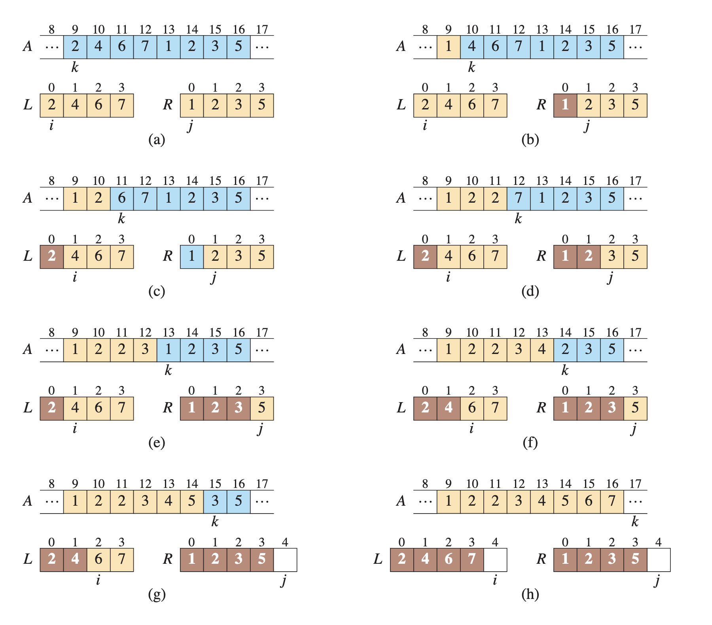

## 2. Sorting Algorithms

- Essentially sorting can be defined by

  - Keys
  - Satellite data / records

- We can read it by _sorting keys and records_

### 2.1 Insertion sort

Efficient algorithm for sorting small number of elements.

```
Input: A sequence of numbers <a1, a2, ..., a(n)>
Output: A permutation <a1', a2', ..., a'(n)>
```


### 2.2 Analyzing algorithms

**Analyzing an algorithm** means predicting the resources that the algorithm requires.

- Memory
- Bandwidth
- Energy Consumption

This analysis assumes that each operation is performed in the same amount of time.

#### byte shifting explanation

##### Left Shift

All the bits of a a value are moved to the **left**. Which represents a multiplication by 2. For example:

```
00101 // 5
01010 // 10
```

##### Right Shift

All the bits of a a value are moved to the **right**. Which represents a division by 2. For example:

```
01010 // 10
00101 // 5
```

#### Analyzing Insertion Sort

1. The running time & input size, depends on the size of the input
2. The best explanation of input size is: _the number of items in the input_
3. For problems such as multiplying 2 numbers the metric would be: _the total number of bits used to represent the number_
4. In a graph we usually consider **input size** as the number of:

- Vertices
- Edges

The **running time** of an algorithm on a particular input is the number of instructions and data accesses executed.

#### Worst-case and average-case analysis

- **average-case** means the most common running time of any input of size _n_

- **Worst-case** means the longest running time of any input of size _n_

#### Order of growth

- Instead of using `o(n)` uses _theta_
- We usually consider one algorithm to be more efficient than another if its worst case running time has a lower order of growth

### 2.3 Order of growth

- Insertion sort uses **incremental** algorithm. It means _for each element A[i], insert it into its proper place_

### 2.3.1 The divide and conquer method

- Many useful algorithms are **recursive** in structure
- **Recursive** means: to solve a given problem, they call themselves (recurse)
- **divide-and-conquer** method:

  - Break the problem into several sub-problems
  - Problems that are similar to the original but smaller
  - Solve the sub problems recursively
  - Combine these solutions to solve original problem

- **Divide** the problem into sub problems (one or more)
- **Conquer** the sub-problems by solving them recursively
- **Combine** the sub-problem solutions to form a solution to the original problem

- An example of this technique: _merge sort_

#### Merge sort

- divides `A[p:r]` into 2 sub arrays `A[p:q]` and `A[q+1:r]`
- Then sorts them
- then merges the values again

##### Iterative



##### Recursive


