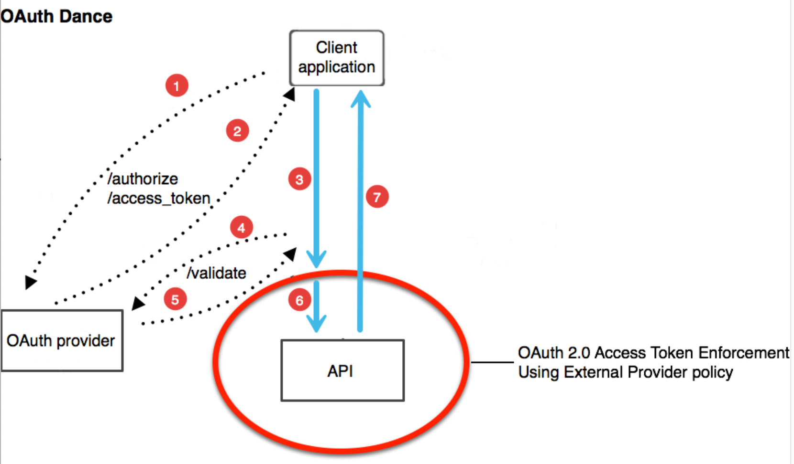

# RESTful API authentication basics
## Authentication vs Authorization
**Authentication** => Verification of the credentials of the connection attempt. The remote client sends information in plaintext or encrypted by using an authentication protocol

**Authorization** => Is the verification that the connection attempt is allowed

**Authorization vs Authentication?** _I'm_ Jorge _can I do_ this?

## Basic authentication
The most simple: **HTTP Authentication.**
For every request we send `username:password` and encode this in base64. 

**Important:** Only use this on SSL/TLS

## HMAC
It means **Hash Based Message Authentication**. The idea is to send the hash version of password _along with more information_

Usually it's send with time and date (nonce). However, servers tend to have problems with this type of authentication because time constrains.

Each time we need to generate a new **nonce**. For this case _each request is valid once and only once_

## OAuth 1.0 or OAuth 2.0
**OAuth 1.0** -> Requires crypto underpinnings and crypto-implementation

**OAuth 2.0** -> Easier to implement but less secure. Basically it's the way to go today.

### OAuth dance


## OAuth 1.0
- **Transport-Independent**: Security is not delegated to HTTPS/TLS

- **Founded in cryptography, specially digital signatures**: These signatures are used to prove the integrity and authenticity of a message. Each message is tied to its origin. 

- **Messages are each individually cryptographically signed:** If the signature is not correct, the entire transaction is invalid

- **Basic Signature Workflow**:
```
1. Client registers with a provider. I.E. Twitter
2. Provides gives you a "consumer secret"
3. Client signs each request with "consumer secret"
4. Any malformed data? Reject!
```

## OAuth 2.0
- **Transport-Dependent**: Depends on HTTPS/TLS. Any typo, improper configuration of TLS, failure on validation or any vulnerabilities can lead to Man-in-the-middle attack

- **Easier**: easier to use, much more difficult to build securely

- **Flexible:** Considers non-web clients as well

- **Better separation of duties**

- **Centered around bearer tokens** bearer tokens do not provide internal security mechanisms. They can be copied an easier to be stolen

[Source](https://blog.restcase.com/restful-api-authentication-basics/)