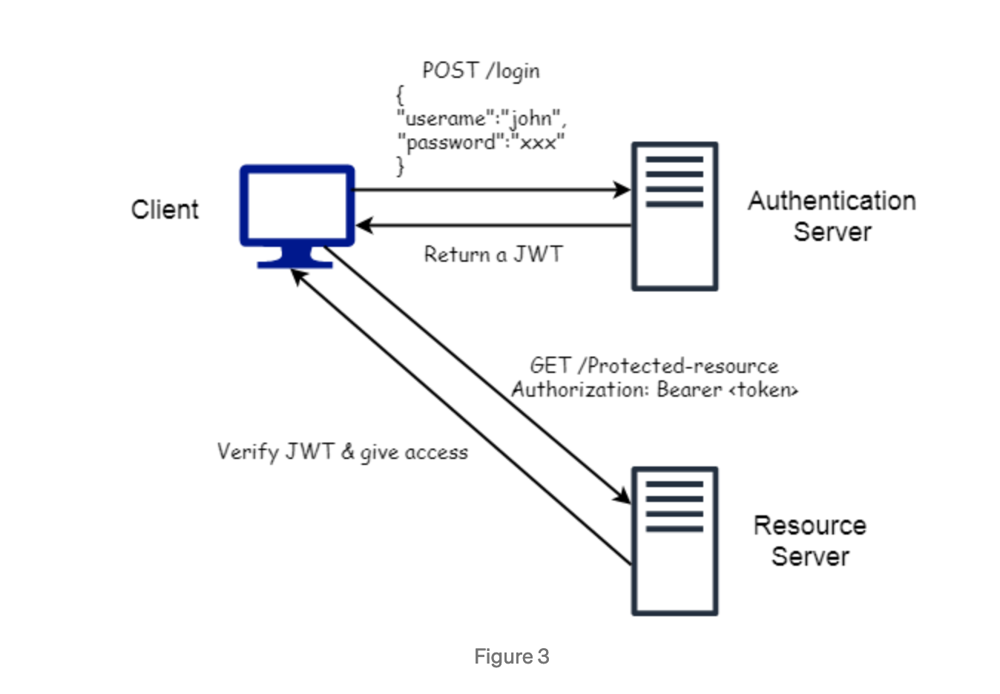

## 1. Best Guide to JSON Web Token (JWT)
[Source](https://medium.com/swlh/all-you-need-to-know-about-json-web-token-jwt-8a5d6131157f)

**Definition:** A 'jot' is a JSON Web Token, it's used for securely transmitting information between entities as a JSON object

**What it solves?** It is a compact and secure way of exchanging information over the network.

**Characteristics:** JSON Web tokens help to maintain the integrity and authenticity of the information. Because it's digitally signed using a secret or public/private key.

**Important** It is not encrypted.

## 2. Why we need JSON Web token?
HTTP is a stateless protocol, that means a new request does not remember a previous one. For each request a login is required...?

A session is an object stored on the server that helps the user to stay logged in or to save any reference to their account.

## 3. Problems with Session-based authentication
**Scalability:** APIs receive several requests per second, so this could lead to problems to scale up

**Session Management:** Tracking of sessions could be a pain

**Performance:** Finding a session is a time consuming task

## 4. Better and effective solution
JWT does not use sessions, thus, it does not face this problems. Instead of making a session the server creates a JWT (Similar to a hotel key). 

They come with an expiration dates.

## 5. Structure of a JWT
Made up from 3 pieces separated by a period, after that, the string is encoded
```
1. Header
2. Payload
3. Signature

i.e. header.payload.signature
```

### 5.1 Header
Contains 2 parts: type of token & algorithm (HMAC, SHA256 or RSA)
```json
{
    "typ": "JWT",
    "alg": "HS256"
}
```

The header is encoded (Base64Url)

### 5.2 Payload
Consists on **Session data called as Claims** 

There are 3 types of **Claims**
- Registered
- Public
- Private

#### **5.2.1 Registered**
Predefined claims that can increase the security. Recommended are:
- **iss** => User who sends the claim
- **sub** => The subject of the JWT
- **aud** => Recipients that the JWT is used for
- **exp** => Expiration date
- **nbf** => Not before time to be processed
- **iat** => Issued at time
- **jti** => Unique identifier for the JWT. Case sensitive string. Unique the "jti" prevents for any replication

#### **5.2.2 Public claims**
These type of claims can be defined by a group of people using the JWT.

Claims needs to be registered in the IANA (JWT Registry) or it should contain a collision resistant name to avoid collisions

#### **5.2.3 Private claims**
Custom claims defined and created by 2 parties to exchange information between them.
```json
{
"sub": "user123",
"name": "John",
"role": "developer",
"exp": "1606595460",
}
```

Then this is encoded in Base64Url

## 6. Signature
This is the most important part of the signature. Helps to check integrity of the JWT key (tampered or not)

How you calculate this? `encoded Header + encoded payload + secret`
```
RSA(base64UrlEncode(header) + "." + base64UrlEncode(payload), secret)
```

## 7. How does JWT works?
1. User sends credentials to the server to login
2. Server authenticates the user
3. If the authorization is successful then a JWT is sent back
4. The user can use this JWT to access resources

To do this, the user can use a **Bearer Schema**
```
Authorization: Bearer <token>
```


Every JWT is signed by a token that only the server **MUST** know

If the attacker tries to change the token, the signature will need to be recalculated.

## 8. Advantages of JWT
- **Compactness:** Less verbose than XML
- **No need of session:** Contains all required information from the user
- Expiration
- No need of cookies: The token can be stored in the localStorage, indexDB or some native store. This will prevent from CORS or CSRF attacks
- Compatibility: JSON parsers are populars among languages.