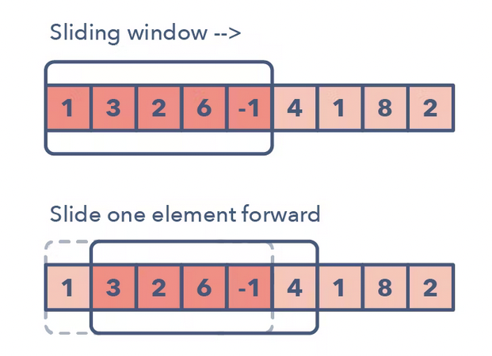
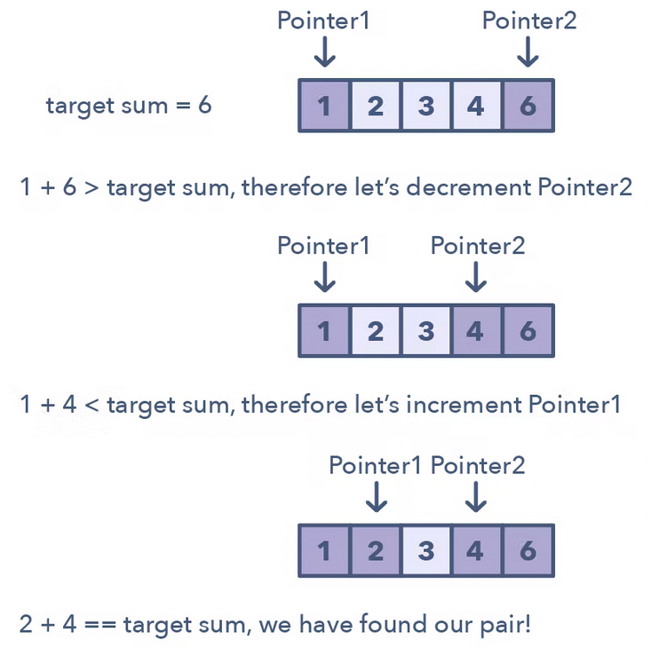
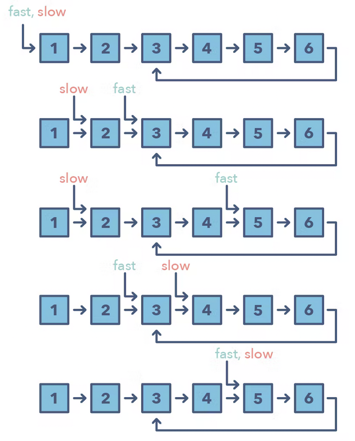
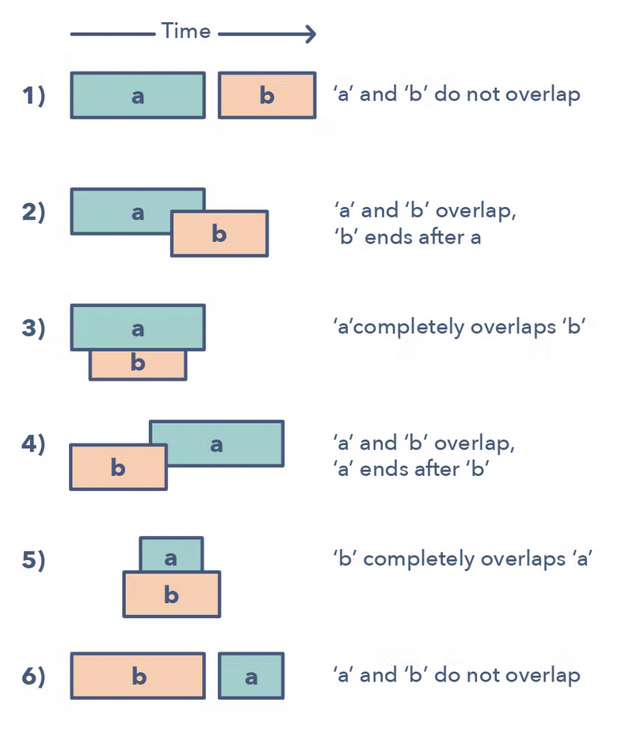
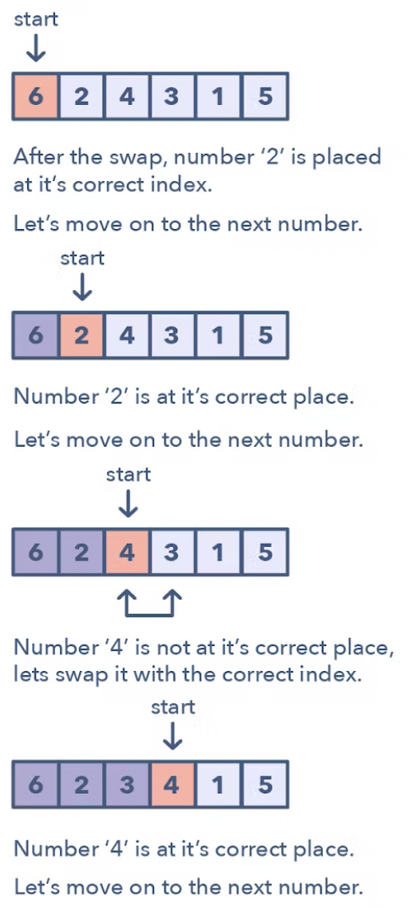
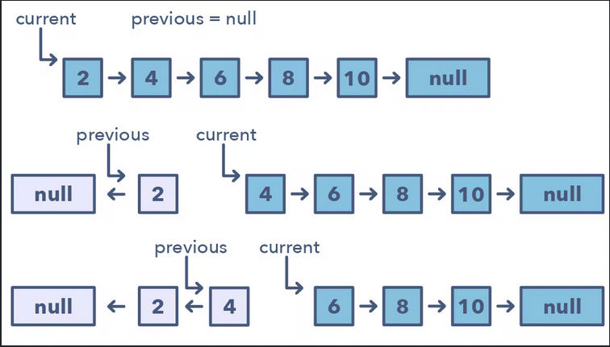

# 14 Patterns to Ace Any Coding Interview Question

## **1. Sliding Window**
Used to perform a required operation on a specific window size of a given array or linked list. For example: `Finding the longest subarray containing all 1s`

### How to identify the problem?
- The input is linear data (LinkedList, Array or String)
- You are asked to find the longest/shortest substring, subarray or desired value

### Examples
- Maximum sum subarray of size ‘K’ (easy)
- Longest substring with ‘K’ distinct characters (medium)
- String anagrams (hard)



## **2. Two pointers or iterators**
Two pointers iterate through a data structure. Its often useful when searching pairs in a sorted array or linked list.

Used when we want to improve **Brute Force** algorithms. With one pointer, we would have to loop and loop

### How to identify the problem?
- It will features problem where you deal with sorted arrays and need to find a set of elements that fulfill certain constraints
- The set of elements in the array is a pair, a triplet, or even a subarray

### Examples
- Squaring a sorted array (easy)
- Triplets that sum to zero (medium)
- Comparing strings that contain backspaces (medium)



## **3. Fast and Slow pointers**
Also known as `Hare and Tortoise` algorithm. Two pointers that move in different speed. Useful when dealing with cyclic linked list or arrays

Moving the pointers at different speeds, the algorithm proves that the two pointers are bound to meet.

### How to identify the problem?
- The problem will deal with a loop in a linked list
- When you need to know the position of certain element or the overall length of the linked list

### Examples
- Determine if a linked list is a palindrome
- Palindrome Linked List (medium)
- Cycle in a Circular Array (hard)



## **4. Merge Intervals**
The merge intervals pattern is an efficient technique to deal with overlapping intervals. In a lot of problems involving intervals, you either need to find overlapping intervals or merge the intervals if they overlap

Given 2 intervals (A & B), you can assume:
```
- A and B do not overlap
- A and B overlaps. B ends after A
- A completely overlaps B
- A and B overlaps. A ends after B
- B completely overlaps A
- B and A do not overlap
```

### How to identify the problem?
- If you are asked to produce a list with only mutually exclusive intervals
- If you hear the term "Overlapping intervals"

### Examples
- Intervals Intersection (medium)
- Maximum CPU Load (hard)



## **5. Cyclic Sort**
This pattern describes an interesting approach to deal with problems involving arrays containing numbers in a given range. 

It iterates over the array one number at a time, if the current number is not at the correct index, you swap it to its correct place.

### How to identify the problem?
- The problem involves a sorted array with numbers in a given range
- If the problem asks you to find the missing/duplicate/smallest number in a sorted/rotated array

### Examples
- Find the Missing Number (easy)
- Find the Smallest Missing Positive Number (medium)



## **6. In-place reversal of linked list**
You maybe asked to reverse the links between a set of nodes of a linked list. Often is required to be `in place` no extra memory used.

You will have 2 pointers (current and previous) then you will lock them and start swapping them. Starting from the head

### How to identify the problem?
- Reverse a linked list without using extra memory

### Examples
- Reverse a Sub-list (medium)
- Reverse every K-element Sub-list (medium)



## **7. Tree Breath First Search**
This pattern is based on BFS technique to traverse a tree. Uses a queue to keep track of all the nodes of a level before, jumping onto the next level

The Tree BFS pattern works by pushing the root node to the queue and then continually iterating until the queue is empty.

For each iteration, we remove the node at the head of the queue and "visit" that node. After removing each node from the queue, we also insert all of its children into the queue

### How to identify the problem?
- If you are asked to traverse a tree in a level-by-level fashion (or level order traversal)

### Examples
- Binary Tree Level Order Traversal (easy)
- Zigzag Traversal (medium)


## **8. Tree DFS**
Tree DFS is based on the Depth First Search (DFS) technique to traverse a tree. You can use recursion (or a stack for the iterative approach) to keep a track of all the previous (parent) nodes while traversing

It works starting by the root, then moving to the children. If a node has no children, then you can do:
1. Process the current node (In order, pre-order, post-order)
2. Make two recursive calls for both the children of the current node to process them

### How to identify the problem?
- If you are asked to traverse a tree in-order, pre-order, post-order
- If the problem requires searching for something where the node if closer to a leaf

### Examples
- Sum of Path Numbers (medium)
- All Paths for a Sum (medium)


#### **Source**

[14 Patterns to Ace Any Coding Interview Question](https://hackernoon.com/14-patterns-to-ace-any-coding-interview-question-c5bb3357f6ed)


## Template
## Title
### How to identify the problem?
### Examples


