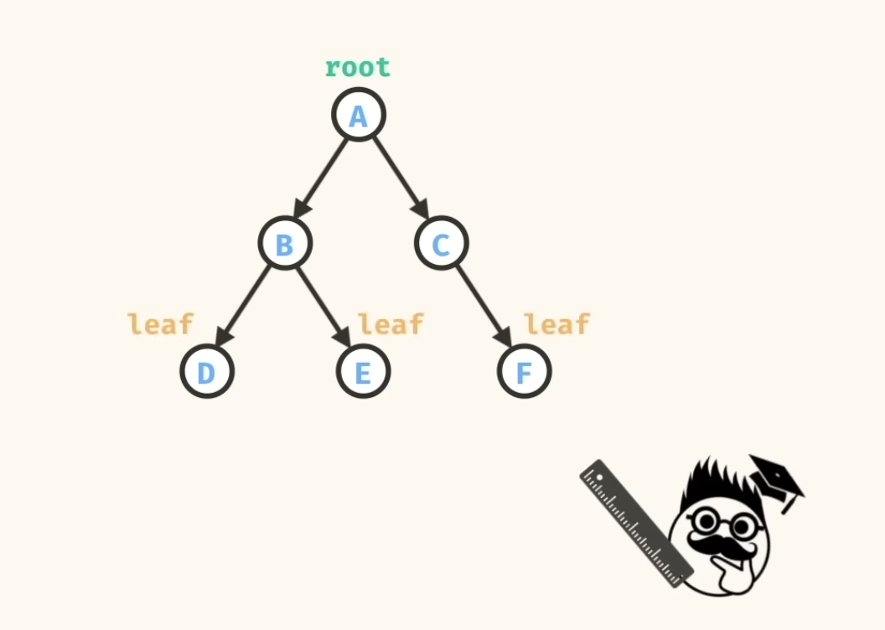

# Binary trees

This is a condensed knowledge for Trees and Binary Trees.

## Binary Tree Definition

## Parent and Child relationship

## Root and Leaves

## Root

## Table of Contents

1. [Depth First Traversal](dfs.mjs)
2. [Breadth First Traversal](bfs.mjs)
3. [Find in Tree](find-in-tree.mjs)
4. [Tree Sum](tree-sum.mjs)
5. [Tree Min](tree-min.mjs)
6. [Max Root to Leaf Path Sum](max-root-to-leaf-path-sum.mjs)

## Source

[Binary Tree Algorithms for Technical Interviews - Full Course ](https://www.youtube.com/watch?v=fAAZixBzIAI)
