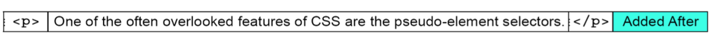
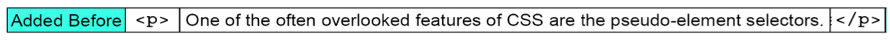

## Chapter 2 - Pseudo Selectors and Elements
### 2.1 Pseudo elements
- These elements start with `::`
- These elements don't refer to explicit DOM elements

#### 2.1.1 After
```css
p::after {
  content: "Added after"
}
```


#### 2.1.2 Before
```css
p::before {
  content: "Added before"
}
```


#### 2.1.3 ::first-letter
- Will affect only the first letter inside `<p>`
```css
p::first-letter { font-size: 200%}
```

#### 2.1.4 ::first-line
- Will apply CSS to the first line only
```css
p::first-line { text-transform: uppercase; }
```

#### 2.1.5 ::selection
`::selection` will affect the look on how text selection shows up
```css
::selection {
  background: black;
  color: white;
  caret-color: blue;
}
```

#### 2.1.5 ::slotted(*)
- Only works on `template` HTML element
- Could be `::slotted(*)` or `::slotted(element-name)`
- It will affect `<slot>` elements only
```html
<template>
  <div>
    <slot name="animal"></slot>
    <ul>
      <li><slot name="kind"></slot></li>
      <li><slot name="name"></slot></li>
    </ul>
  </div>
</template>
```

