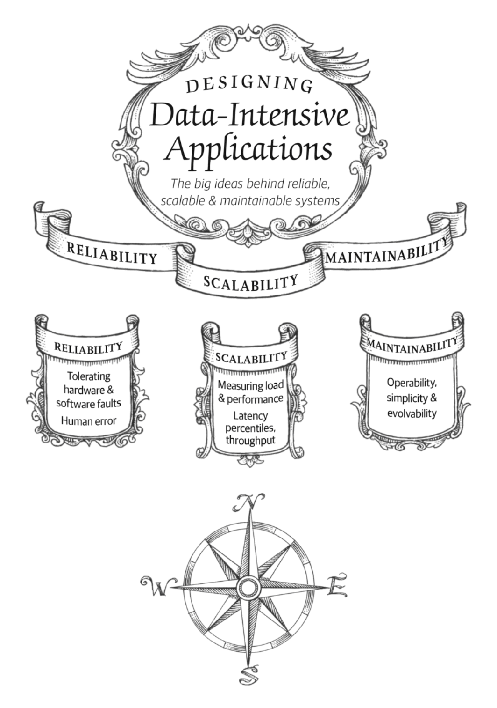

# Chapter 1: Reliable, Scalable & Maintainable

Today, many applications are **Data-Intensive**, as opposed to _compute-intensive_

The main idea is top be able to handle **complexity, amount & speed** of changing data.

**Typically built on standard blocks**:
- _Databases_ => where to store and find data
- _Caches_ => Remember the result of an expensive operation (read)
- _Search Indexes_ => Allow users to search data by keywords or filter in various ways
- _Stream processing_ => Send message or request to another process (Async processing)
- _Batch processing_ => Periodically crunch a large amount of accumulated data

When building an app, we still need to **figure out** which **tools** and which approaches are the **most appropriate** for the task at hand, and if one tool can solve the task, then how to combine tools

## Thinking about Data Systems
Databases and Message queues have some superficial similarity. Both **store data** for some time.

They are part of the same path, **processing and storing** data. These 2 tools can be stitched together to solve this problem

APIs must hide implementation details from clients.

Within this new way of thinking (data intensive) several tricky questions arise. 
- How do you ensure that the data remains correct and complete, even when things go wrong internally?
- How do you provide consistently good performance to clients, even when parts of your system are degraded?
- How do you scale to handle an increase in load?
- What does a good API for the service look like?

While designing a system there are a lot of constrains to be taking in consideration. We will focus on 3 concerns that are key

1. **Reliability** => The system should continue to work correctly. Even in the face of adversity
2. **Scalability** => As the system grows (data, traffic or complexity) there should be a way to keep up with this growing 
3. **Maintainability** => People should be able to work on ti productively

## Reliability
Definitions:
- The app performs the function that the user expected
- Should be able to tolerate the user making mistakes
- The performance is good enough for the required use case
- The system prevents from unauthorized access and abuse

**TL;DR: Continuing to work correctly, even when things go wrong**

**Faults** => Elements in the system that could go wrong. A component deviating from its spec

**Failure** => A moment when the system stops providing service to the user

A system is **resilient** when it can anticipate **faults** and cope with them (fault-tolerant).

Most of the critical faults can be discovered by actively testing. One great example for this is [Chaos Monkeys by Netflix](https://netflixtechblog.com/the-netflix-simian-army-16e57fbab116)

We prefer tolerating faults over preventing faults. _Preventions is better than cure_

## Hardware faults
The first response in our heads its to add redundant systems to prevent failures in large data centers
- RAID configurations
- Diesel generators
- Dual power supplies
- Hot-swappable CPUs

However, all of this cannot prevent hardware problems. Regularly apps focused on _high-availability_

With data intensive applications, we are **moving towards** using **software-fault** techniques in addition to _hardware redundancy_

One advantage is:
- For a distributed system, you don't need to have planned downtime. You just disable one node

## Software Errors
We can assume that even hardware malfunctions happen, they are non-related

Another fault type is **systematic error** something that might affect several nodes. These type of errors are harder to anticipate  
- Second leap in linux kernel
- Runaway process that consumes some shared resource
- An external service that fails 
- Cascade failures

These types of situations remain dormant during years, until certain set of circumstances, trigger this situation.

What you could do to mitigate this problem?
- Careful thinking your assumptions through the system
- Thorough testing
- Process isolation
- Allow process to crash and restart
- Measuring monitoring and analyzing system behavior in PROD
- Health checks

## Human Errors
Humans are known to be unreliable. So how do we make systems for unreliable humans?
- Design systems in a way that minimizes opportunities for errors
- Decouple the places where people make the most mistakes from the places where they can cause failures
- Test thoroughly at all levels (unit, integration, manual & automated)
- Allow quick and easy recovery from human errors to minimize the impact.
- Set up detailed and clear monitoring (telemetry)
- Training on how to use

## How important is reliability?
A site which is not reliable loses credibility and money!
Even tho there are moments where we may choose to sacrifice reliability in order to reduce development cost

## Scalability
**TL;DR** => If a system is reliable today, doesn't mean that tomorrow will be.

**Degradation** could happen when increased the load

**Scalability** => A systems ability to cope with increased load. It tries to answer the questions of "How we are going to cope with the growth or the additional load?"

## Describing load
The first step is to define current load on the system; Then only we can discuss growth questions.

Load is defined by _load parameters._ i.e. "X request per Y time"
It's what **matters to the system**

## Describing performance
You can look at it in 2 ways:
- When you increase a load parameter and keep the system resources unchanged. How is the performance of your system affected?
- When you increase a load parameter, how much do you need to increase the resources if you want to keep the performance?

**throughput** => The number of records we can process per second or the total time it takes to run a job a data set of a certain size. 

## Latency and response time
**Response Time** => it's what the client sees.
**Latency** => Duration that a request is waiting to be handled

As an important note, this should be accounted as a _distribution of data_ mostly because **one request can vary on its response time**

Instead of use "average" to measure a good performance use **percentiles** & **median**

The **median** is known as **50th percentile**, because you take all your data, sort it and then get to know what is below or above this measure.

To measure how bad your **outliers** are use:
  - 95th percentile
  - 99th percentile
  - 99.9th percentile

**Tail latencies** are important because they directly affect users experience of the service. However reducing response times at very high percentiles is difficult because they are easily affected by events outside of control, and the benefits are diminishing.

**SLA** => Service Level Agreement

**SLO** => Service Level Objective

**Head-of-line blocking** => An slow request blocks subsequent requests

During a parallel calls, customers depend on the slowest request, even in parallel processes

**tail latency amplification** => The chance of getting a slow call if we have multiple backend calls.

## Approaches for Coping with Load
**Vertical Scaling**   -> Moving to a more powerful machine
**Horizontal Scaling** -> Moving to distributed machines

**Shared-nothing architecture** => distribute load across multiple machines

Good architectures are **pragmatic** this means having a mixture of both scaling

**Elastic systems** => Automatically add resources when a load is increased. This approach is preferred if your load is **highly** unpredictable.

Distributing **stateless** services across => straightforward 
Distributing **stateful** data system => Adds a lot of complexity

The architecture of systems that operate a large scale is usually **highly specific to the application**.

The problems are bast and they represent a challenge:
- Volume of reads
- Volume of writes
- Volume of data to store
- Complexity of data
- Access patterns
- All of above in certain degree

**Important:** An architecture that scales well for a a particular app is built around assumptions of which operations will be common and which will be rare - The load parameters

## Maintainability
The majority of the cost of software is not in its initial development, but in its ongoing maintenance

We can and should design software in such a way that it will hopefully minimize pain during maintenance

Design principles of software systems:
1. **Operability** => Make it easy for ops team to keep the system running smoothly.
2. **Simplicity** => Make it easy for new engineers to understand the system
3. **Evolvability** => Make it easy to make a change. Also known as extensibility

## Operability: Making life easy for operations
Good operations can often work around the limitations of a bad (or incomplete) software, but good **software cannot run reliably with bad operations**

Good operations teams should look for:
- Monitoring the health of the system
- Tracking down problems
- Keeping software and platforms up to date
- Keep software and platforms up to date
- Keeping tabs on how different systems affect each other
- Anticipating software
- Establishing good practices and tools for deployments
- Performing complex maintenance tasks
- Maintaining the security of the system
- Defining processes that make operations predictable
- Keep production stable
- Preserving the organization knowledge about the platform

Data System should be in charge of:
- Providing good support for automation & integration
- Providing visibility into the runtime behavior
- Avoiding dependency on individual machines
- Providing good documentation and easy-to-understand operational model
- Define and provide a good default behavior. And provide tools to override this default
- Self-healing where appropriate
- Exhibiting predictable behavior

**Important:** Good operability lets your team focus on high-value activities

## Simplicity: Managing complexity
Complexity slows down everyone who needs to work on the system, further increasing the cost of maintenance

**Symptoms of complexity:**
- Explosion of the state space
- Tight coupling of modules
- Tangled dependencies
- Inconsistent naming and terminology
- Hacks aimed at solving performance problems
- Special casting to workaround issues

_Simplicity should be a key goal for the systems we build_

_Accidental Complexity_ => Complexity not inherited through the problem that the software aims to solve, but introduced by the implementation.

_Abstraction_ => A way to hide a great deal of implementation detail behind a clean, simple-to-understand facade. Making it reusable and also leads to higher-quality software.

In the field of distributed systems, finding a good abstraction is a complex task.

## Evolvability: Making change easy
It's extreme unlikely that your system's requirements will remain unchanged forever.

_Agile_ framework provides a way to deal with the constant change in software development

**TL;DR** Simple and easy-to-understand systems are usually easier to modify than complex ones.

## Summary
**Functional requirements** => What it should do? what are the data processes?

**Non-functional requirements** => Security, reliability, compliance scalability, compatibility and maintainability)

**Reliability** => systems work correctly, even when faults occur

**Fault-tolerance** => techniques can hide certain types of files to the user

**Scalability** => Strategies for keeping performance good! even when loads increases. Define first what is load and performance

**Maintainability** => make life better for the engineering and ops team. Good abstractions reduce complexity & good operability means having a good 