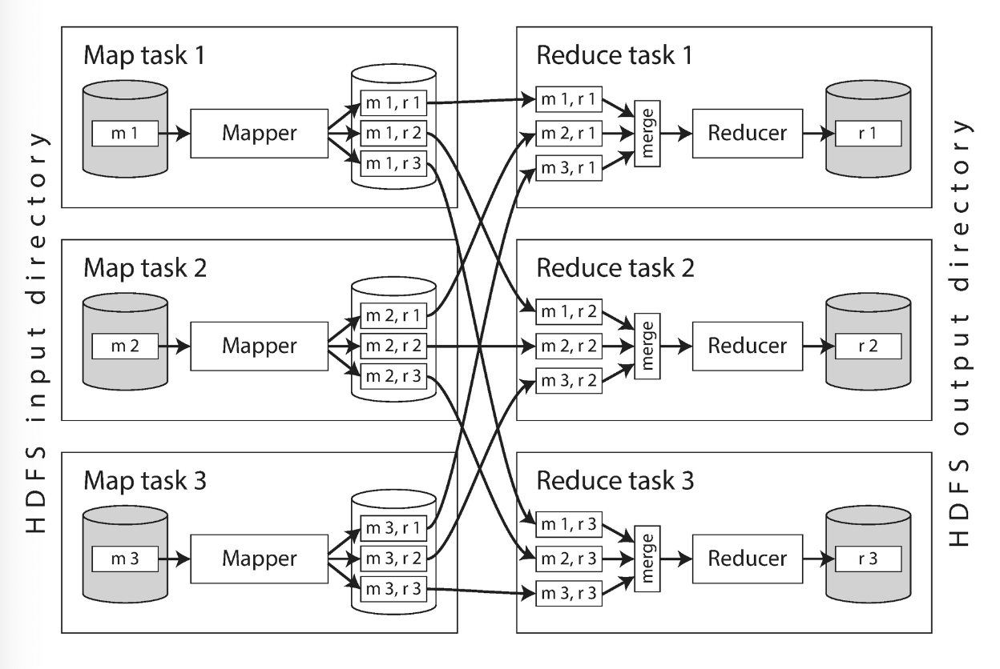
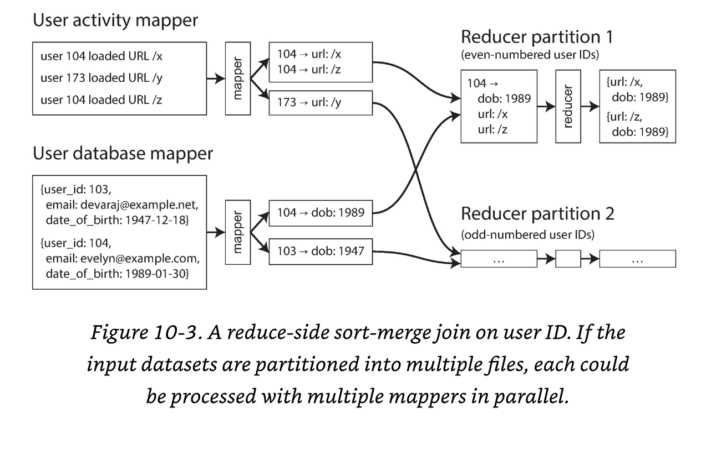

## Systems of Record and Derived Data
Systems that can store and process data can be grouped in 2 broad categories
- **Systems of record** => _Source of truth_, hold the authoritative version of your data. Each fact is represented exactly once. The representation is usually _normalized_
- **Derived data systems** => Data in this kind of system is the result of taking some existing data from another system and transforming or processing it in some way. If you lose derived data, you can recreate it from the original source.

Technically speaking, **derived data** is _redundant_. In the sense that it duplicates existing information. 

However, it's required if we want to have a good performance in our app.

**Derived data** is usually _denormalized_ and you can derive the data based on "points of views"

# Chapter 10 - Batch Processing

in the first section of the book we talked about `request & queries` then later we discussed about `responses & results`.

Basically, you ask for something, or you send an instruction, and then sometime later(hopefully) you get a response.

Let's describe 3 types of systems:
- **Services (Online)** => It waits for a request or instruction from a client to arrive. Then tries to process it as fast as possible and responds to the client.

- **Batch processing systems (offline)** => It takes a large amount of input data, runs a job to process it, and produces some output of data

- **Stream processing systems (near-real-time systems)** => A stream processor consumes inputs and produces outputs (rather than responding to a request). These type of systems works on _events_ whereas a job operates on a fixed set of input data. 

## The Unix Philosophy
1. Make each program do one thing well. To do a new job build a fresh rather than complicate old programs by adding new "features

2. Expect the output of a every program to become the input to another, as yet unknown, program.

3. Design and build software, even OS, to be tried early, ideally within weeks. Do not hesitate to throw away the clumsy parts and rebuild them

4. Use tools in preference to unskilled help to lighten a programming task.

Part of what makes Unix tools so successful is that they make it quite easy to see what is going on:

- The input files to Unix commands are normally treated as immutable.

- You can end the pipeline at any point.

- You can write the output of one pipeline stage to a file and use that file as input to the next stage.

## MapReduce and Distributed Filesystems
MapReduce is a bit like Unix tools, but distributed across potentially thousands of machines.

A single MapReduce job is comparable to a single Unix process: it takes one or more inputs and process one or more outputs

MapReduces respects immutability.

We can break MapReduce jobs in 4 steps:
1. Break the files into records
2. Map them to a function we want to use to extract information
3. Sort 'em
4. Reduce it, which means write your custom data.

**HDFS** consists of a daemon process running on each machine, exposing a network service that allows other nodes to access files stored on that machine.

Distributed systems continuously replicate these files on other places.

### MapReduce Job Execution
**MapReduce** is a programming framework with which you can write code to process large datasets in a distributed filesystem like HDFS.

1. Read a set of input files and break it up into _records_
2. Transform the records through a Mapper function
3. Sort all the key-value pairs available
4. Call the reducer function to iterate over the sorted key-value pairs.

To create a MapReduce job, you need to implement 2 callback functions: 
- Mapper => Called once for every input record, extracts the key and value from the input record.
- Reducer => Collects all the values belonging to the same key and calls the reducer which produces an output record.

Basically, the mapper extracts the key-value pairs and the reducer process this data.

#### **Distributed execution of MapReduce**
The main difference between Unix pipelines & MapReduce is that MapReduce can parallelize a computation across many machines, without having to write code explicitly to handle parallelism

The mapper and reducer only operate on one record at a time.

The mapper and reducer don't need to know where the input comes from or where the output goes

**Important** Within this approach we try to keep the data as close as possible to the reducer.

In most cases the **Map task** is not yet in the machine assigned to process it, so the MapReduce framework first copies the code to the appropriate machines.

The output of the mapper consists of `key -> value` pairs.

The reduce side of the computation is also partitioned. The number of reduce tasks is configured by the job author.

To ensure that all **key-value pairs** with the **same key** end up at the same reducer, the framework **uses a hash of the key** to determine which reducer should process it.

The key-value pairs must be sorted, but usually the dataset is likely to be massive. 

What to do? Sort data in stages! also known as **_shuffle_**
1. Each map task partitions its output **by reducer**
2. Once the mapper has sorted out the files based on the reducer, the scheduler then informs reducers to fetch their data
3. The reducer downloads from nodes it's data. 
4. The reducer takes the files from the mappers and merges them together, preserving the sort order.
5. The reducer starts to process each key.
6. The output of the reducer is written to a file on the distributed filesystem.

#### **MapReduce Workflows**
The range of problems that you can solve using a **single** MapReduce job is limited.

Thus, it's quite common to use the output of one MapReduce job chained as the input of another job.

Then `MapReduce` jobs don't work as pipelines, more like separate commands. This approach has advantages and disadvantages.

A `MapReduce` job is considered completed if the job has finished successfully. Therefore, one job in a workflow can only start when the prior jobs have completed.

To manage these dependencies, Hadoop and other systems have: _Workflow schedulers_ such as: Azkaban, Luigi, Airflow & Pinball

Tool support is important for managing complex dataflows. I.E. recommendation system which might require 50 to 100 MapReduce jobs

#### **Reduce-Side Joins and Grouping**
A **join** is necessary whenever you have some code that needs to access records on both sides of the association

Although, `Denormalization` reduces the need of using joins, that does not mean you wont need ***joins**

`MapReduce` does not know the concept of _indexes_. When a `MapReduce` job is given a set of files as input, it reads the entire content of all of those files (In relational db: full table scan);

`MapReduce` jobs have a different advantage: Parallelism, which DBs don't have.

When we talk about joins in the context of batch processing, we mean resolving all the occurrences of some association within a dataset.

#### Sort-merge joins
Recall that the purpose of a `mapper` is to extract the `key-value` from a record.

When the `MapReduce` framework partitions the mapper output by key and then sorts the `key-value` pairs

> Same keys goes at the same file and the records are adjacent

`Secondary sort` => The `MapReducer` job can even arrange the records to be sorted such that the reducer always sees the record from the key first

_Sort merge join_ => Same Keys consecutive then merge them into one aggregate element. Additional info [here](https://www.youtube.com/watch?v=jiWCPJtDE2c)

#### **Bringing related data together in the same place**
In **Sort merge join** the mapper ensures that all the necessary data to perform a join is brought together in the same place. 

This means _a single call to the reducer_. 

**Important** In the end, **all key-value pairs with the same key will be delivered to the same destination**

MapReduce handles all network communication, this means MapReduce transparently retries failed tasks without affecting app logic.

#### **Group by**
All records with the same key form a group, and the next step is often to perform some kind of aggregation within each group.

This function is similar to `GROUP BY` in SQL

To achieve this, MapReduce is set up so the mapper produce groups with the same Grouping key. Then each group is delivered to a Reducer

#### **Handling Skew**
The patter of "bringing all records with the same key to the same place" breaks down if there is a very large amount of data related to a single key

This type of situation is called: `linchpin objects` or `hot keys`

Processing a _hot spot_ can lead to a _skew_. Basically, the processing balance between reducers will be broken.

**Important** Any subsequent jobs must wait for the slowest reducer to complete before they can start.

There are algorithms that might help such as:
- Skewed join => Performs a dry-run to determine which keys are hot. Then mappers distribute the records through different reducers.

- Sharded join => It's similar to _Skew join_ however, this algorithm requires that hot keys are selected manually.

When **grouping records by a hot key** and aggregating them, you can perform the grouping in 2 stages:
1. MapReduce stage sends records to a random reducer, so that each reducer performs the grouping on a subset of records for the hot key and outputs a more compact aggregated value per key
2. The next MapReduce job then combines the values from all of the 1st stage reducers into a single value per key

These reducers are known as: **_Reduce-Side Joins_** 

The advantage of **Reducer-Side Joins** is that jobs do not need to make any assumption of the input data: The mapper can prepare the data to be ready for joining.

As a downside is that all the `[Sorting | Copying | Merging]` can be quite expensive.

### Map-side Joins
These type of joins _can_ make certain assumptions about your input data, and it will make the join a bit faster

Using a `cut-down` MapReduce, this means that no reducers and no sorting. Instead each mapper simply reads one input file block and writes it to other filesystem.

#### **Broadcast hash joins**
One example of `Map-Side` join **applies** in the case **where a large dataset is joined with a small dataset**. In particular, the small dataset needs to be small enough that it can be loaded entirely into memory in each of the mappers.

If the mapper is able to load the `small dataset` into memory, then it will create a `hash-map` with the keys.

As example, you can load all the users into a memory and get the **detailed information** for the following mapping operations.

> The key here is: the small dataset must fit into memory.

This is called _Broadcast hash joins_. 
- Broadcast comes from the idea that all mappers will load the whole small dataset into memory
- Hash reflects the use of the hash table.

Another option is: instead of load a hash table in memory, you can create a read-only index on the local disk

#### **Partitioned hash joins**
If the inputs to the map-side join are partitioned in the same way, then the hash join approach can be applied to each partition independently.

Basically, each record will be partitioned based on a key. For example the last digit of the user id. and then distribute the records to all the mappers. For example the mapper 3, can take all the users that end with the number 3.

If the partitioning is done correctly, you can be sure that all the records you might want to join are located in the same numbered partition.

This has the advantage that each mapper can load a smaller amount of data into its hash table.

This approach only works if the join inputs are have the same size of the mappers.

**Important** Partitioned hash joins are known as _bucketed map joins in Hive.

#### **Map-side merge joins**
Another variant of a Map-side join is where you have partitioned and **sorted by** the same key. In this case the mapper accomplish the same function as the reducer.

_Reading both input file frequently, in order of ascending keys and matching records with the same key._

If a map-side merge join is possible, it probably means that prior MapReduce jobs brought the input datasets into partitioned and sorted form in the first place.

It would make sense to split these tasks (partition/join) if the same dataset will be used on other places.

#### **MapReduce workflows with map-side joins**
The output of a `reduce-side` join is **partitioned and sorted by the joining key**

Whereas the output of a `map-side` join is **partitioned and sorted in the same way as the large input**

The `map-side` joins also make more assumptions about the: size, sorting, and partitioning of their input datasets.

Knowing about the physical layout of datasets in distributed filesystems becomes important when optimizing join strategies.

It's not enough to know the encoding format; You must also know the number of partitions and the keys in which the data is partitioned and sorted.

### The output of batch workflows
OLTP look up small number of records by key.

OLAP scan over a large number of records, performing grouping and aggregations, the output often has the form of a report.

Batch processing is neither a transaction nor a analytic processing. However, it's closed to analytics because processes a large number of records.

The question lies on: _What is the format of the output?_

#### Key-value stores as batch process output
**Search indexes** are just one example of the output of a batch process. Another example is to build machine learning systems such as **classifiers** & **recommendation systems**

The output of those batch jobs is often some kind of _database_. These outputs are queried by the web app that handles user requests.

Once everything is MapReduced, how does it gets back the database?

The most common answer is using an insert row by row. However, this might be a bad idea since:
- Making a network request for every single record is quite expensive and slow.
- MapReduce jobs often run many tasks in parallel, which can cause a db collapse.
- Normally MapReduce jobs provides a clean all-or-nothing guarantee for job output. Writing to an external system from inside a job produces externally visible side effects that cannot be hidden in this way.

A much better solution would be to build a brand-new database inside the batch job and write it as files to the job output in the distributed filesystem. Usually these db files are _read-only_ and can be **bulk processed** by servers.

(Voldemort) The idea is that the servers can still respond to request. Meanwhile the processing the new dataset to eventually switch from the old dataset to the new.

#### **Philosophy of batch process outputs**
MapReduce jobs consider input as immutable avoiding any side effect. Using this approach batch jobs are maintainable and performant.
- If you make a mistake in your code, you can rollback to a previous version and rerun the job with the same input.
- Faster development
- If a `MapReduce` job fails then the framework will re-schedule it and re-run it. (Fault tolerant)
- The same set of files can be used as input for various jobs.
- Separation of concerns: _What the job does_ vs _Where and when the job runs_

### Comparing Hadoop to Distributed Databases
TL;DR: Hadoop is somewhat like a distributed version of unix. Where:
- HDFS - filesystem
- Hadoop - Unix processes

The combination of a `MapReduce` and a `distributed filesystem` is a _general purpose_ operating system that can run arbitrary programs

#### **Diversity of Storage**
Databases require you to structure data according to a **particular model**(relational or documents). 

Meanwhile files in a distributed filesystem are just byte sequences, which can be written using any data model and encoding.

They can be:
- Database records
- text
- images
- videos
- sensor readings
- sparse matrices
- etc

Batch processing (Hadoop) put in the table the possibility to indiscriminately dump any data into `HDFS` to later figure out how to process it

>  Have data fast in whichever format > Specific, well thought data model

Simply bringing data together (from various parts of a large organization) is valuable.

Indiscriminate data dumping shifts the burden of interpreting the data. 

**Important** The producer does not have to worry about having the same format for all values, that should be consumer's problem/responsibility.

**Sushi principle**: _Raw data is better_

Since data may come from different teams, there might not be an exact data model. We might think of this data as _different views of the same problem_

Data modeling happens, but it's **decoupled** from the data collection.

#### **Diversity of processing models**
For `MapReduce` processes the data models tend to be very specific to the application that will use the data

It tends to be more declarative, not just queries.

**Important** `MapReduce` gave engineers the ability to easily run their own code over large datasets.

Later, it was found that `MapReduce` has its own tradeoffs. Could be really slow or too limiting for certain scenarios.

However, still a great machine to process various models that can all be run on a single shared-use of clustered machines

The system is flexible enough to support a diverse set of workloads within the same cluster.

Not having to move data around makes it a lot of easier to derive value from the data, and a lot of easier to experiment with new processing models

#### Designing for frequent faults
Batch processes are less sensitive to faults than online systems, because they do not immediately affect users if they fail and they can be run again

`MapReduce` can tolerate the failure of a map or reduce task without it affecting the job as a whole by retrying work at the granularity of an individual task.

**important** `MapReduce` is optimal for larger jobs. Jobs that process so much data and run for such a long time that they are likely to experience at least one task failure along the way

`MapReduce` jobs assumes that might be terminated at any time, they are considered **low-priority** jobs.

If at any time another process needs the resources, the `MapReduce` jobs may be **preempted**

**important** `MapReduce` is designed to tolerate frequent unexpected task terminations.

## Beyond MapReduce
Depending on the volume of data, the structure of the data and the type of processing being done with it, other tools may be more appropriate for expressing a computation

Implementing MapReduce from scratch is hard. Understand how it works, that might be easier

MapReduce is robust; You can use it to:
- Process large amounts of data on unreliable systems
- Can be rerun
- Will get the job down... but might be slow
- Every MapReduce job is independent

**TL;DR**: It's powerful but sometimes really slow

### Materialization of Intermediate State
MapReduce jobs are independent from every other job.

The main contact point of a job within the rest of the world are inputs and outputs

Publishing data to a well-known location in the distributed filesystem allows loose coupling so that jobs don't need to know who is producing their input or consuming their output

Unfortunately, input/outputs are used by the same team. The files on the distributed system are simply intermediate state: _pass data from one job to another_

_Materialization_ is the process of writing out this intermediate state to files.

One subtle difference from Unix and MapReduce is that Unix _streams_ the output of one job to the other, which saves memory and buffer

_Materialization_ has downsides:
- A job can only start if the previous one has already finished and succeeded. Having to wait until the job finishes slows down the whole process
- Mappers are often redundant; They just read back the same file and prepare it.
- Storing intermediate state files in a distributed filesystem means those files are replicated across several nodes, which is often overkill for such temporary data.

#### **Dataflow Engines**
They (Spark, Tez & Flink) handle a entire workflow as one job, rather than breaking it up into independent subjobs.

They explicitly model the flow of data through several processing stages, these systems are known as dataflow engines.

They parallelize work by partitioning inputs, and they copy the output of one function over the network to become the input to another function.

## Concepts
**HDFS** => Daemon that allows other nodes to access file stored in a machine

**MapReduce** => Framework that allows you to process data across different nodes (distributed system)

**Mapper** => Called once for every input record, extracts the key and value from the input record.

**Reducer** => Collects all the values belonging to the same key and calls the reducer which produces an output record.

**Foreign Key** => In a relational model, one record may have an association with another record. 

**Foreign Key** => In a document model, called document reference

**Foreign Key** => In a graph model, called edge

**Star schema or dimensional modeling** => fact table + dimensions (events)

**Dimension table** => What, where, who, when, how and why of the event

**Snowflake schema** => Similar to star, but with sub dimensions

**Nondeterministic function** => Undetermined value such as `NOW()` or `RAND()`

**Sessionization** => Grouping all the activity events for a particular user session, in order to find out the sequence of actions that the user took.

**Hot keys / Linchpin objects** => Keys that accumulate a massive amount of data. For example: Followers of celebrities in social networks

**Skewed join** => Performs a dry-run to determine which keys are hot. Then mappers distribute the records through different reducers.

**Sharded join** => It's similar to _Skew join_ however, this algorithm requires that hot keys are selected manually.

**OLTP** => Online transaction processing

**OLAP** => Online analytics processing

**WAL** => Write ahead log

**Data lake / Enterprise data hub** => Collecting data in one place, it doesn't matter in which format. Jobs will figure it out later

**Sushi principle** => _Raw data is better_