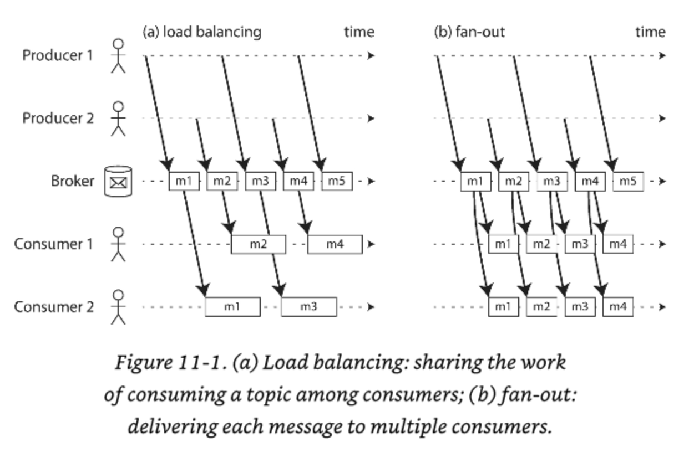
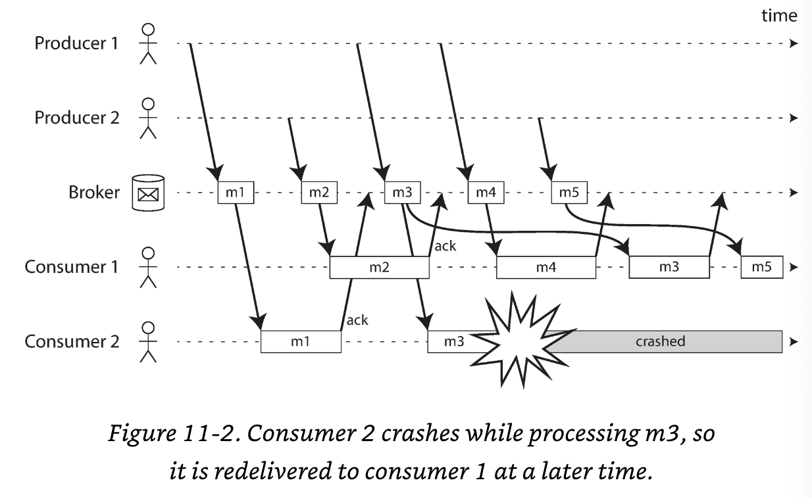
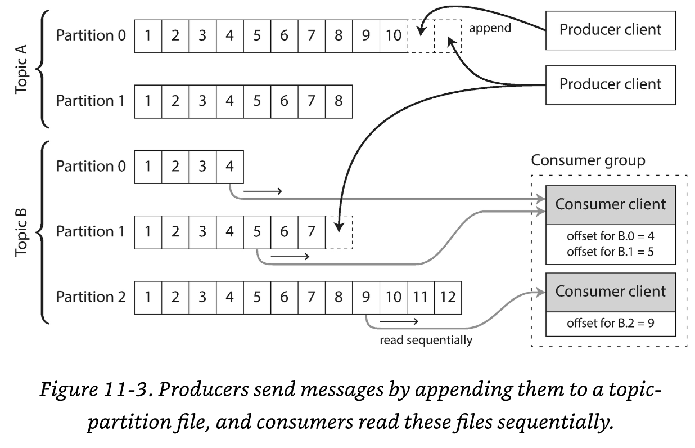

## Stream processing
_A complex system that works is invariably found to have evolved from a simple system that works._

_The inverse proposition also appears to be true: A complex system designed from scratch never works and cannot be made to work._

In chapter 10 we discussed _batch processing_ and how it transform input in _derived data_

However, for batch processing the assumption is that the input is _bounded_. So the batch job knows when its complete/done

Another important concept it's that its **sequential**. You can start one job without finishing the previous step.

However, in real life, a lot of data is unbounded because it arrives gradually over time. The dataset is never complete.

This means that data is produced on a daily based and batch processors needs to make a _cut_ of the data

The problem with daily batch processes is that changes in the input are only reflected in the output a day later. Which may be too slow for users

How do we solve this problem?
Run the process more often, which leads to have streams

A `stream` refers to data that is incrementally made available over time.
- `stdin` / `stdout`
- TCP
- Lazy lists
- Filesystem APIs

In this chapter we will learn about _event streams_.

### Transmitting event streams
In a stream processing context, a record is more commonly known as **event**.

An **Event** is a small, self-contained immutable object containing the details of something that happened at some point of time

An event usually contains a timestamp indicating when it happened according to a time-of-day clock.

An event may be encoded as a text string, or JSON, or perhaps in some binary form. This encoding allows you to store an event or send it over the network.

In stream processing a event is generated once by a **Producer** and then potentially processed by multiple **Consumers**

In streaming system, related events are usually are grouped together into a _topic_ or stream.

_How it works?_ The general idea is that a **producer writes** every event that it generates to the datastore, and each **consumer periodically polls** the datastore to check for events that have appeared since it last ran.

**Important** Continual Processing with low delays.

The task that needs to be particularly fast is **polling** which needs to be connected to a datastore that it's designed for this kind of usage.

The more often you poll, the lower the percentage of request that return new events and thus the higher the overheads become.

It's better for consumer to be **notified when new events appear**.

But traditional relational dbs are not suited for this task.

### Messaging Systems
A producer sends a message containing the event, which is then pushed to the consumers.

With this _publish/subscribe_ model, there are different approaches. To differentiate the systems, it's particularly helpful to ask the following two questions:

- What happens if the producer sends messages faster than the consumers can process them?
  - Drop messages
  - Buffer messages into a queue -> Important to understand what happens if the queue grows. Does the system crash if the queue no longer fits in memory, or does it write messages to disk?
  - _Backpressure_ 

- What happens if nodes crash or temporarily go offline, are any message lost?
  - As in DBs, durability requires a combination of writing to disk and/or replication.

Whether message loss is acceptable depends very much on the application.

#### **Direct messaging from producers to consumers**
A number of messaging systems use direct network communication between producers and consumers without intermediaries.
- UDP multicast is used by financial industry
- `Brokerless` messaging such as ZeroMQ uses publish/subscribe over TCP or IP multicast
- StatsD & Brubeck use unreliable UDP
- If the consumer exposes a service over the network, producers can make a direct HTTP or RPC request to push the event to the consumer

Even if the protocols detect and retransmit packets that are lost in the network, the generally assume that producers and consumers are constantly online.

So the app needs to have code to be aware of the possibility of message loss

#### **Message Brokers**
> Message broker == message queue

A `Message broker` is essentially a kind of database that is optimized for handling message streams.

Runs as a server, having producers and consumers as `clients`
- Producer => writes to Broker
- Consumer => reads from broker

Centralizing data via `Message Brokers` the data in the broker, these system can more easily tolerate clients that come and go, and the question of durability is moved to the broker instead.

Some Brokers keep messages in memory, while others write them to disk so that they are not lost in case of a broker crash.

Brokers allow **unbounded queueing** which allows them to be _asynchronous_ which means:

> When a producer sends a message, it normally only waits for the broker to confirm that i has buffered the message and does not wait for the message to be processed by consumers

The delivery of a message will happen at some undetermined future point in time

#### **Message brokers compared to databases**
Some message brokers can even participate in two-phase commit protocols. What's the difference between brokers and DBs?
- Databases usually keep data until it is explicitly deleted, meanwhile brokers automatically delete a message when it has been successfully delivered to its consumers.
- Most message brokers assume that their working set is fairly small. Queues needs to be small otherwise the overall throughput may degrade
- While DBs have support for indexes and various ways of searching, message brokers often support some way of subscribing to a subset of topics. 
- When querying a database, the result is is typically based on a point-in-time snapshot of the data; By contrast, message brokers do not support arbitrary queries, but they notify clients when data changes

#### **Multiple consumers**
A broker may have several consumers on the same topic. There are 2 main patterns of messaging:
- Load balancing => Each message is delivered to **one** of the consumers, so the consumers can share the work of processing the messages in the topic. This pattern is useful when the messages are expensive to process

- Fan-out => Each message is delivered to **all** consumers. Allows several independent consumers to each "tune in" to the same broadcast of messages without affecting each other.

**Important** These patterns can be combined

#### **Acknowledgements and redelivery**
Consumers may crash at any time. It could happen that a broker delivers a message to a consumer but the consumer never process it or partially process it before crash.

Message brokers use `acknowledgments` to ensure the message is not lost.

**Important** It could happen that the message actually was fully processed, but the acknowledgment was lost in the network.

Handling this requires **atomic commit protocol**.

The combination of load balancing with redelivery inevitably leads to messages being reordered.

To avoid this issue you can use a separate queue per consumer. 

Message reordering is not a problem if messages a completely independent of each other, but it can be important if there are causal dependencies between messages.

### Partitioned Logs
Sending a packet over a network or making a request to a network service is normally a transient operation that leaves no permanent trace.

**Important** Messages are _supposed_ to be transient.

Meanwhile, DBs and Filesystems are the opposite: _Everything that is written to a db or file is normally expected to be permanently recorded.

AMQP/JMS differs from batch processing because, while batch processing expects that the input remains, in stream processing receive a message is destructive if the acknowledgement causes it to be deleted from the broker.

**Important** New consumers cannot access/read/process previous messages. 

Why can't we have a hybrid between db and messages?

There's an option called _log-based message brokers_

#### **Using logs for message storage**
A log is a simply an append-only sequence of records on disk.

The same structure can be used for message brokers:
1. A producer sends a message by appending it to the end of a log
2. A consumer receives messages by reading the log sequentially
3. If a consumer reaches the end of the log, then waits.

If you want to scale then you can use _partitioned log_ distributed through different machines.

A topic can then be defined as a group of partitions that all carry messages of the same type.

Within each partition, the broker assigns a monotonically increasing sequence number, or **offset**

Messages within a partition are totally ordered. Meanwhile there is not order guarantee across different partitions.

#### **Logs compared to traditional messaging**
The log-based approach trivially supports fan-out messaging, because several consumers can independently read the log without affecting each other.

Reading a message does not delete it from the log.

To achieve load balancing across a group of consumers, instead of assigning individual messages to consumer clients, the broker can assign entire partitions to nodes in the consumer group

Then each client consumes all the messages in the partitions it has been assigned.

Typically, each consumer reads the messages in the partition **sequentially**

_What are the downsides of this approach?_
- The number of nodes sharing the work of consuming a topic can be at most the number of log partitions in that topic
- If a single message is slow to process, it holds up the processing of subsequent messages in that partition.

In situations where messages may be expensive to process and you want to parallelize processing on a message-by-message basis

Where message ordering is not so important the JMS/AMPQ style of message broker is preferable.

For a situation with high message throughput, each message is fast to process and where ordering is important, use log-based approach

In a log-based remember that all messages that need to be ordered consistently need to be routed to the same partition.

#### **Consumer offsets**

## Concepts
**Batch processing** => Read a set of files as input and produce a new set of output files. 

**Derived data** => The output generated by the batch processing. It's a dataset that can be recreated by running the batch process again. 

**Bounded input** => A known and finite size

**Stream** => refers to data that is incrementally made available over time

**Event stream** => The unbounded, incrementally processed counterpart to the batch data processing.

**Event** => small, self-contained immutable object containing the details of something that happened at some point of time.

**Producer** => Creates an event

**Consumer** => Takes an event and process it

**Topic** => Group of related events.

**Backpressure** => Block the producer from sending more messages.

**Message broker** => It's essentially a kind of database that is optimized for handling message streams.

**Asynchronous** => When a producer sends a message, it normally only waits for the broker to confirm that it has buffered the message and does not wait for the message to be processed by consumers

**Message Acknowledgment** => A client must explicitly tell the broker when it has finished processing a message, so the broker can remove it from the queue

**Atomic commit** => We might have the problem of a transaction that fails in some nodes but succeed on others. We have to get all the nodes to agree: _all abort/rollback_ or _all of them commit_

**Log** => An append-only sequence of records on disk.

**Monotonic** => Always increasing or always decreasing, as the value of the independent variable increases;