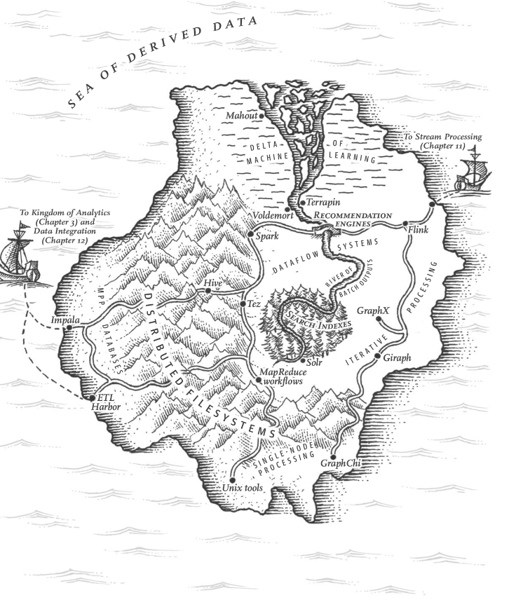
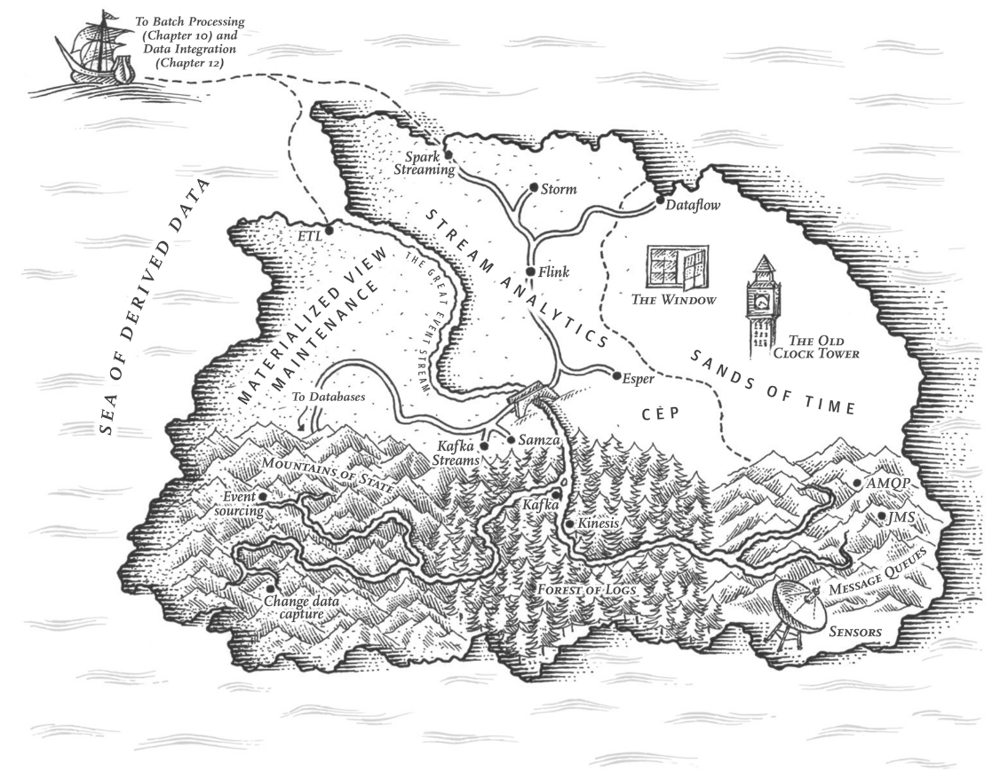

## Stream processing

_A complex system that works is invariably found to have evolved from a simple system that works._

_The inverse proposition also appears to be true: A complex system designed from scratch never works and cannot be made to work._

In chapter 10 we discussed _batch processing_ and how it transform input in _derived data_

However, for batch processing the assumption is that the input is _bounded_. So the batch job knows when its complete/done

Another important concept it's that its **sequential**. You can start one job without finishing the previous step.

However, in real life, a lot of data is unbounded because it arrives gradually over time. The dataset is never complete.

This means that data is produced on a daily based and batch processors needs to make a _cut_ of the data

The problem with daily batch processes is that changes in the input are only reflected in the output a day later. Which may be too slow for users

How do we solve this problem?
Run the process more often, which leads to have streams

A `stream` refers to data that is incrementally made available over time.
- `stdin` / `stdout`
- TCP
- Lazy lists
- Filesystem APIs

In this chapter we will learn about _event streams_.

### Transmitting event streams
In a stream processing context, a record is more commonly known as **event**.

An **Event** is a small, self-contained immutable object containing the details of something that happened at some point of time

An event usually contains a timestamp indicating when it happened according to a time-of-day clock.

An event may be encoded as a text string, or JSON, or perhaps in some binary form. This encoding allows you to store an event or send it over the network.

In stream processing a event is generated once by a **Producer** and then potentially processed by multiple **Consumers**

In streaming system, related events are usually are grouped together into a _topic_ or stream.

_How it works?_ The general idea is that a **producer writes** every event that it generates to the datastore, and each **consumer periodically polls** the datastore to check for events that have appeared since it last ran.

**Important** Continual Processing with low delays.

The task that needs to be particularly fast is **polling** which needs to be connected to a datastore that it's designed for this kind of usage.

The more often you poll, the lower the percentage of request that return new events and thus the higher the overheads become.

It's better for consumer to be **notified when new events appear**.

But traditional relational dbs are not suited for this task.

### Messaging Systems
A producer sends a message containing the event, which is then pushed to the consumers.

With this _publish/subscribe_ model, there are different approaches. To differentiate the systems, it's particularly helpful to ask the following two questions:

- What happens if the producer sends messages faster than the consumers can process them?
  - Drop messages
  - Buffer messages into a queue -> Important to understand what happens if the queue grows. Does the system crash if the queue no longer fits in memory, or does it write messages to disk?
  - _Backpressure_ 

- What happens if nodes crash or temporarily go offline, are any message lost?
  - As in DBs, durability requires a combination of writing to disk and/or replication.

## Concepts
**Batch processing** => Read a set of files as input and produce a new set of output files. 

**Derived data** => The output generated by the batch processing. It's a dataset that can be recreated by running the batch process again. 

**Bounded input** => A known and finite size

**Stream** => refers to data that is incrementally made available over time

**Event stream** => The unbounded, incrementally processed counterpart to the batch data processing.

**Event** => small, self-contained immutable object containing the details of something that happened at some point of time.

**Producer** => Creates an event

**Consumer** => Takes an event and process it

**Topic** => Group of related events.

**Backpressure** => Block the producer from sending more messages.