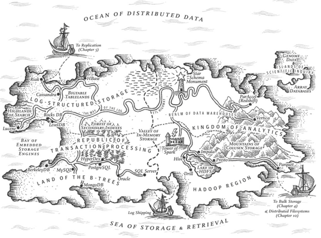
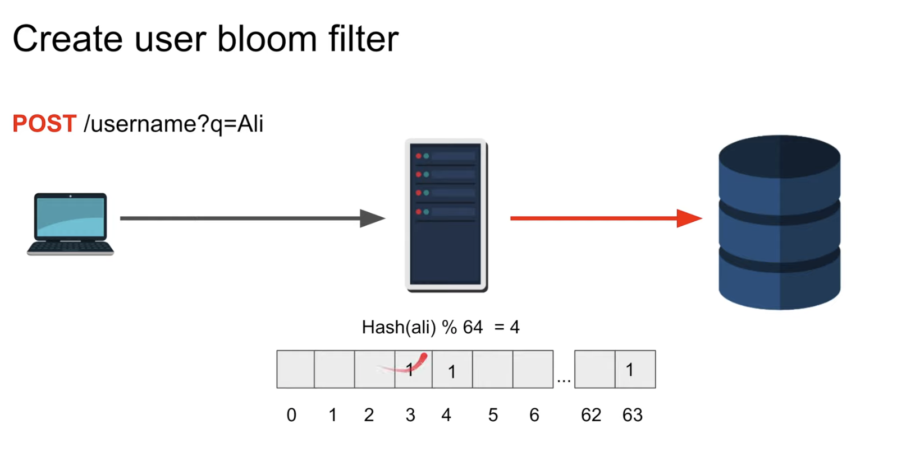
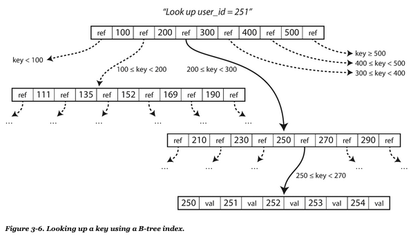

# Chapter 3: Storage and retrieval

_If you keep things tidily ordered, you are too lazy to go searching_

On the most fundamental level, a database needs to do two things: **save data & retrieve data.**

**Important:** You don't need to know all the details of a db, however, you _do_ need to select a storage engine that appropriate for your app.

## Data structures that power your database
Many DBs use (internally) a _log_, which is an **append-only** data file

DBs deal with more issues (not only with data file):
  - Concurrency control
  - Reclaiming disk space
  - Error handling
  - Partially written errors

> log => Will be used as an append-only sequence of records. It does not have to be _human readable_

An **index** keeps additional data which acts as a signpost and helps you to locate the data you want.

An **index** is an additional structure that is derived from the primary data. It does not affect the original data, however, affects the query performance

**important** Maintaining additional structures incurs overhead, specially on writes

**TL;DR** There's an important trade-off in storage systems: well-chosen indexes **speed up** read queries; but every index **slows down** writes

## Hash indexes
_dictionaries_ are key-value data. For _hash map_ indexing, usually they are **stored in Memory or disk**

They are **well suited** to situations where the value for each key is **updated frequently.**

**The limitation is**: How many keys you can store in memory? Updating values has a good performance

**How do we avoid running out of disk space?**

Break the log into segments of certain size, and making subsequent file, then run _compaction_ and after that _merge_ the segments into a new file. Then we switch the old and new segments.

> Compaction => means throwing away duplicate keys in the log and keeping only the most recent update for each key

_merge_ & _compaction_ happens in a background thread, so we can keep reading from the db. _Why?_ this is because segments are **never** modified, instead, merged segments are written to new files.

**Real life implementation limitation**:
- _File format_: CSV is not the best format for a log, a binary format is better
- _Deleting records_: If you want to delete a key and it's associated data, you will need a **tombstone**
- _Crash recovery_: If db is restarted the hash-maps are lost.
- _Partially written records_: DB might crash at any time, including halfway through appending a record to the log
- _Concurrency Control_: Are writes that append to the log in a strictly sequential order.

> tombstone => extra deletion record, when log segments are merged the tombstone tells the merging process to discard any previous value for the deleted key

**Advantages of append-only logs**
- Append and merge are sequential operations. Which are faster than random writes
- Concurrency and crash recovery operations are much simpler if segments are append-only or immutable. I.E. **update + crash**
- Avoids fragmentation

**Limitations of hash table index**
- Must fit in memory 
- Range queries are not efficient

## SSTable and LSM-Trees
> SST => _Sorted String Table_ means that the sequence of key-value pairs is sorted by key.

On SST we cannot add a new key-value pair immediately.

These are the advantages of SST:
- Merging segments is simple and efficient (even with large files). This approach is like the merge-sort algorithm
- In order to find an element you don't need to have an index in memory for it. I.E. I'm looking for handiwork and I know that it's between _handbag_ and _handsome_
- Grouping key-value pairs is possible

How do you sort keys in first place? or how do you maintain the order ?
Using Red Trees or AVL which can insert keys in any order and read them back in sorted order

**Then how it works?**
1. Write comes in, add it to in-memory balance tree (**_memtable_**)
2. When memtable grows up to certain threshold write it in disk as an SSTable file
3. For reads, first look at memtable then disk (recent to older)
4. Run a merging and compaction process in the background to combine segments

This approach works well, however, what happens if db crashes? 
Well... the data in memtable is lost.

### Making a LSM-tree out of SSTables
> _LST-tree_ => Log-structured merge-tree

Storage engines that are based on this principle of merging and compacting are often called **LSM storage engines**

For Solr or Elasticsearch theres a similar method for storing: _term dictionary_

For **_term dictionary also known as full-text index_**: given a word in a search query, find all the documents that mention that word.

It's based on a _key=>value_ structure. Where key is a word (term) and the value is a list of IDs of all the documents that contain the word (the posting list)

## Performance optimizations
LSM-Trees can be slow when looking up words that do not exists in the DB.
  - You need to check memtable
  - Then go through the segments up to the oldest
  - Then you know it does not exists

For this situation, DBs uses a `Bloom Filter` to know if an element exists or not.

> Bloom filters => its a memory-efficient data structure, for approximating the contents of a set.

> [More info](https://www.youtube.com/watch?v=gBygn3cVP80)

> 

Strategies to determine the order and timing of how SSTables are compacted and merged:
  1. Size-tiered => Newer and smaller SSTables are merged into the older and larger tables
  2. Leveled => Key range is split up into smaller SSTables and older data is moved into separate levels

**Important** Basically keep a cascade of SSTables that are merged in the background.

## B-Trees
They are the standard index implementation for almost all Relational dbs and non-relational dbs.

B-trees keep _key-value_ pairs sorted, like SSTable. Having this **enables efficient** _key-value_ lookups and range **queries**.

B-trees **break** the database down into **fixed-size blocks or pages**, traditionally 4KB and read/write one page at a time.

Each page can be identified by a address/location. Which allows one page to refer to another (disk instead of memory)

One page is designated as a **root**, when the search starts, this is the right place to be.

A page with individual keys is called **leaf page**

> Branching factor => Number of references to child pages

Add key? Find the range, add the new element. If page is full, then split & update parent page

Update key? Find it & update it

Example:

**Important** The algorithm must ensure that the tree remains balanced.

> _n_ keys always has a depth of _O(log n)_

## Making B-trees reliable
It's assumed that Overwrite a page does not change the location of the page. B-trees in contrast with LSM-trees they modify files in place.

To make B-trees resilient to crashes, B-tree implementations usually contain an additional data structure on disk: write-ahead log (WAL, also known as a redo log)

> WAL => Basically before writing you record the modification in WAL then if something happens you restore it from here.

An additional complication is _concurrency control_ this is typically done via `Latches` (lightweight locks)

## B-trees optimizations
1. Instead of using WAL, some dbs creates a new page and then swap it
2. Abbreviate keys, which means packing more keys into a page (Higher branching factor and fewer levels)
3. Pages ordered in a sequential order.
4. Use of _fractal trees_
5. Additional pointers

## Comparing B-trees and LSM-Trees
As as rule of thumb, **LSM-trees** are typically **faster for writes**, whereas **B-trees** are though to be faster for **reads**

## Advantages of LSM-trees
B-trees needs to write twice every piece of data (WAL and the page tree)

Log-structured indexes also rewrite the data multiple times due to repeated compaction. Also known as _write amplification_

> _write amplification_ => One write would mean several writes to the disk

In **write-heavy** apps the performance bottle-neck might be the rate at which the database can write to disk

**Important** LSM-Trees are able to sustain higher write throughput than B-trees

LSM-Trees can be compressed better. B-trees tends to have _fragmentation_ (allocate memory in pages that we wont use)

## Downsides of LSM-trees
Compaction process might interfere with the performance of ongoing reads and writes.

On Higher percentiles, the time of response of a query can be quite high. B-trees are more predictable

The bigger the DB gets, the more disk bandwidth is required for compaction.

An advantage of B-trees is that each key exists in exactly one place in the index. Meanwhile for log-structured storage there may be several copies of the same key

B-trees and the only one place for a key, offer a good advantage for transaction isolation.

Other indexing structures

## Other indexing structures
_Secondary indexes_ are often  crucial for performing joins efficiently. They can be constructed from a _key-value_ index

Secondary indexed values are **not necessarily unique**;

## Storing values within the index
The key in an index is the thing queries looks for, the value can be 2 things: a row or a reference

In this case, the place where rows live is the _heap file_ It has no particular order and each index refers to one location only

Update is in place, while writing a new element is complicated (update to new space and update all index referencing it)

> Clustered index => store indexed row directly with the index

There's an hybrid option between _clustered index_ and _non clustered index_

> Covering index => stores some table's columns within the index.

**clustered and covering** index can **speed up reads**, but they **require additional storage**.

## Multi-column indexes
> Concatenated index => Which simply combines several fields into one key by appending multiple columns.
> Like a phone book [(name, lastname) => number]

Multi-dimensional indexes are a more general way of querying several columns at once. This is relevant for geospatial data

LSM-trees or B-trees cannot answer efficiently this type of queries (geospatial).

## Full-text search and fuzzy indexes
All previous index options assumed that there a key and a value. What they don't allow its look for _similar_ keys.

A full-text search engine allow a search for one word to be expanded.
  - include synonyms of the word
  - Ignore grammatical variations of words
  - Search occurrences near each other in the same document.

> edit distance => one letter is added, removed or replaced

## Keeping everything in memory
All previous approaches consider _dealing with disk_

Disks (ssd or magnetic) have 2 advantages:
  - Cheaper per GB
  - Durable, not like RAM (power off)

`Memcache` is an _in-memory_ db, used for speedup. They _replicate_ to disk or to other machines(network replica). When memory is lost (power off) they can load current state from disk or network replicas

Disk writing is used for persistence (append-only log & backup) **reads are served from memory**

## Transaction Processing or Analytics
> ACID => Atomicity, Consistency, Isolation & Durability

> Transaction processing != ACID

_Transaction processing_ mean allowing clients to make low-latency reads and writes as opposed to _batch processing jobs_.

> OLTP => Online Transaction Processing, records inserted or updated based on the user's input.
> OLAP => Online Analytics Processing

Data analytics is a different pattern than OLTP, their queries responds to: _how many_ or _total_ and they need to read an massive amount of data and _use_ aggregate functions

> Business intelligence => processed data that helps businesses to take better decisions

| Property | OLTP | OLAP |
| :------------- | :----------: | -----------: |
| Read | Small number of records per query, fetched by `key` | Aggregate over large number of records |
| Write | Low latency writes (Random access) | Bulk import (ETL) or event stream  |
| Used by | End user and customers | Internal Analysts |
| What data represents | Latest state of data | History of events |
| Data set size | GB to TB | TB to PB |

SQL turned out to be pragmatic for OLTP and OLAP

## Data Warehousing
OLTP systems are usually expected to be highly available and to process transactions with low latency, since they are often critical for business.

A _data warehouse_ is a separate copy db, read-only that does not affect OLTP operations. They get a copy of the OLTP db via ETL

> ETL => Extract, transform, load

## Divergence between OLTP dbs and data warehouses
The data model used for data warehouse is _relational_, SQL works well with analytics

> Common OLAP operations => Drill-down, slicing and dicing

## Stars and snowflakes
> Star schema or dimensional modeling => fact table + dimensions (events)

> Dimension table => What, where, who, when, how and why of the event

> Snowflake schema => Similar to star, but with sub dimensions

Snowflake schemas are more normalized than star schemas. However, star schemas are preferred

## Column oriented storage
OLTP => **row** oriented (key)
OLAP => **Column** oriented (aggregate values)

The idea behind _column-oriented_ storage is simple: **don't store all the values from one row together, but store all the values from each column together instead.**

## Column compression
Column-oriented allows to compress data from a query.

Often the number of `distinct values` in a column is small compared to the number of rows.

## Memory bandwidth and vectorized processing
For data warehouse queries that need to scan over millions of rows, the bottle neck is the bandwidth for getting data from disk into memory

## Sort order in column storage
The DB administrator can chose based on what the table will be sorted (using his/her knowledge about common queries)

## Writing to column-oriented storage
Reads are fast, writes are a pain!

B-trees are not so helpful but LSM-trees yes!

## Aggregation: Data cubes and Materialized Views
> Materialized view => a table-like object whose contents are the result of some query

A _materialized view_ is different from a _virtual view._ Materialized views are the results of a query written to disk. Meanwhile _virtual view_ is just a shortcut to the query

When the data change the _materialized view_ needs to be updated as well.

> Data Cube/OLAP Cube: a grid of aggregates grouped by different dimensions 