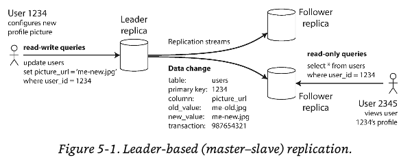
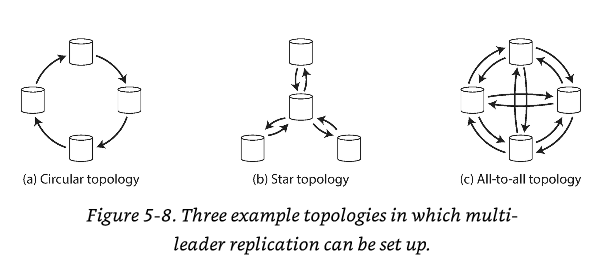

# Chapter 5: Replication


> Replication -> means keeping a copy of the same data on multiple machines that are connected via a network

Why we need replication?
- To keep data geographically closer to the users (reduce latency)
- To allow the system to keep working even if some of its parts have failed
- To scale out the number of machines that can serve read queries

## Leaders and followers
> Replica => Each node that stores a copy of the database is called a **replica**

**Question**: How do we ensure that all the data ends up on all the replicas?
Every write to the DB needs to be processed by every replica, a solution for this is called _leader-based replication_

**How it works?**
- One of the replicas is designed as **Leader**. When clients needs to write to a DB they do it first here
- **Followers** (read replicas, slaves, secondaries or hot standbys) whenever the leader writes to its local storage, it also sends the data change to all of its followers as part of the _replication log_ or _change stream_
- Each **follower** updates its local copy on the same order as the leader
- Writes are only accepted on the leader, while read can happen within the leader or the followers



This functionality is available in several DBs (Postgres, MySQL, Oracle, SQL Sever, MongoDB). However it's not exclusive for dbs. Distributed message brokers (Kafka & RabbitMQ) also use this

## Synchronous vs Asynchronous Replication
The **advantage** of synchronous replication is that the follower is guaranteed to have an up-to-date copy of the data, that is consistent with the leader

The **disadvantage** is that if the synchronous follower does not respond, the write cannot be processed (Leader must wait until follower responds).

In practice we have:
- One leader
- One synchronous follower
- All of others followers as asynchronous

This guarantees that we have an up-to-date copy of the data at least in two nodes.

The **disadvantage** of asynchronous replication is that if the leader **crashes** all the pending writes that have not been replicated, they will be lost.

As **advantage** of asynchronous replication, the leader can continue processing writes even if all of its followers have fallen behind.

## Setting up new followers
Simply copying data file from one node to another is typically not sufficient: _Clients are constantly writing to the DB and the data is always in flux. So a standard file copy would see different parts of the db at different points in time.

> locking the db => making it unavailable for writes.

The process would look like this:
1. Take a consistent snapshot of the leader's database at some point in time
2. Copy the snapshot to the new follower node
3. The follower requests the leader all the data changes that have happened since the snapshot was taken
4. When the follower has processed the backlog of data, it has _caught up_

## Handling nodes outages
Any in the system can go down, perhaps unexpectedly due to a fault, but just as likely due to planned maintenance.

Our goal is to keep the system as a whole running despite individual node failures, and to keep the impact of a node outage as small as possible.

### Follower failure: Catch-up recovery
On its local disk, each follower keeps a log of the data changes it has received from the leader. The follower can recover quite easily from this **log**

Also the follower can request leader the list of changes (diff/delta) from its last fault/restart.

### Leader failure: Failover
If the leader fails, one of the followers needs to be promoted to be a new leader. Then point clients and followers to the new leader. This process is called _failover_

**Automatic failover usually follows these steps:**
1. Determining that the leader has failed - Usually use a timeout.
2. Choosing a new leader. Usually selected by majority or previously elected (controller node). The most suitable candidate for this is the node most up-to-date with the data changes from the old leader.
3. Reconfiguring the system to use the new leader.

**What could go wrong then?**
1. The new leader might be missing some writes from the old leader (usually old leader's writes are discarded)
2. Discarding writes is especially dangerous if other storage systems outside of the DB need to be coordinated with database content.
3. It could happen that two nodes both believe that they are the leader. (split brain)
4. What is the right timeout to declare a leader as _dead_? 

For these reasons, teams prefer to do a **manual** failover instead of an automatic

## Implementation of replication logs
How does leader-based replication work under the hood?

### Statement-based replication
The leader logs every **write request (INSERT, UPDATE, DELETE)** and sends the log to replicas. Thus they use the log to execute write requests as if a client had requested it.

> statement => A write request

**Downsides**:
1. Any nondeterministic function such as `NOW()` or `RAND()`, each replica will have their own value
2. Each statement must be executed in the same order otherwise they may have a different effect.
3. Statements might have side effects (Triggers or Stored procedures) and may result in an undesired outcome in each replica

The most common is that for any _nondeterministic_ value in a statement, the DB will use a row-base replication

### WAL(Write ahead log) Shipping
Usually the leader sends the WAL to replicas. The downside is that WAL contains exact directions or positions in the disk sector. That's why this method is coupled to the DB system.

If the replication protocol does not allow _version mismatch_ then with WAL it will be required a downtime.

### Logical (row-based) log replication
> logical log => Distinguish from storage engine's data representation.

A **logical log** if usually a sequence of records describing writes to the db tables at the granularity of a row
- Insert -> new values of all columns
- Delete -> Contains enough information to uniquely identify the row that was deleted (PK or values of all columns)
- Update -> Contains enough information to uniquely identify the row that was updated

A transaction that modifies several records, creates several **logical logs** and one additional log to state that the transaction was **committed**

Since logical log is decoupled from the storage engine, then it's feasible to have different versions in the leader and the follower.

A logical log format is also easier for external apps to parse.

### Trigger-based replication
Previously mentioned replication approaches are built in the db system. In many cases this is the **best option**

However, an alternative (in relational dbs) is to use _triggers_ and _stored procedures_ and move replication to the application layer.

A trigger lets you register custom application code that automatically is executed when data changes. The trigger has the ability to write in another table, from which the external process will get its input.

Later in the process the external app. will replicate to followers.

This replication style has a greater overhead and it's prune to bugs. But its flexibility is greater as well.

## Problems with replication Lag
Leader-based replication requires all writes to go through a single node, but read-only queries can go to any replica

For workloads with _**High** number of reads and **Small** number of writes_ (common for web applications) there's an attractive option: Distribute read requests across followers (load balance)

This removes the load from the leader and read requests are handled by **nearby replicas**

In _read-scaling_ architectures a synchronous approach would only lead to problems. Its better to use asynchronous approach since delivering the data to replicas would perform better.

> eventual consistency => When the replicas/followers are not _up to date_ but they eventually will catch-up with the leader

The term "eventually" is deliberately vague: in general there is no limit to how far a replica can fall behind. This is also know as **replication lag**

Usually _replication lag_ is 1 or 2 seconds, but when the data gets outdated with a big difference this might be an actual problem

### Reading your own writes
When the data is submitted, it must be sent to the leader, but when the user views the data, it can be read from a follower. (Change your profile picture example)

**Problem**: if the user tries to read from one replica, this could lead to _eventual consistency_ because the replica might not have the change that the user just submitted. How can we help to solve this problem

**Read-after-write** consistency also known as **_read your own writes_** this guarantees that the user will the the latests submitted data, however It cannot guarantee that others users will see the latests.

**How can we implement _read-after-write_ in a system with leader-based replication?**
- Read a user writes, then read from the leader; Otherwise read from a replica (user profile example)
- For apps with lot of editable info, _Time base it_ for 1min read from the leader, after that read it from a replica. Also you could prevent reads from a follower when the replication lag goes beyond 1min
- Use a _logical timestamp_ where the client can remember the timestamp of its most recent write. Avoid reading or wait reading if the replica does not match with the timestamp.
- If your replicas are geographically distributed then route the read to the datacenter that contains the leader.

What about **cross-device** reads? There are additional problems
- Using timestamp would become a trouble! due different devices
- Routing to the same datacenter would be a pain.

### Monotonic reads
> moving backwards in time => effect that the user experiences when reading info from different replicas. They see most updated data and sometimes outdated data. I.E. when the user refreshes the site several times

Its a guarantee that prevents _moving backwards in time_ to happen, its lesser than strong consistency, but a stronger guarantee that eventual consistency

A way to achieve this is to **assign** a read replica to the user, this can be achieved using a hash of the user. If the replica fails it will need to be reassigned.

### Consistent prefix reads
> Violation of causality => The idea that someone answers something before was asked

This guarantee says that if a sequence of writes happens in a certain order, then anyone reading those writes will see them appear in the same order.

This problem is common in `sharded` (partitioned) databases.

One solution to this problem is that any writes that are causally related to each other are written to the same partition. Not something easy to implement.

### Solutions for replication lag
While working with an eventually consistent system, it is worth thinking about how the app behaves if the replication lag increases to several minutes or even hours.

**Important**: _Pretending that replication is synchronous when in fact it is asynchronous is a recipe for problems down the line_ 

Databases abstract the complexity of _do the right thing_ and with **transactions** helps to make the application easier for the developer.

## Multi-leader replication
Although, Single-leader replication is the most common approach, it has one mayor downside... There is only one leader, and all the writes **MUST** got through them

The natural answer for this is a `master-master` also known as `multi-leader` replication. The process remains the same, each node that processes a write must forward that data change to all the other nodes.

> active/active or master/master => Each leader simultaneously act as a leader and follower

### Use cases for Multi-leader replication
**Important**: It rarely makes sense to use multi-leader replication with a single data center. Because the benefits rarely outweigh the added complexity.

#### **Multi-datacenter operation**
With a leader in each datacenter, the replication happens like:
1. Gets writes
2. Propagates to followers
3. Updates other leaders
4. Resolve conflicts


#### **Advantages**
Performance => Removes latency because the "local" datacenter processes the write and then proceeds the replication

Tolerance of datacenter outages => If a datacenter fails, then app can work as normally because each datacenter has its own leader. Avoids a _failover_ procedure

Tolerance of network problems => A temporary network interruption does not prevent writes being processed

#### **Disadvantages**
The same data may be concurrently modified in two different datacenters, and those write conflicts must be resolved.

The consistency between auto-incrementing keys, triggers and integrity constraints can be problematic. 

#### **Clients with offline operation**
Another situation that requires multi-leader replication is where you need your app to continue to work even when offline.

An example of this would be your calendar. It needs to keep a track of your meetings even offline. In this case every device acts as a leader and they act as their own leader(accepts writes) & updates other devices(replication).

The replication lag might be hours or days depends on your network. Basically, each device is a "datacenter" 

#### **Collaborative editing**
When one user edits a document, the changes are instantly applied to their local replica(the state of the document in their web browser or client application) and asynchronously replicated to the server and any other users who are editing the same document


If you want to guarantee no conflicts while editing, then you will need to lock the section of the document before it can edit it.

It would look like this _single leader replication with transactions on the leader_
> ask for edit -> lock -> commit the text -> other user can edit 

### Handling Write Conflicts
The most complex problem with multi-leader replication is that write conflicts can occur, which means that conflict resolution is required. 

**Wiki example: Two users change the title of a page**
> First user changes the title from  { Title: a -> b }
> Second user changes the title from { Title: a -> c }
> There's a conflict!

#### **Synchronous vs asynchronous conflict detection**
In a _single-leader database_, the second writer will either block and wait for the first write to complete, or abort the second write transaction.

Meanwhile, on a _multi-leader setup_ both writes are successful, and the conflict is detected asynchronously in the future.

If you want synchronous conflict detection, then use _single-leader_ don't lose the main advantage of the _multi-leader_ replication setup

#### **Conflict avoidance**
The simplest strategy for dealing with conflicts is to avoid them. If the application can ensure that all writes for a particular record go through the same leader, then conflicts cannot occur!

#### **Converging toward a consistent state**
A single-leader database applies writes in a sequential order. In a multi-leader configuration there's no way to determine which write will be the final result.

If each replica simply applied writes in the order that it saw the writes, the final result between them would be inconsistent. Every replication system must ensure that the data is eventually the same in all replicas.

The database must resolve the conflict in a _convergent_ way

> Convergent => All replicas must arrive at the same final value when all changes have been applied.

**How?** There are options for this issue:
1. Give each write a unique ID (i.e. a timestamp, a long random number, UUID, or a has of the key and value)If a unique ID is provided remember that _Last write wins_. This approach is prone to data loss
2. Give each replica a unique ID, and let writes that originated at a higher-number always take precedence. This is also prone to data loss
3. Somehow merge the values together
4. Save the conflict in a data structure and perhaps ask the user for input.

#### **Custom conflict resolution logic**
Most multi-leader apps let you write code that will help the system handle the conflict. This could be _on read_ or _on write_

### Multi-leader replication topologies
> Replication topology => describes the communication path along which writes are propagated from one node to another

The most common topology is _All-to-All_ which every leader sends its writes to every other leader.

The _star topology_ means that one node is in charge to _forward_ writes to other nodes

The _circular topology_ in each node receives writes from one node and forwards those writes.



In star / circular topologies to prevent infinite replication loop, each node is given a unique identifier, and in the replication log each write is _tagged_ with the identifiers that has gone through

If it was already processed, then ignore it. However, if a node fails can interrupt the replication flow.

**Important** The fault tolerance of a more densely connected topology is better because allows messages to travel along different paths, avoiding a single point of failure.

However, _all-to-all_ replication might have problems too, such an write depends on another write that hasn't arrived yet. This could be due to slower network between replicas.

## Leaderless Replication
Some data storages systems take a different approach, abandoning the concept of a leader and allowing any replica to directly accept writes from clients.

In this type of implementation, the client directly sends its writes to several replicas. In some other implementations, a coordinator node does this on behalf of the client.

The coordinator does not enforce a particular order in writes.

#### **Writing to the database when a node is down**
**failover** configuration does not exists in a leaderless configuration. 

In this type of replication system/architecture, the client sends the write to (i/e) 3 nodes, then 2 nodes respond as `success` but one node is down. 

As consensus, the write is accepted. However if a client reads from the node that just got back it will read a _stale_ version of the code

> stale => outdated

To solve this problem _read requests are also sent to several nodes in parallel_ and evaluate the response based on `Version Numbers`

#### **Read repair and anti-entropy**
The replication system ensure that eventually all the data is copied to every replica. In dynamo-style datastores there are 2 ways to ensure this:

**Read repair*** => When a client finds a _stale_ response, it will update the _stale_ replica with latest version. This approach is good for `frequently read` systems

**Anti-entropy process** => background process that constantly looks for differences in the data between replicas

In systems without `anti-entropy` values that are rarely reads, they don't get updated so often. This reduces durability.

#### **Quorums for reading and writing**
What happens if only one of the replicas accepted the write? How far can we push this?

**Formula**: 
```
r => read nodes
w => writes confirmed
n => number of replicas

w + r > n
# As long as this condition above is accomplish we expect to get an up-to-date value when reading

w +r => the minimum number of votes required for a read or write to be valid. This is called quorum
```

The quorum condition `w + r > n` allows the system to tolerate unavailable nodes as follows

- if `w < n` then we can still process writes if a node is unavailable
- if `r < n` thus we can still process reads if a node is unavailable
- Reads and writes are always sent to all `n` replicas in parallel. The parameters `w` and `r` determine how many nodes we wait for.

**TL;DR** If `w + r > n` at least one of the `r` replicas you read from must have seen the most recent successful write.

If fewer than required _w_ or _r_ nodes are available, writes or reads return an error.

On this situations the only value or matter expected is if the **node returned a successful response** and don't need to distinguish between different kinds of faults

**Remember** even with `w + r > n` there are edge cases where stale values are returned.

**Why this could happen?**
- Sloppy quorums => The `w` writes may end up on different nodes than the `r`
- If two writes occur concurrently and it is not clear which one happened first.
- If a write happens concurrently with a read, the write may be reflected on only some of the replicas.
- If a write succeeded on some replicas but failed on others, and overall succeeded on fewer than `w` replicas, it is not rolled back on replicas where it succeeded 
- If a node carrying a new value fails, and its data is restored from a replica carrying an old value.

Dynamo-style databases are generally optimized for use cases that can tolerate eventual consistency. 

Stronger guarantees generally require transactions or consensus.

#### **Monitoring staleness**
Even if your application can tolerate stale reads, you need to be aware of the health of your replication. If it falls behind significantly, it should alert you so that you can investigate the cause

For leader-base replication systems, some dbs already expose _replication lag_

For leaderless replication system, writes don't have a particular order, which makes monitoring difficult

Eventual consistency is a deliberately vague guarantee, but for operability its important to be able to quantify "eventual"

#### **Sloppy Quorums and hinted handoff**
Databases with appropriately configured quorums can tolerate the failure of individual nodes without the need for failover.

They can also tolerate individual nodes going slow, because requests don't have to wait for all `n` nodes to response. They can return when `w` or `r` nodes have responded.

leaderless replication is quite appealing for _high availability_, _low latency_ & can tolerate occasional stale reads.

**quorums** (as described so far) are not fault-tolerant as they could be.

In large clusters, it's likely that clients can connect to some... database nodes during a network interruption, just not the nodes that needs to assemble a quorum. Then database designers face a trade-off
- Is it better to return errors when no quorum?
- Or we should accept writes anyway? This would mean to write on reachable nodes that could potentially mean the value could reside in another node. This is know as Sloppy quorum

> Sloppy quorum => writes and reads still require w & r successful responses, but those may includes nodes that are not among the designated n "home" nodes for a value

> Hinted handoff => Once the network interruption is fixed, writes that one node temporarily accepted on behalf of another node are sent to the appropriate "home" node.

Sloppy quorums are particularly useful for increasing write availability, as long as _any w_ node is available, the db can accept writes.

A sloppy quorum is only an assurance of durability, namely that the data is stored on `w` nodes somewhere.

#### **Multi-datacenter operation**
leaderless replication is also suitable for multi-datacenter operation, since it is designed to tolerate conflicting concurrent writes, network interruptions & latency spikes

### Detecting concurrent writes
Dynamo-style dbs allow several clients to concurrently write to the same key, that would mean _Conflicts will occur even if strict quorums are used_

The problem is that in this type of architecture, events may arrive in a different order at different nodes, due to variable network delays and partial failures

In order to become eventually consistent, the replicas should converge toward the same value. How do they do that?

#### **Last write wins (discarding concurrent writes)**
One approach for achieving eventual convergence is to declare that each replica need only store the most "recent" value and allow "older" values to be discarded.

This will work if we have a way to determine which value is the most "recent", eventually all replicas will converge.

"Recent" is ambiguous how we determine which write occurred first? We say the writes are concurrent, so their order is undefined

> LWW => last write wins

We can attach a **timestamp** to writes and accept that **LWW** will be the conflict resolution. 

LWW achieves the goal of eventual convergence, but at the cost of **durability**

**Remember** LWW is only a good choice if loosing data is acceptable.

The only safe way of using a db with LWW is to ensure that a key is only written once and thereafter treated as immutable, thus avoiding any concurrent updates to the same key.

#### **The happens-before" relationship and concurrency**
How do we decide whether two operations are concurrent or not?
_An operation "A" that happens before another operation "B" knows about "A", or depends on "A", or builds upon "A" in someway_

Whether one operation happens before another operation is the key to defining what **concurrency** means

> Concurrent operations => If neither happens before the other (neither knows about the other). Operations that are unaware of each other

If one operation happened before another, the later operation should overwrite the earlier operation, but if the operations are concurrent, we have a conflict that needs to be resolved.

#### **Capturing the happens-before relationship**
A server can determine whether two operations are concurrent by looking at the version numbers, it does not need to interpret the value itself.

1. The server maintains a version number for every key, increments the version number every time that key is written, and stores the new version number along with the value written

2. When a client reads a key, the server returns all the values that have not been overwritten, as well as the latest version number. A client must read a key before writing

3. When a client writes a key, it must include the version number from the prior read, and it must merge together all the values that it received in the prior read.

4. When the server receives a write with a particular version number, it can overwrite all values with that version number or below but it must keep all the values with a higher version number (concurrent with incoming write)


#### **Merge concurrently written values**
This algorithm ensures that no data is silently dropped, but unfortunately requires that the clients do some extra work: _If several operations happen concurrently, clients have to clean up afterward by merging the concurrently written values_

A reasonable approach to merge siblings is to just take the **union** of the elements (only for adds, for deletes this could lead to problems)

For deletion, use tombstones

> tombstone => Leave a mark on the item, so system knows that it was removed.

This process is prune to errors and bugs.

#### **Version vectors**
With leaderless replication, we need _version number per replica_

Each replica increments its own version number when processing a write, and also keeps track of the version numbers it has seen from each of the other replicas.

This information indicates which values to overwrite and which values to keep as siblings

> version vector => collection of the version numbers from all the replicas

Version vectors are sent from the db replicas to clients when values are read, and need to be sent back to the db when a value is subsequently written.

**Important** The version vector allows the db to distinguish from overwrites and concurrent writes. The version vector structure ensures that it is safe to read from one replica and subsequently write back to another replica.

## Summary
> High availability => Keep the system running, even when one machine (or several) goes down

> Disconnected operation => Allowing an application to continue working when there's a network interruption

> Latency => Placing data geographically close to the users, so that users can interact with it faster

> Scalability => Being able to handle a higher volume of reads that a single machine could handle, by performing reads on replicas

> Replication goal => Keeping a copy of the same data on several machines

Replication is a complex problem, at minimum we need to deal with unavailable nodes and network interruptions

> Single-leader => Client sends all the writes to a single node(leader). which sends a stream of data change events to the other replicas(followers). Reads can be from any replica but reads from followers might be stale

> Multi-leader => Clients send each write to one of several leader nodes, any of which can accept writes. The leaders sends streams of data change events to each other and to any follower nodes.

> Leaderless => Client sends each write to several nodes, and read from several nodes in parallel in order to detect and correct nodes with stale data.

Each type of replication has trade-offs
1. Single-Leader:
    - Easy & popular
    - No conflict resolution

2. Multi-leader & leaderless
    - Robust in the presence of faulty nodes, network interruptions & latency spikes
    - Harder to reason about
    - Very weak consistency guarantees

Replication can be **Synchronous** or **Asynchronous**

> Asynchronous => Fast when system is running smoothly. But think through when replication lag increases and servers fail. If leader fails promote a follower. Recently committed data might be lost

Consistency models against replication lag

> Read after write consistency => Users should always see data they submitted themselves

> Monotonic reads => After a users have seen data at one point in time, they shouldn't see the data from some earlier point in time

> Consistent prefix reads => Users should see data that makes causal sense. (Order of causality)