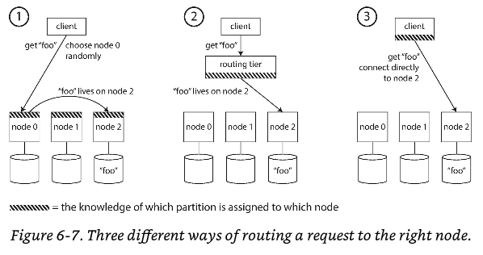

# Chapter 6: Partitioning


_Clearly, we must break away from the sequential and not limit computers. We must state definitions and provide for priorities and descriptions of the data._

_We must state relationships, not procedures_

> replication => Having multiple copies of the same data on different nodes.

**Replication** is not sufficient for systems with **very large datasets** or **very high query throughput**

We need to break the dataset in **partitions** also known as _sharding_

Partitions are defined in a way that each **piece of data** (row / document) **belongs** to exactly **one partition**

Each partition (in effect) is a small database of its own.

**Important** The problem that partition solves is: _Scalability_

Different partitions can be placed in a _shared-nothing_ cluster. 

Thus a large dataset can be distributed across many disks, and the query load can be distributed across many processors

## Partitioning and Replication
Partitioning is usually combined with replication so that copies of each partition are stored on multiple nodes.

This helps with fault tolerance.

**Important** A node may store more than one partition


## Partitioning of Key-Value Data
How do you decide which records to store on which nodes?

Our goal with partitioning is to spread the data and the query load evenly across nodes.

> Skewed => If the partitioning is unfair, so that some partitions have more data or queries than others.

You can partition using:
- Even configuration
- _Skewed_ configuration (less effective)

> Hot spot => A partition with disproportionately high load.

A way to distribute data is using _random_ the big disadvantage is that you don't know where the data you want is, thus you have to query all nodes in parallel.

So what to do?

### Partitioning by Key Range
One way of partitioning is to assign a continuous range of keys (Dictionary Style)

If you know the boundaries of each node, you can easily determine which partition contains a given key.

**Important** The ranges of keys are not necessarily evenly spaced, because your data may not be evenly distributed.

In order to distribute the data evenly, the partition boundaries need to adapt to the data.

We could try to adapt **SSTables** and **LSM-Trees** for the partitioned keys in the nodes

> Remember => LSM is Log Structured Merge

This has the advantage of **Range scans are easy**, and as a disadvantage is that certain access patterns could lead to _hot spots_

### Partitioning by Hash of Key
A good hash function takes skewed data and makes it uniformly distributed.

This is a common approach to avoid _hot spots_ and _skewed data_

Many programming languages have `hashing` functions, however, examples like Java or Ruby might not be suitable for partitioning purposes.

**Why?** They might give you a different hash because of the `pid`

Hashing will evenly distribute the values from 0 to `(2^32) - 1` and with this you can assign each partition a range of hashes, rather than a range of keys

> Consistent hashing => Hashing is good at distributing keys fairly among the partitions. Boundaries can be evenly spaced, or they can be chosen pseudorandomly.

With `Hash partitioning` we lose the good performance of range queries. **Keys** that were not adjacent are not scattered across all the partitions

> Compound primary key => Several columns. Only the first part of the key is hashed to determine the partition, but the other columns are used as a concatenated index for sorting the data.

The concatenated index approach enables an elegant data model for `one-to-many` relationships.

### Skewed Workloads and Relieving Hot Spots
Hashing a key to determine its partition can help reduce hot spots. However, it can't avoid them entirely

**Why?** Hashing has collisions!

Today, most data systems are not able to automatically compensate for a high skewed workload, so it's the responsibility of the app to reduce the skew.

**Example**: If one key is known to be very hot add a `random` number to the beginning or end of the key.

As well for reads you will need to **join** the data from different partitions.

Remember that this technique is only for hot spots, not for normal partitions since requires additional _bookkeeping_ and keep a track of which keys are being split.

## Partitioning and Secondary Indexes
A secondary index usually doesn't identify a record uniquely but rather is a way of searching for occurrences of a particular value.

Secondary indexes are common in document databases as well as relational DBs

For partitioning, secondary indexes represent **an extra complexity**. The problem is that they don't map neatly to partition

### Partitioning Secondary Indexes by Document
If you have declared a secondary index, and you want to insert an element to the DB you can perform the indexing automatically. (Red car example)


In this indexing approach each partition will have **it's own secondary indexes**.

> Local index => Whenever you write to the db, you only need to deal with the partition that contains the document ID that you are writing.

**Important** Reading from a document-partitioned index requires care. Since not all documents IDs will be in same partition.

> Scatter / gather => Read from all partitions and combine all the results you get back

Even is you query the partitions in parallel, `scatter/gather` is prone to `tail latency amplification` (percentiles)

### Partitioning Secondary Indexes by Term
Rather than each partition having its own _local index_, we can construct a _global index_ that covers data in all partitions.

A global index must also be partitioned!

> term partitioned => Because the therm we're looking for determines the partition of the index.

The name `term` comes from full-text indexes, where the terms are all the words that occur in a document.

Same as partitioning techniques we can use `the term itself` or `hashes` with the same goods and bad
- Term itself => Range lookups
- Hashes => more even distributed loads

The advantage or a global (term-partitioned) index over a document partitioned index is that it can make reads more efficient. Rather than doing `scatter/gather` a client only needs to make a request to the partition containing the term it wants.

As a disadvantage, writes are slower and more complicated, because a write to a single document may affect multiple partitions of the index. Basically we need to update the index in the different partitions

Updates to global secondary indexes are often async, that means that if you read shortly after a write, the change you just made may not yet be reflected in the index.

## Rebalancing Partitions
Over time, things change in a database
- The query throughput increases. Thus the need for more CPUs to handle the new load
- The dataset size increases, so you want more disks and RAM
- A machine fails, and other machines need to take over.

> Rebalancing => The process of moving load from one node in the cluster to another.

Rebalancing minimum requirements:
- After rebalancing, the load (data storage, reads and writes) should be shared fairly between the nodes of the cluster
- While rebalancing, the db should continue accepting reads & writes
- No more data than necessary should be moved between nodes, to make rebalancing fast and minimize the network and I/O load.

### Strategies for Rebalancing
#### How not to do it: hash mod N
With hashing we need to do something like:
```
  if 0 <= hash(key) < b0
  if b0 M= hash(key) < b1
  ... # and so on
```

With previous formula we can infer that: `hash(key) mod N`, would return the numbers of the partitions. For example `hash(key) mod N` would return from 0 to 10

The problem with `mod N` is that if the number of N changes, most of the keys will need to be moved from one node to another. Making rebalancing excessively expensive.

This is not a suitable solution and we need a solution that doesn't move data around more than necessary.

#### Fixed number of partitions
There's a fairly simple solution for this. Create many more partitions than there are nodes. Each node will contain several partitions assigned.

If a node is added to the cluster, new node can steal a few partitions from every existing node until partitions are fairly distributed. 

If the node is removed, then the process is inverted.


**Important** Only entire partitions are moved between nodes. The number of partitions does not change, nor does the assignment of the keys to partitions.

The only change is the assignment of partitions to nodes. Which is not immediate, so old assignment of partitions is used for reads and writes while transfer is in progress

Its common for this type of configuration to use a **fixed partitions**, which is operationally simpler.

**Remember** To accommodate the nodes as a high number otherwise cannot be changed in the future.

If partitions are large, then recovery and rebalancing is expensive!

If partitions are too small, they incur too much overhead!

Just right number of nodes, neither too big nor too small.

#### Dynamic Partitioning
When a partition grows to exceed a configured size, it is split into two partitions so that approximately half of the data ends up on each side of the split.

Conversely, if lots of data is deleted and a partition shrinks below some threshold, it can be merged with an adjacent partition.

Each partition has a node. A Node can handle several partitions.

As an advantage of **dynamic partitioning** is that the number of partitions adapts to the total data volume.

As a caveat is that an empty db starts with a **single partition** so then it creates a bottleneck. This can be solved with _pre-splitting_

#### Partitioning proportionally to nodes
With dynamic partitioning, the number of partitions is proportional to the size of the dataset (min-max)

With a fixed number of partitions the size of each partition is proportional to the size of the dataset.

A third option is to make the number of partitions proportional to the number of nodes, in other words, to have a fixed number of partitions _per node_

In this case the size of the partition grows proportionally to the dataset size while the number of nodes remains unchanged, but when you increase the number of nodes, the partitions become smaller again.

### Operations: Automatic or Manual Rebalancing
Does the rebalancing happens manually or automatically?

There's a gradient between full automatic rebalancing to manual rebalancing

Fully automated rebalancing can be convenient, because there's less operational work to do for normal maintenance.

However, it can be unpredictable.

> Rebalancing => Expensive operation, requires rerouting requests and moving a large amount of data from one node to another.

If rebalancing is not done carefully, it can overload the network or the nodes and harm the performance. It's good to have a human in the loop to prevent operational surprises

## Request Routing
When a client wants to make a request, how does it know which node to connect to?

As partitions are rebalanced, the assignment of partitions to nodes changes. To solve this problem you can use _service-discovery_ approach

1. Allow clients to contact any node (e.g via round-robin load balancer). If the node can handle the request, it will take it, otherwise it will forward it, then will forward the answer to the client.

2. Partition-aware balancer, acts as a router but does not process the request by itself

3. Clients aware to the node they want to access.



How does the component making the routing decision learn about the changes in the assignment of partitions to nodes?

There a third actor (such as ZooKeeper) which maintains the authoritative mapping of partitions to nodes. 
- Each node registers to ZooKeeper.
- Each client subscribes to ZooKeeper.

Zookeeper notifies of any change in the routing.

> Gossip Protocol => Requests can be sent to any node, and that node forwards them to appropriate node for the request partition.

Another option is **_gossip protocol_** among the nodes to disseminate any changes in the cluster state

### Parallel query execution
> MPP => Massive parallel processing

MPP is often used by analytics and are more sophisticated in the types of queries they support

The MPP query optimizer breaks complexity of filtering, grouping, and aggregation operations into a number of execution stages and partitions, many of them can be executed in parallel within the nodes.

## Summary

### Partitioning
- **Partitioning** => Dive large data sets into smaller subsets
- Partitioning is necessary when you so much data that storing and processing on a single machine is no longer feasible
- The goal of partitioning is to spread the data and query load evenly across multiple machines
- Also avoid hot spots!
- **Hot Spot** => Nodes with disproportionately high load

### Keys
- **Key range partitioning** => where keys are sorted and partitions owns a _range_ of the keys. In this approach we could have _hot spots_, good _range queries_ & requires _dynamical rebalancing_
- **Hash partitioning** => Where the hash is applied to the key, and each partition owns a range of hashes. You loose _range queries_ but distributed more evenly. Its common to use _fixed number of partitions in advance. Dynamic partitioning can be used as well
- **Compound key** => Using one part of the key to identify the partition and another part for the sort order.

### Secondary Indexes
- **Document-partitioned indexes(local indexes)** => Where the secondary indexes are stored in the same partition. Only the affected partition needs to be updated when a write happens, and for reads we would need a join (scatter/gather)
- **Term-partitioned indexes(global indexes)** => Where secondary indexes are partitioned separately, using the indexed values. When a write happens the global index needs to be updated along with replicas but you can read from one point.

By design, every partition operates mostly independently, that's what allows a partitioned db to scale to multiple machines.
