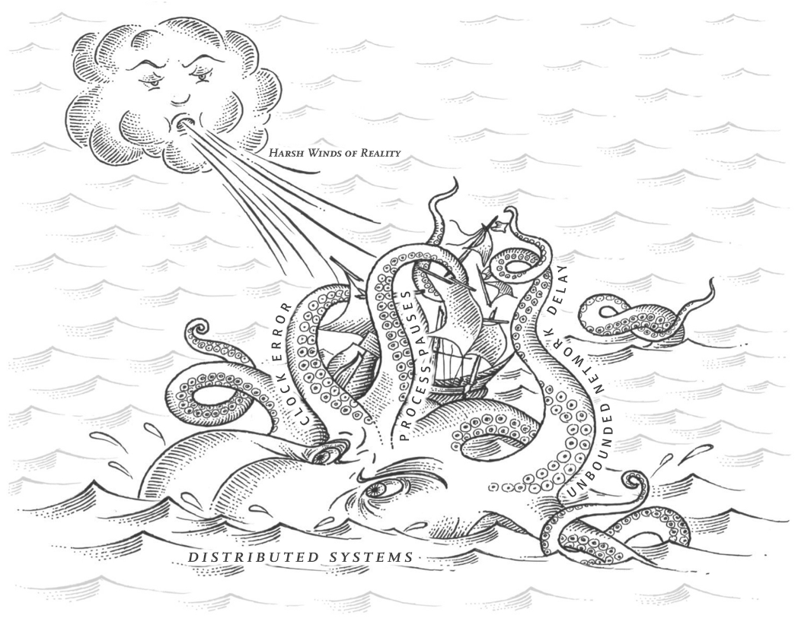

# Chapter 8: The trouble with Distributed Systems

_In the end, our task as engineers is to build systems that do their job_

## Faults and Partial failures
When writing a program on a single computer, it normally behaves in a fairly predictable way: _either it works or it doesn't_

Having to reboot a system alleviates temporarily an issue, but not the root cause. 

Having to reboot is a consequence of badly written software.

> Deterministic => When the hardware is working correctly, then it an operation produces the same result.

A choice in the design of computer: _If an internal fault occurs, we prefer a computer to crash completely, rather than returning a wrong result, because wrong results are difficult to deal with_

When you are writing software that runs on several computers, connected by a network, the situation is fundamentally different.

With distributed systems, we have to face the reality and how things can and will go wrong.

> Partial Failure => Some parts of the system are broken, even though other parts of the system are working fine.

The difficult part of a _partial failure_ is that they are _nondeterministic_

The nondeterminism and possibility of partial failures is what makes distributed systems hard to work with.

### Cloud computing and supercomputing
> HPC => High performance computing

**Supercomputers** are usually like a single-node computers. If something fails, then the whole system stops and then resumes once the problem is repaired

On the other hand **Cloud computing** is often associated with: _multi-tenant_, _datacenters_ _commodity computers connected with an IP network_, _elastic/on-demand resource allocation, and _metered billing_

Many internet-related applications are _online_, in the sense that they need to be able to serve users with low latency at any time. Making the service unavailable is not acceptable.

Nodes in cloud services are built from **commodity** machines, which can provide equivalent performance at lower cost.

**Important** The bigger a system gets, the more likely it is that one of its components is broken. 

In large systems, it is reasonable to assume that something is always broken.

The **goal** is to create system that can tolerate failed nodes and still keep working as a whole.

> Geographically distributed deployment => Keeping data geographically close to your users to reduce access latency.

In geographically distributed deployment, communication most likely goes over the internet, which is slow and unreliable (compared with local network).

If we want to make distributed system works, we need to **be in peace with the possibility of partial failure** and build fault-tolerance mechanisms into the software.

**Important** We need to build reliable systems from unreliable components

**Fault handling** must be part of the software design, and we need to **know what behavior to expect** from the software in the case of a **fault**.

Consider a wide range of faults, then artificially create them in our environments. We need to be able to understand how the system will behave in these **faulty scenarios**

_In distributed systems, suspicion, pessimism, and paranoia pay off_

In **Asynchronous packet networks** one node can send a message to another node, but the network gives no guarantee as to when it will arrive or whether it will arrive at all

What could go wrong while sending a message over the network?
- Your request gets lost
- Your request gets into a queue and will be resolved later.
- The remote node failed
- The remote node temporary stopped responding
- The remote node processed your request, but the response got lost 

The sender can't even differentiate between, an error, failure or if the response was lost.

The usual way to handle this is via a _timeout_ and assume that the response is not going to arrive.

#### **Network faults in practice**
No body is immune to network problems!

> Network partition => When one part of the network is cut off from the rest due to a network fault.

Even if network faults are not common in your environment, that doesn't exclude the responsibility of your code performing well under a network fault.

If the error handling of a network fault is not defined and tested, arbitrarily bad things could happen.

Handling network faults does not necessarily mean _tolerate them_

**Important** You do need to know how your software reacts to network problems and ensure that the system can recover from them

#### **Detecting faults**
Many systems need to automatically detect faulty nodes. Example: a load balancer needs to redirect the traffic

There are some clues on how to track if a node is down:
- You can connect to the node, but the destination port is off
- A script can notify if any crash has happened
- Hardware level check
- Unaccessible node

Still, rapid feedback is quite useful, however, it is 100% accurate

## Unreliable Networks
Why are we using **Shared-nothing Systems**?
- Cheap, because does not require specialized software
- It can make use of commoditized cloud computing services
- It can achieve high reliability through redundancy across multiple geographically distributed datacenters

### Timeouts and Unbounded Delays
A long timeout means a long wait until declare a node dead.

A short timeout detects faults faster, but carries a higher risk of incorrectly declaring a node dead.

When a node is declared dead prematurely, it can become a problem, because another node needs to take over the dead node. Even can re-process the same task.

If the system is already struggling with high load, declaring nodes dead prematurely can make the problem worse.

A reasonable amount of time would be `timeout = 2d + r`
> d => Maximum delay for packets, delivery never takes longer than d

> r => time for a node to deliver a response

Unfortunately this is not 100% trustworthy. Because asynchronous systems might have network _unbounded delays_

If your timeout is low, it only takes a transient spike in round-trip times to throw the system off-balance.

#### **Network congestion and queueing**
**Network Congestion** is that if several different nodes simultaneously try to send packets to the same destination, the network switch must queue them up, then feed them into the destination, **one by one**. 

On a busy network, a request might have to wait until a node is clear. 

If the network queue is full, some packages might even get drop.

Another issue might that the destination machine's CPU might be full, meaning that the request will be queued. Depending on the load on the machine, this may take an arbitrary length of time.

And last but not least, on virtualized environments, are often paused while other machine uses de CPU core.

> TCP Flow control / Backpressure => Limit the rate of request sending on a node, to avoid overloading the network.

TCP considers a packet to be lost if its now acknowledge within some timeout. Lost packets are retransmitted automatically

Although, the app does not _see_ the `packet loss and retransmit`, it suffers the resulting delay. 

Queueing delays have an specially wide range when a system is close to its maximum capacity: _A system with a plenty of spare capacity can easily drain queues, whereas in a busy system, long queues can build up VERY QUICKLY_

On cloud computing environments, you can only choose timeouts **experimentally**; Measure the distribution of network round-trip times over an extended period, and over many machines to determine the expected variability of delays.

### Synchronous vs Asynchronous Networks
Distributed systems would be a lot simpler if we could rely on the network to deliver packets with some fixed maximum delay, and not drop packets.

> Synchronous => even as data passes through several routers, it does not suffer from queueing. On synchronous calls, a circuit is reserved from the beginning, from end to end. Nobody else can use this channel.

> Bounded delay => When the maximum end-to-end latency of the network is fixed

On TCP, the packets transmitted use the network bandwidth opportunistically. While TPC is idle, does not use any bandwidth.

Ethernet and IP are packet-switched protocols, this means that suffer from queueing and thus varying delays in the network. These protocols does not have a concept of a circuit

**Important** On audio or video calls, we have a expected rate of bytes to transmit. So we can create a circuit. While on TCP, its optimized for bursty traffic. This means that requesting a web, sending an email, or transferring a file does not have any particular bandwidth requirement.

**Important** On TCP, we just to complete the request as quickly as possible

The internet shares network bandwidth _dynamically_, this approach has the downside of queueing but the advantage is that it maximizes utilization of the wire.

## Unreliable Clocks
Clocks and time are important. Apps depend on clocks in various ways to answer questions like:
- Has the request timed out yet?
- What's the  99th percentile response time of this service?
- How many queries per second did  this  service handle on average?
- How long did the user spend on our site?
- When was this article published?
- When does this cache entry expire?

In distributed system, time is a tricky business, because communication is not instantaneous.
- It takes time for a message to travel to the destiny
- We do not know how much delay exists between sender and receiver

**Important** This is why is difficult to determine the  order in which things happened when multiple machines are involved

In distributed systems, each machine has its own clock. It is possible (to certain degree) to synchronize different clocks via NTP.

Nowadays computers have 2 types of clocks:
- Time of the day clock
- Monotonic clock

### Monotonic vs Time-of-day clocks
Most of modern computers have 2 types of clocks: `time-of-day` & `monotonic`

#### **Time of day clock**
It returns date and time accordingly to some calendar

Usually synchronized with NTP

#### **Monotonic clock**
Suitable for **measuring a duration**, such as timeouts or service response

They have two values something likes `start/end`

The difference between `start & end` tells you how much time have elapsed between the two checks.

**Important** The absolute value of the clock is meaningless. It makes no sense to compare monotonic clock values from 2 different computers. Basically, they don't mean the same thing.

> Slewing the clock => NTP may adjust the frequency at which the monotonic clock moves forward. If it detects that the computer's local quarts is moving faster or slower than the NTP server.

On most systems monotonic clocks can measure time intervals in microseconds or less.

Using monotonic clocks in a distributed system is usually good. Mostly, because it does not assume any synchronization between different node's clocks and its not sensitive to slight inaccuracies of measurement

### Clock Synchronization and accuracy
- Monotonic -> Does not need synchronization
- Time-of-day -> requires sync with NTP

**Important** computer clocks are not reliable because..
- Quarts can _drift_ (run faster or slower)
- If a clock differs too much, NTP refuses to sync
- By misconfiguration, you can block NTP synchronization
- Network delays
- NTP might be wrong or misconfigured!
- Leap seconds result in an inaccurate minute (59s or 61s)
- Virtual machines virtualize the hardware clock. Pauses to use the CPU between virtual machines
- Devices that have manually changed their time

If you need accuracy (for example financial markets) you can use `PTP` **Precision Time Protocol** which depends on GPS receivers. However, it requires expertise and significant effort

### Relying on Synchronized clocks
The main problem on clocks is that they look simple and reliable. However, they have plenty of pitfalls.
- A day might not have exactly 86,400s
- time-of-day may move backward in time
- Difference between clock nodes

**Important** Although clocks work quite well most of the time, robust software needs to be prepared to deal with incorrect clocks.

Part of the problem is that incorrect clocks easily go unnoticed. 

**Important** If some piece of the software is relying on an accurately synchronized clock, the result is more likely to be silent and subtle data loss than a dramatic crash.

If your software needs to trust in clocks, it's important to monitor the clock offsets. Any node that drift too much from others, then it should be declared as dead and removed from the cluster

#### **Timestamps for ordering events**
The common solution for conflicts is: **Last Write Wins (LWW)** for leaderless and multi-leader
- One big problem of this approach is that a lagging clock is unable to overwrite values previously written by a node with a fast clock until the clock skew between them has elapsed.
- This scenario cannot distinguish between writes that occurred sequentially. 
- Causality problems require version vectors
- Situations where 2 nodes generate an update with the same 2 time stamps.

Even, when the easiest way to solve conflicts is just depend **_on the most recent_** write, there's a subtle situation with the question... What's the most recent? It will depend on _time-of-day_ which might be incorrect.

NTP's synchronization is limited by the network round-trip time, in addition to other sources of errors (such as quartz drift)

But then, what other option do we have? **Logical Clocks**

They (logical clocks) are based on incrementing counters rather than an oscillating quartz.

**Logical clocks do not measure the time of the day or the number of seconds elapsed**, only the relative ordering of events.

_time-of-day_ & _monotonic_ clocks are also known as **physical clocks**

#### **Clock readings have a confidence interval**
Think of reading a **physical clock** not as a _point of time_ due delays it would be more accurate to think of it as a _range of times_ within an **confidence interval**

Example: A system may be 95% confident that the time now is between 10.3 & 10.5

Unfortunately, its quite complicated to calculate that 5% of uncertainty and most of the clocks do not expose this value.

#### **Synchronized clocks for global snapshots**
The most common implementation of **snapshot isolation** requires a monotonically increasing transaction ID.

**Remember** if a write happened later than the snapshot, that write is **invisible**

For this situation, the transaction ID must reflect **causality** (What happened first! T(B) > T(A)). Otherwise the snapshot would not be **consistent**

In a distributed system the creation of _transaction ids_ may become a bottleneck!

### Process Pauses
Process pauses are common nowadays. For example
- Many programming languages have a garbage collector (GGC) that occasionally needs to stop all running threads. They are also known as _stop-the-world_ GC pauses and may last for several minutes
- Virtual machines can be `suspended` & `resumed`. This pause can occur at any time in a process's execution and can last for an arbitrary length of time.
- In laptops, a process may be suspended and resumed arbitrarily due to the **close of the lid**
- A OS switches context, causing a pause
- A thread might be paused waiting for a slow disk I/O operation to complete
- if the operating system allows: _swapping to disk_ (_paging_)
- Manually stopping the process using `SIGSTOP` in unix

**Important** You cannot assume anything about timing, because arbitrary context switches and parallelism may occur

A node in a distributed system must assume that its execution can be paused for a significant length of time at any point, even in the middle of a function.

#### **Response time guarantees**
**Hard real time systems** such as control aircraft, rockets, robots, cars and other physical objects that must respond quickly and predictable to their sensor input.

In _hard real time systems_ there's a **deadline** by which the software must respond; if it doesn't that may cause a failure of the entire system.

Providing real-time guarantees in a system requires support from all levels of the software stack: A real-time operating system or **RTOS**

> Real time != High performance

For most server-side data processing systems, real-time guarantees are simply not economical or appropriate. That's why, these system must accept that there are pauses or clock instability.

#### **Limiting the impact of garbage collection**
Coding languages sometimes have some flexibility around when they schedule garbage collections.

**Important** The idea behind it would be to **treat GC pauses as something planned**, so the systems knows ahead when a node is going to be out or not available. Then the system can **rebalance** using other nodes.

Another approach is to use GC only for shot-lived objects and restart the process often, before they start to cumulate long-lived objects that require a full GC.

## Knowledge, Truth and Lies
So far we have talked about the differences from distributed systems and programs that run in a single computer.
- There's no shared memory
- Messages are passed through an unreliable network with delays
- There are processing pauses
- Unreliable clocks

**Important** A Node in the network cannot know anything for sure; It can only make guesses based on the messages it receives (or doesn't receive) via network

> In a distributed systems, we can state assumptions about the behavior (_System model_) and design the actual system in such a way that it meets those assumptions.

### The truth is defined by the majority
A distributed system cannot exclusively rely on a single node, because a node may fail at any time, potentially leaving the system stuck and unable to recover.

Instead, many distributed systems rely on a **quorum** voting among the nodes

#### **The leader and the lock**
Even if a node believes that it is "the chosen one", that does not ensure that other nodes agree.

Distributed systems need to be carefully design thinking about these problems.

#### **Fencing Tokens**
Via _fencing_ we can ensure that the lock/lease is still valid. However, we need to have a mechanism that validates that the _token_ is still valid.

Clients are not trustworthy to validate their own _token_.

**Important** It is **unwise** for a service to assume that its clients will always be well behaved. Thus, its a good idea for any service to protect itself from accidentally abusive clients.

### Byzantine faults
**Fencing tokens** can detect and block a node that is _inadvertently_ acting in error. But what happens when the node deliberately **wants to break the rules**

Distributed systems problem become much harder if there is a risk that nodes may **lie**

> Lie => send arbitrary faulty or corrupted responses

These type of problems are known as _Byzantine faults_

A system is **Byzantine fault tolerant** if it continues to operate correctly even if some of the nodes are malfunctioning and not obeying the protocol, or if malicious attackers are interfering with the network.

Where do you need to be Byzantine fault tolerant?
- In aerospace environments
- In a system with multiple participating organizations.

Web systems typically do not use Byzantine fault-tolerant protocols, but simply make the server the authority on deciding what client behavior is and isn't allowed.

If an attacker can compromise one node, they can probably compromise all of them, because they are probably running the same software. Thus traditional mechanisms continue to be the main protection against attackers.
- Authentication
- Access Control
- Encryption
- Firewalls
- and so on

#### Weak forms of lying
Although, we assume that nodes are generally honest, it can be worth adding mechanisms to software that guard against weak forms of lying

For example: _invalid messages due to hardware issues_, _software bugs_ & _misconfiguration_

What can we do for these issues?
- Checksums of network packages at TCP / UDP level. Also if possible add them at application level
- Public apps must sanitize user inputs
- Use multiple NTP servers

### System Model and Reality
For an algorithm (distributed apps) to be adequate, it needs to be written in a way that does not depend too heavily on the details of the hardware and software configuration on which they run.

Thus, we somehow need to formalize the kind of faults that we expect to happen in the system.

We do this definition via: **System Models**.

#### **System Models Time Guarantees**
**Synchronous Model** => Assumes bounded network delay, bounded process pauses and bounded clock error. It assumes a expected delay on clock, network and pauses, which might not be realistic

**Partially Synchronous Model** => Behaves like a Synchronous model... most of the time! This is a realistic model for most of the systems.

**Asynchronous model** => It is not allowed to make any timing assumption. In fact, it does not even have a clock

#### **System Models Node Failure Guarantees**
Three most common are:

**Crash-stop faults** => Assumes that a node can fail only in one way... _CRASHING_ The node never comes back.

**Crash-recovery faults** => Assumes that a node can crash at any moment, and perhaps start responding again after some _unknown_ time. Non volatile storage is safe but memory storage is lost

**Byzantine(arbitrary) faults** => Nodes become the Joker and can do anything good or bad. Chaos reigns!

#### **Correctness of an algorithm**
To define what it means for an algorithm to be correct, we can describe its properties. 

We can write down the properties we want of a distributed algorithm to define what it means to be correct

An algorithm is correct in some system model if it always satisfies its properties in all situations that we assume may occur in that system model.

#### Safety and liveness
There's a small & informal classification for properties, **Liveness** and **Safety**

**Liveness** refers to **eventuality** such as us, living in this earth may be temporary

Meanwhile, **Safety** can be defined as _Nothing bad happens_

**Safety** => If a safety property is violated, then we can point at a particular point in time at which it was broken. Once its violated, the damage is already done.

**Liveness** => It may not hold at some point in time.

Liveness and Safety help us to deal with difficult. Safety properties needs to be **ALWAYS** hold. With Liveness we are allowed to have some caveats 

#### **Mapping System Model to real life**
**Remember** A System model is just a simplified abstraction of reality.

Proving an algorithm correct does not mean its implementation on a real system will be necessarily always behave correctly. But it's always a very good first step!

## Summary
In this chapter we have discussed a wide range of problems that might occur in distributed systems, including:
- Network delays while sending a packet over the network
- Node clock out of sync
- The danger of processes pauses

The fact that such partial failures can occur is the defining characteristic of distributed systems.

**Important** We try to build tolerance of partial failures into software, so that the system as a whole may continue functioning even when some of its constituent parts are broken

To tolerate faults, the first step is: _Detect Them_. Although, most of the systems don't have an accurate mechanism of detecting whether a node has failed.

Most distributed algorithms rely on **Timeouts**.

However, timeouts cannot distinguish between a failure or a delay in the network.

Nodes depend on _quorum_ protocol to agree on something.

**Important** If you can avoid opening Pandora's box and simply keep things on a single machine, it is generally worth doing so

As discussed in this chapter, scalability is not the only reason for wanting to use a distributed system. Fault tolerance and low latency(Placing data close to customers) are other reasons too.

## Concepts
**Partial Failure** => Some parts of the system are broken, even though other parts of the system are working fine.

**Geographically distributed deployment** => Keeping data geographically close to your users to reduce access latency.

**Shared-nothing System** => The network is the only thing that communicate them. 

**Unbounded delay** => System tries to deliver packets as quickly as possible, but there's no upper limit on the time it may take for a packet to arrive

**Synchronous** => even as data passes through several routers, it does not suffer from queueing. On synchronous calls, a circuit is reserved from the beginning, from end to end.

**NTP** => Network Time Protocol

**Smearing** => The best way of handling leap seconds may be to make NTP servers "lie", by performing the leap second adjustment gradually over the course of the day.

**Fencing** => A technique that ensures that the lock or lease is still valid. It does through a special key that increments every time a lock/lease is granted.

**System model** => It's an abstraction that describes what things an algorithm may assume