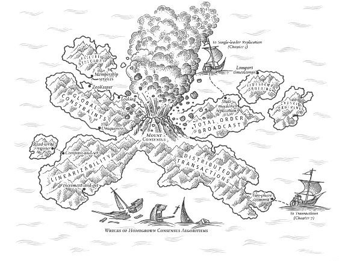
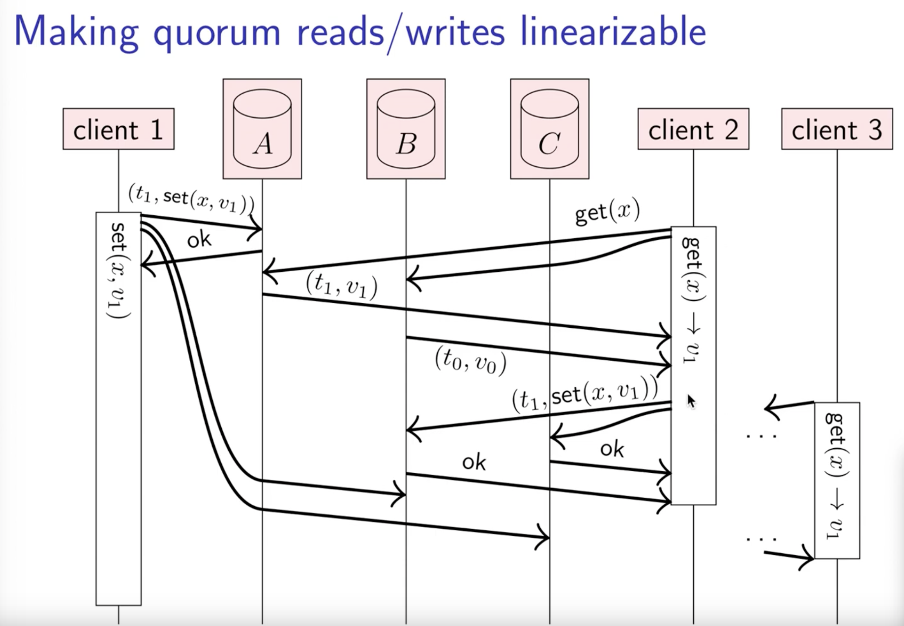
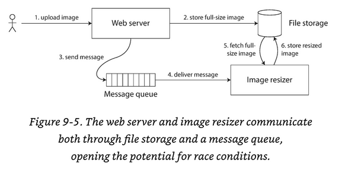
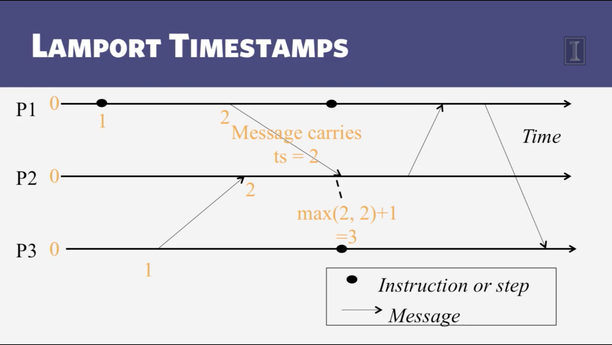

# Chapter 9: Consistency and Consensus

_Is it better to be alive and wrong or right and dead>_

Lot of things can go wrong. The simplest way of handling such faults is to simply let the entire service fail, and show the user an error message.

If just an error it's not a good solution, then we need to find ways of tolerating faults.

> Tolerating faults => Keeping the service functioning correctly even if some internal component is faulty

The best way of building fault-tolerant systems is to find some **general-purpose abstractions with useful guarantees**, implement them once, and then **let applications rely on those guarantees**

This is the same approach as transactions:

> Atomicity -> Pretend that there are no crashes

> Isolation -> Nobody else is concurrently accessing the db

> Durability -> That storage devices are completely reliable

**Transaction** abstraction hides those problems so that the application doesn't need to worry about them.

**Remember** Seek abstractions that can allow an application to ignore some of the problems with distributed systems

**Important** In some situations, it's possible for the system to tolerate faults and continue working; In other situations that is not possible.

## Consistency Guarantees
> Replication lag: if you look at 2 database nodes at the same moment in time, you're likely to see different data on the two nodes, **because write requests arrive on different nodes at different times**

Most replicated dbs provide at least **Eventual Consistency**; In other words, the inconsistency is temporary, and eventually resolves itself.

We expect that all replicas **converge** to the same value _eventually_

However, this is a weak guarantee, it does not say anything about _when_ the replicas will converge.

Until that happens replicas could return `nil` or `nothing`

When working with a db that provides only weak guarantees, you need to be constantly aware of its limitations and not accidentally assume too much.

_Remember ~~Devil~~ Bugs are on the details_

There's a trade off here: _stronger guarantees may have worse performance or be less fault-tolerant_

Isolation guarantees overlap with transaction guarantees, however, they are different. For example:

**Transaction isolation** is primarily about avoiding race conditions due to concurrently executing transactions

**Distributed consistency** is mostly about coordinating the state of replicas in the face of delays and faults.

## Linearizability
The basic idea is to make a system appear as if there were only one copy of the data, and all operations on it are atomic.

In a linearizable system, as soon as one client successfully completes a write, all clients reading from the db must be able to see the value just written.

A query that returns a stale result is a violation of linearizability. 

### What makes a System linearizable?
The basic idea behind linearizability is simple: to make a system appear as if there is only a single copy of the data.

The requirement of linearizability is that the lines joining up the operation markers always move forward in time, never backward.

Once a new value has been written or read, all subsequent reads see the value that was written, until is overwritten again.

On this algorithm, clients take an actual role of update values if they see the most updated version.

> Serializability != Linearizability

A DB must provide linearizability and serializability to guarantee: `Strict serializability` or `strong one-copy serializability` 

[Additionally you can look at this video for more details](https://www.youtube.com/watch?v=noUNH3jDLC0)

### Relying on Linearizability
#### **Locking & leader election**
One way of electing a leader (and avoid a _split brain_) is to use a lock: Every node that starts up tries to acquire and the one that succeeds becomes the leader.

No matter how the lock is implemented, **it needs to be linearizable.** All nodes needs to agree which node owns the lock; Otherwise is useless.

#### **Constraints and uniqueness guarantees**
Through Linearizability, you can guarantee the uniqueness of a value, for example a `username`, `the balance of an account that never should go below 0` or `your store inventory`

A hard uniqueness constraint, such as the one you typically find in relation dbs, requires linearizability.

#### **Cross-channel timing dependencies** 
Linearizability violation was noticed due to `user a` telling `user b` that there's a most updated version of the data. Meaning, that there's an additional communication channel in the system.

This is a good example of multiple communication channels, which one of them is faster (message broker) & the other slower (image uploader). Creating a **race condition** on the image resizer, which might see an old version of the image.

Linearizability is not the only option to avoid this race condition, however, it's the simplest to understand.

### Implementing Linearizable Systems
The simplest approach to have a Linearizable system would be: _have the data in just one node_

However, this is not fault tolerant. If the node dies, then... **Game Over**

The most common approach to making a system fault-tolerant is to use replication.

- **Single-leader replication** (potentially linearizable) => By design this could be `potentially linearizable`, however, if the db uses `snapshot isolation`, then it is not possible. Using leader for reads leads to a problem where **we need to know who is the leader**. We might have problem where 2 nodes think they are the leader or with synchronous replication, we could have lose committed writes.

- **Consensus Algorithms** (linearizable) => Resembles to single-leader replication. However, this consensus contains protocols to **prevent split brain & stale replicas**

- **Multi-leader replication** (no linearizable) => Systems with multiple leader replication are generally not linearizable. The reason: _They write concurrently on multiple nodes and asynchronously replicate them to other nodes_. This consensus requires **conflict resolution**

- **Leaderless replication** (probably not linearizable) => There's a discussion that claims that it's possible but in reality, it may be a sloppy quorum.

#### **Linearizability and Quorums**
It is possible to have a race condition in `strict quorum`. This may be the case due to **network delays**

Although, it's possible to _force_ linearizability in Dynamo-style quorums (w + r > n) it reduces the performance because it uses _Read repair & Anti-entropy_ processes.

It is safest to assume that a leaderless system does not provide linearizability

### The cost of linearizability
In cases where we have multiple data-centers, if the application requires linearizable reads and writes, the network interruption causes the application to become unavailable in the data-center that cannot contact the leader.

### The CAP Theorem
Network interruption issues is not limited only to single-leader and multi-leader replication: _Any linearizable db has this problem, no matter how it is implemented_

The issue isn't specific to multi-datacenter deployments, but can occur on any unreliable network. The trade-off is as follows:

- If your application **requires** _linearizability_ and replicas are disconnected due to a network problem then they are unavailable.

- If your application **does not requires** _linearizability_, and there's a network problem, then replicas will respond with some stale information. This behavior is not linearizable.

In conclusion: _Applications that don't require linearizability can be more tolerant of network problems_

The CAP Theorem is presented as: `Consistency`, `Availability`, `Partition Tolerance`. Pick 2 out of 3.

However, since network faults are unavoidable, it's better to present the CAP theorem as: **Either Consistent or Available when Partitioned**

By Consistent / Consistency we mean **Linearizability**

#### **Linearizability and Network delays**
Although, Linearizability is a useful guarantee, surprisingly few systems are actually linearizable in practice.

The reason for dropping linearizability is _performance_, not fault tolerance.

Linearizability is slow, not only during a network fault.

## Ordering guarantees
> Linearizability => The system appears to have 1 source of truth and that operations appears to be atomic and placed in the right order.

Ordering is a recurring theme, so let's recap where other places take this in consideration
- **Order of writes** => The main purpose of the leader in a single-leader replication is to **determine the order of writes**. Otherwise, we can fall into write conflicts

- **Serializability** => It's about ensuring that transactions behave as if they were executed in some **sequential order** (lock and abort operations)

- The use of timestamps in distributed systems

It turns out that there are deep connections between ordering, linearizability & consensus.

The chains of causally dependent operations define the causal order in the system. Basically: _what happened before what?_

If a system obeys the ordering imposed by causality, we say that it is **Causally Consistent**

### Ordering and Causality
Ordering preserve causality! But what are examples of causality
- Causal dependency between _questions & answers_
- During replication, which write happened first?
- The happened before relationship between transactions
- With snapshot isolation, we read from a _consistent snapshot_ which could be translated to _consistent with causality_
- Write skews and Doctors on call!

**Important** Causality imposes an ordering on events. Cause comes before effect.

#### **The causal order is not a total order**
A **total order** allows any 2 elements to be compared. However, mathematical sets are not totally ordered.

I.E: `{A, B} compared to {B, C}` which one is greater? We say they are incomparable

The difference between total order and a partial order is reflected in DB consistency models:
- **Linearizability** => We have **Total order** of operations. We can say that one operation happened before another
- **Causality** => We have **Partial Order** Some operations are ordered with respect each other, but some are incomparable.

Based on this definition, we can conclude that there are no concurrent operations in a linearizable datastore. All operations must follow a single timeline.

Concurrency would mean that the timeline branches and merges again, in this case branches are incomparable.

#### **Linearizability is stronger than causal consistency**
What's the relationship between linearizability & causal order? Well, **linearizability implies 
causality**

**Important** Any system that is linearizable will preserve causality correctly.

THis is why **linearizability** is so appealing, however, with network delays (for example if the system is geographically distributed) the performance & availability will suffer

Causal consistency is the strongest guarantee possible, in fact this model does not slow down due network delays, and remains available in the face of network failures

**Remember** WE might think that a system requires Linearizability, however, it may only need **causal consistency**

#### **Capturing causal dependencies**
To better understand the word: _causal_ let's define it as: Which Operation **happened before** which operation.

This is called **_partial order_**

Then when a replica processes an operation, it must ensure that all causally preceding operations have already been processed.

In order to determine causal dependencies, we need some way of describing the "knowledge" of a node in the system.

To keep the system with causal consistency, it needs to track causal dependencies across the entire db, not just for a single key. Version Vectors can be generalized to do this.

The application needs to be aware of the "latest" version read by the application.

### Sequence Number Ordering
Although causality is an important theoretical concept, explicitly tracking all the data that has been read, would mean a large overhead.

However, there's another option: _timestamps_ or _sequence numbers_.

**Timestamps** needs to come from a _logical clock_, which is an algorithm to generate a sequence of numbers to identify operations, typically using counters that are incremented for every operation.

These _timestamps_ are **compact** and provide a **total order**.

Sequence numbers offers that if `operation A` happened before `operation B`, then `A` occurs before `B` in the total order. 

In DBs with a **single-leader replication**, the replication log defines a total order of write operations, that is consistent with causality.

#### Non causal sequence number generators
_What happens if we don't have a single leader? Who generates the sequence numbers?_

There are options available for this case!
- Each node can generate its own independent set of sequence numbers. (Odds and Pairs numbers)
- timestamp from clock of the day
- Preallocate blocks of sequence numbers to each node. `Node A -> [1-100]` & `Node B -> [101-200]`

These 3 options all perform better and are more scalable than pushing all operations through a single leader that increments a counter.

However, these 3 options **are not consistent with causality**

#### **Lamport timestamps**
Each node has a unique identifier, and each node keeps a counter of the number of operations it has processed.

Lamport timestamp is then simply a pair of `[counter, nodeID]`

_Rule_: If you have two timestamps, the one with a greater counter value is the greater timestamp; If the counter values are the same, the one with the greater node ID is the greater timestamp.

More details [here](https://www.youtube.com/watch?v=q_UZ532Os14)

Every node and every client keeps track of the maximum counter value it has seen so far and includes that maximum on every request.

**Version vectors** can distinguish whether two operations are concurrent or whether one is causally dependent on the other, whereas **Lamport timestamps** always enforce a total ordering.

#### **Timestamps ordering is not sufficient**
The problem is that the _total order of operations_ only emerges after you have collected all of the operation

### Total Order Broadcast
Getting all nodes to agree on the same total ordering of operations is tricky. Get to an agreement with just a single node processing all the transactions/operations is easy.

However, in this case, the challenge is how to scale the system if the throughput is greater than a single leader can handle and how to handle failover if the leader fails

> Total order broadcast => protocol for exchanging messages between nodes. Needs 2 safety properties Reliable Delivery & Total Ordered Delivery

These 2 safety properties must be guaranteed even when a node fails or the network is faulty

#### **Using total order broadcast**
Consensus services such as: ZooKeeper & etcd implemented total order broadcast. There's a strong correlation between consensus & total order broadcast

Total order broadcast is exactly what you need for db replication. Using _State Machine replication_ replicas can remain consistent

An **important** aspect of total order broadcast is that the order is fixed at the time the messages are delivered.

This means: _A node is not allowed to retroactively insert a message into an earlier position._

Total broadcast bases its idea on logging. Delivering a message is like appending it to the log

It also helps with Fencing Tokens.

#### **Implementing linearizable storage using total order broadcast**
Total order broadcast is asynchronous: messages are guaranteed to be delivered reliably in a fixed order, there there's no guarantee about when a message will be delivered

While this procedure ensures linearizable writes, it doesn't guarantee linearizable reads. This procedure proves: _Sequential consistency also known as timeline consistency.

Timeline consistency is slightly weaker guarantee than linearizability

#### **Implementing total order broadcast using linearizable storage**
The algorithm is simple: for every message you want to send through total order broadcast, you increment-and-get the linearizable integer, and then attach the value you got from the register as a sequence number to the message

Unlike Lamport timestamps, the numbers you get from incrementing the linearizable register **form a sequence with no gaps**

This means: If a node has delivered _message 4_ and receives a _message 6_ the node knows that it needs to wait for _message 5_.

This is a key difference between total order broadcast and timestamp ordering

## Distributed Transactions and consensus

## Concepts
**Eventual Consistency** => If you stop writing to a DB and wait for some unspecified length of time, then eventually all read requests will return the same value

**Serializability** => isolation property of transactions, where every transaction may read and write multiple objects. It guarantees that transactions have been executed in some serial order.

**Linearizability** => it's a recency guarantee on reads and writes of a register (object). Does not prevent problems such as _write skews_

**Split brain** =>  distributed system that acknowledge 2 nodes as leaders

**Single-leader replication (Potentially Linearizable)** => The leader has the primary copy of the data that is used for writes, followers have backup data.

**Read repair** => When a client finds a _stale_ response, it will update the _stale_ replica with latest version. This approach is good for `frequently read` systems

**Anti-entropy process** => background process that constantly looks for differences in the data between replicas

**Partial Order** => Concurrent operations may be processed in any order, but if one operation happened before another, they must be processed in that order on every replica.

**Timestamps** => needs to come from a _logical clock_, which is an algorithm to generate a sequence of numbers to identify operations, typically using counters that are incremented for every operation.

**Total order** => Every operation has a unique sequence number, and you can always compare two sequence number to determine which is greater

**Total order broadcast** => protocol for exchanging messages between nodes. Needs 2 safety properties Reliable Delivery & Total Ordered Delivery

**Reliable Delivery** => No messages are lost: If a message is delivered to one node, it is delivered to all nodes

**Totally Ordered Delivery** => Messages are delivered to every node in the same order.

**State machine replication** => If every message represents a write to the db, and every replica processes the same writes in the same order, the replicas will remain consistent with each other (Aside from any temporary replication lag)