# Dynamic Programming

This is a condensed knowledge for Dynamic programming (memoization & tabulation)

## Table of Contents

1. [Fibonacci](fibonacci.js)

- Memoization

  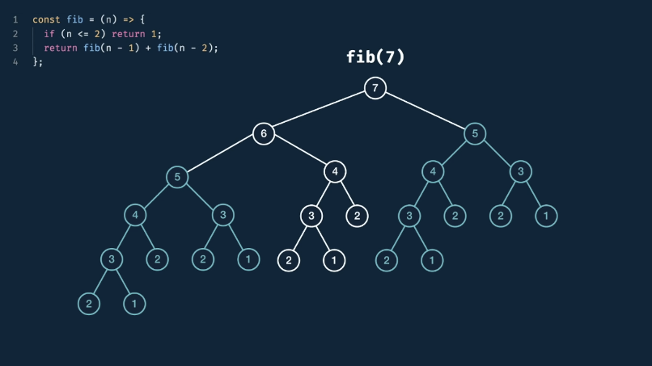

- Tabulation

  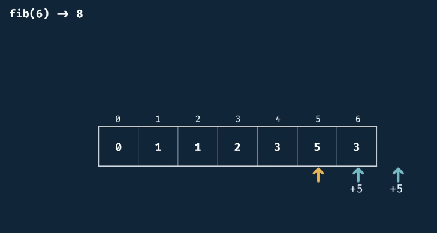

2. [Grid Traveler](gridTraveler.js)

- Memoization

  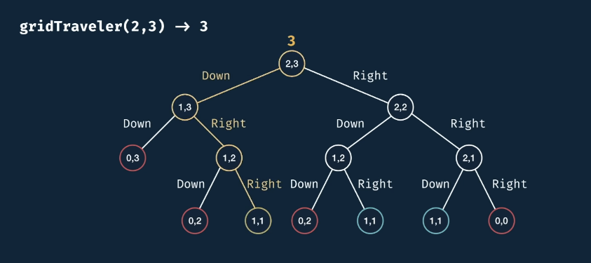

- Tabulation

  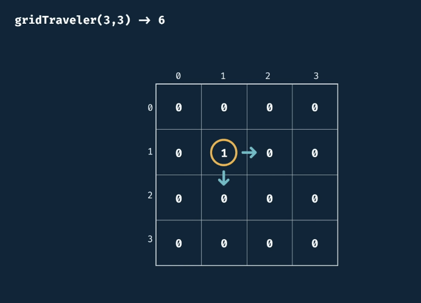

3. [Can Sum](canSum.js)

- Memoization

  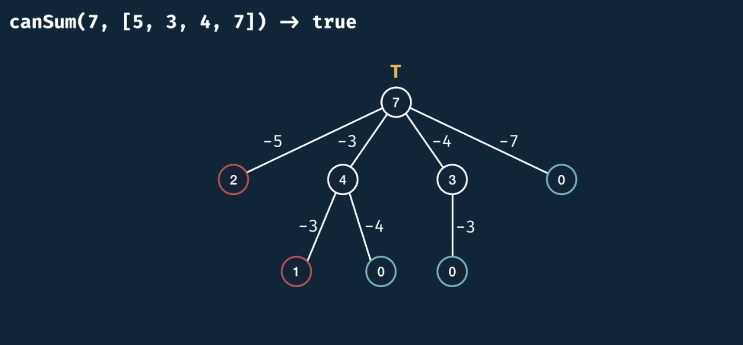

- Tabulation

  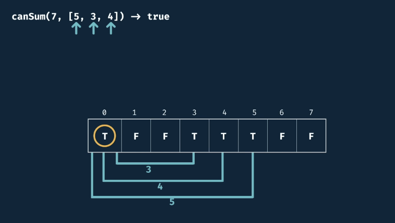

4. [How Sum](howSum.js)

- Memoization

  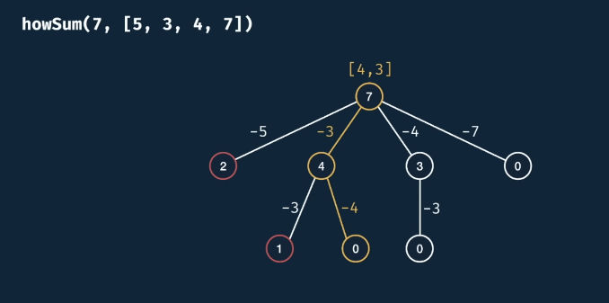

- Tabulation

  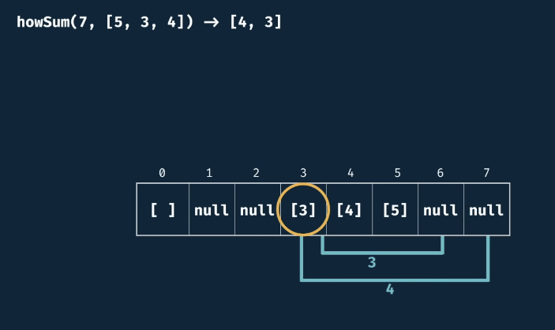

5. [Can Construct](canConstruct.js)

- Memoization

  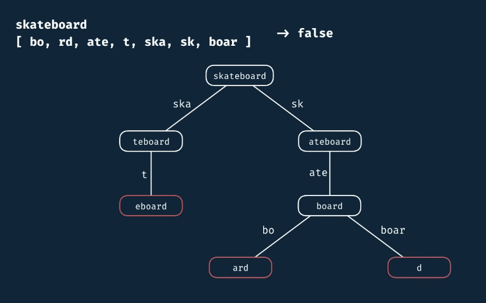

- Tabulation

  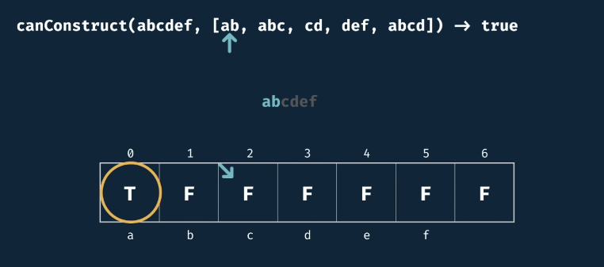

6. [Count Construct](countConstruct.js)

- Memoization

  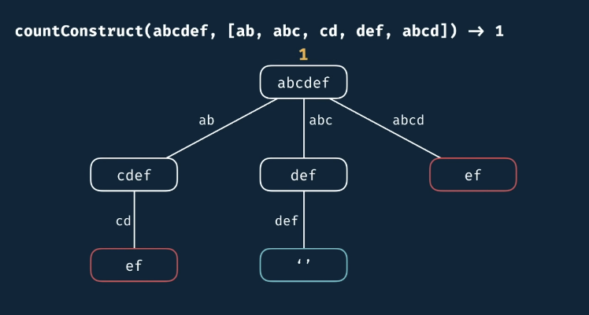

- Tabulation

  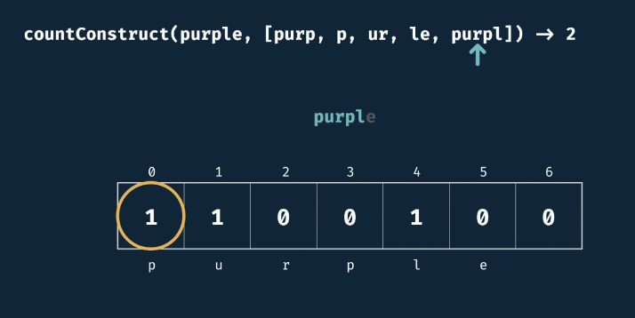

7. [All Construct](allConstruct.js)

- Memoization

  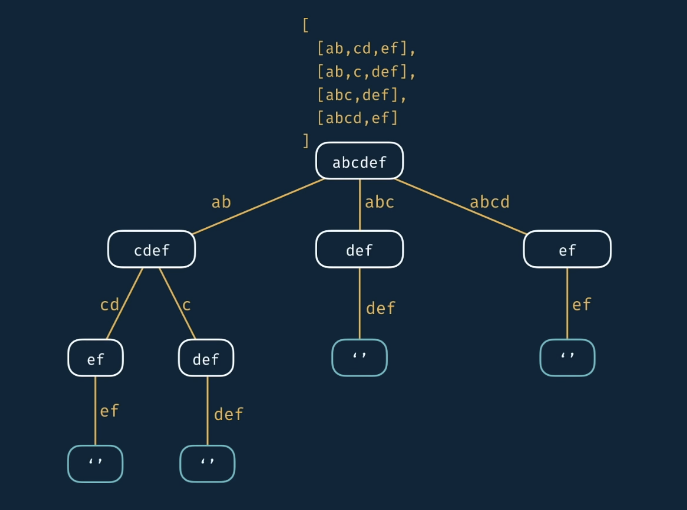

- Tabulation

  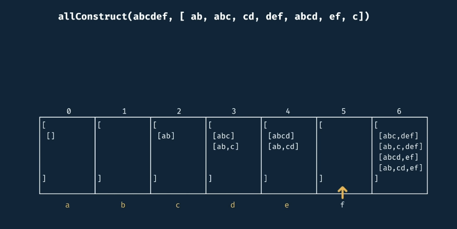

## Memoization Recipe

1. Make it work

- Visualize the problem as a tree
- Implement the tree using recursion
- Test it

2. Make it efficient

- Add a memo object
- Add a base case to return memo values
- Store return values into the memo

## Tabulation Recipe

1. Create table of target size + 1
2. Initialize table with default values
3. Seed the trivial answer into the table
4. Iterate through the table
5. Update the table values

## Final Notes

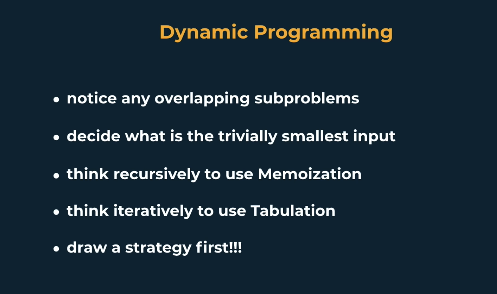

## Source

[Dynamic Programming - Learn to Solve Algorithmic Problems & Coding Challenges](https://www.youtube.com/watch?v=oBt53YbR9Kk)
