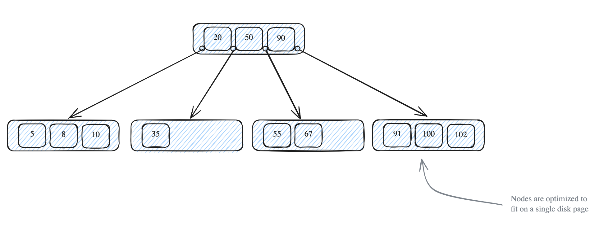
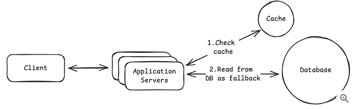
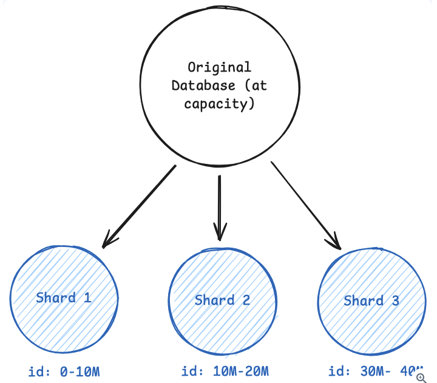

# Core Concepts

These are technologies-agnostic blocks that can be used across several design problems you may encounter in your interviews

> [!TIP]
> They are the grammar or vocabulary for design system problems

## Networking essentials

At least you need to understand how services talk to each other and what happens when those connections fail or get slow

The most important decision you need to have in the top of your head is:

> What will be the communication protocol?
> HTTP vs TCP

For most cases (90/10) the decision will be TCP. If you decide to use TCP you might need to specify the reason for that.

> [!IMPORTANT]
> A common mistake is to think that websockets are required for realtime updates. This could be solved for long polling or SSE

### Websockets and SSE

Websockets and SSE (Server-Sent Events) come up when you need real-time updates.

> [!NOTE]
> Both are stateful, You need to think about connection persistence and what happens when a server goes down with 1000s active connections

#### SSE

- Its unidirectional
- The client request to the server to open an HTTP connection
- Then the server pushes to the client the data
- The client cannot send additional data in the connection opened.
- Simpler to implement and works better with HTTP protocols
- Used for live scores

#### Websockets

- Its bidirectional
- Client and servers share communication (messages)
- Websockets are necessary when clients need to push back data frequently

#### gRPC

When you need internal service-to-service performance is critical choose gRPC because it uses HTTP/2 binary serialization, which is significantly faster than JSON.

Remember that this is not for public APIs because browsers don't natively support gRPC.

> [!TIP]
> gRPC for internal service communication and REST for public API

#### Loadbalancer

- Application level loadbalancer can send API calls to one service and webpage request to another
  - Slower but smarter
- A second option is to use loadbalancer at TCP level
  - Faster but dumber

#### Geography and Latency

If your system needs low latency, you will need

1. Regional deployments
2. Data replication or partitions by geography
3. CDNs for deliver static contents

## API Design

For 90% of the interviews you will need to sketch the API endpoints, being super specific on the details might not be required.

> [!TIP]
> Sketch 4-5 endpoints in a couple minutes and move on. Don't spend more than 5 minutes here

There are few concepts worth mentioning for this step:

1. Pagination when there is a large result sets
2. Cursor-based works better for real time communication, where new items are added frequently
3. Offset-based is fine for most cases
4. JWT for Authentication
5. API key for communication between services
6. Rate limiting if you service can be hammered by bots

## Data modeling

The decisions you make on what data store and how to structure it have direct repercussions with your system performance/scalability and how painful will be to maintain your system

### Relational vs NoSQL

#### Relational

- You have structured data with clear relationships
- You need Strong Consistency

```text
Strong Consistency => All reads reflect the most recent write
```

- You can express complex queries with SQL
- You can use transactions to keep data consistent
- Enforce foreign key constraints
- Uses normalization and denormalization

```text
normalization   => Split data through tables to avoid duplication. This needs joins and they can be expensive if there are multiple tables to read from
denormalization => You duplicate data to speed-up reads. The downside is update, use it when data does not change often
```

> [!TIP]
> Start with normalized relational model then if you identify hot paths or read performance issues then add denormalization. Interviewers are looking to know if you understand the tradeoffs

#### NoSQL

- Your data changes often (Flexible schema)
- Horizontal grow by not having complex queries/joins
- Forces you to design your partition key and sort key based on your access pattern
- You have to know your queries upfront and design around them
  - For example if you design your model by `get all posts for user_id` this means a single partition lookup
  - If you have a `get all post for Y hashtag` that means full table scan because the model was not built for this.

## Database Indexing

Indexes are used to make database queries fast. The most common index is a B-Tree.

A `B-Tree index` keeps data sorted in a tree structure that supports both `exact lookups` and `range queries`



The `Hash Index` can be faster for `exact lookups` but does not support range queries

The `Full-text` index is used for search (finding documents containing an specific word)

The `Geospatial` index is used for location queries (find a restaurant within 4kms)

> [!TIP]
> Think of how your data will be query and propose indexes
> For example, if you are going to be authenticating by email
> add a index for the email in users table

For specialized needs beyond what your primary db supports you can use:

- PostGIS => Geospatial index
- ElasticSearch => Full text search

These extensions use a CDC mechanism (Change Data Capture), which means that the data it uses will be stale by some small amount.

## Caching

The idea is simple, store frequently accessed data in fast memory (Redis) so you can skip database entirely for most reads.

```text
Redis query => 1ms
DB query    => 20ms ~ 50ms
```

Having a cache layer helps your db also, since it can focus more on writes than reads.

### Cache strategy

1. Check if data is in ready
   a. if it is returning
2. If the data is not in redis, read from the database
3. Store it in redis



### Cache complexity

How do you know when data is stale? You need to balance between:

1. When a write in the DB happens update redis data
2. or use short TTL and accept some staleness

Another question that could pop up is `Cache stampede`. How your system will handle when REDIS is down?

1. Strategy 1: Small cache as fallback
2. Strategy 2: Accept degraded performance until redis is back

> [!CAUTION]
> Don't cache everything, only hot paths

### CDN Caching

Used for static assets (images, videos, JS) served for edge locations to users.

Your core application with REDIS is the default

## Sharding

This concept is part of Horizontal Scaling, when you have outgrown a single DB and you need to split your data across multiple independent servers.

- Data hits limit
- Write throughput limit is hit



> [!IMPORTANT]
> The most imporant concept for sharding is how you are doing go to shard your key.

For example `Instagram` it makes sense to have sharding by `user_id` but the **trade off** is that you will need to aggregate global queries like "trending post across all users"

### Hash based sharding

Key -> Hash function -> modulo -> DB

Pros:

- Distribute data evenly
- Avoids hot spots

### Range Base Sharding

Shards per company

Pros:

- Each company gets its own shard

Cons:

- Creates hot spots if one range gets more traffic

> [!TIP]
> Don't shard your data too early, before do the math.
> 10K writes per second and 100GB you don't need sharding yet

### Cons of sharding

Shards add complexity to the system for example:

- Hot spots when disproportionate traffic
- Creating a shard means moving a massive amount of data
- Cross-sharding transactions are quite complex to address.
- The need of using Sagas or distributed transaction
