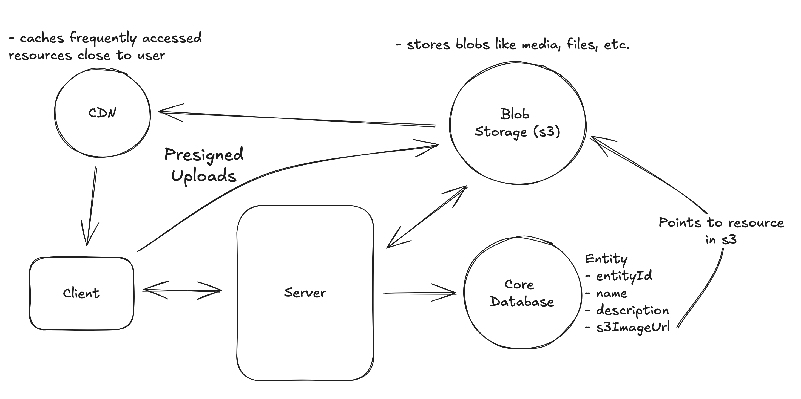
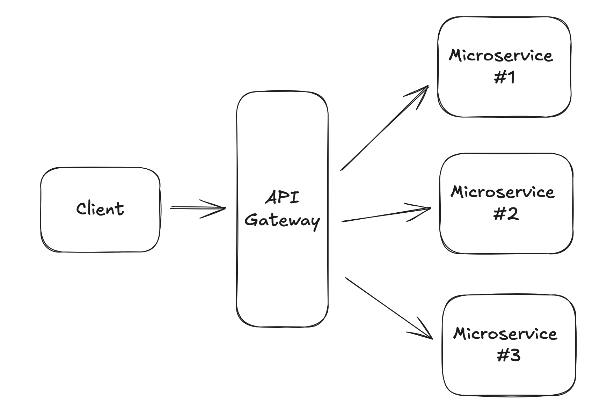
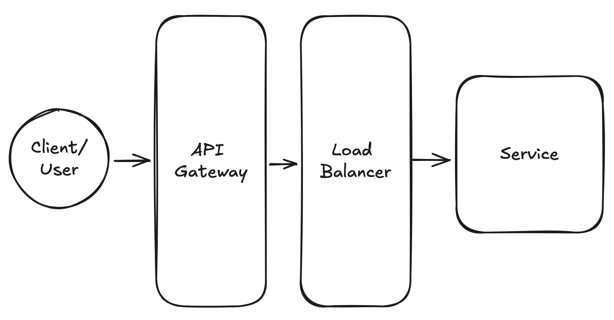
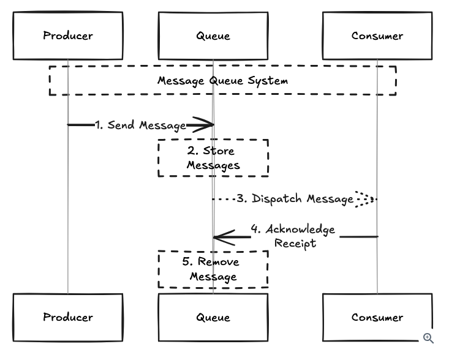

# Key Technologies

## Databases

Almost all system design problems requires you to think in a way to store data. Here we have 2 options
**SQL/Relational vs NoSQL**

If you interview focuses on a product, this means that its a good match for a **Relational Database** (such as Postgres)

If you interview focuses on infrastructure design, then a **NoSQL** would be a good match

> [!TIP]
> Most interviewers are not willing to know why SQL vs NoSQL. Remember that this is a rabbit hole.
> Instead talk about how the DB you selected will help you to solve the problem
> "I'm using Postgres because of ACID properties and how allows me to maintain data integrity"

## Relational Databases

They are often used for transactional data (user, records, user records). These databases store your data in tables, which are composed by Rows and Columns.

```text
Row => Record
Column => Property
```

To retrieve this data is used a SQL to query these tables

### Tools

**SQL Joins**: Joins are a way to combine data from multiple tables. They are a potential bottle neck when retrieving data. Minimize them as possible

**Indexes**: They are a way of storing data in a way that makes faster to query. They are often implemented using a BTree or a Hash Table

**Transactions**: They are a way to group multiple operations together into a single atomic operation.

## NoSQL Databases

They can take different forms such as:

- Key-value
- Column-family
- Documents
- Graph Formats

These type of DBs are not tied to table like structure, they are considered schema-less. This property allows them to handle a large volumes of data (unstructured, semi-structured or structured)

### When to use?

- **Flexible data models**: Your data model is evolving or you need to store different types of data structures without a fixed schema
- **Scalability**: You app needs to scale horizontally
- **Big Data and/or Real-time web apps**: You app deals with large volumes of data, specially unstructured data.

> [!TIP]
> The places where NoSQL Dbs excel are not necessarily places where relational dbs fail

### Important Knowledge

- **Data Models**: key-value, graph, column-family or document
- **Consistency models**: Ranges from strong consistency to eventual consistency
- **Indexing**: Similar to relational
- **Scalability**: Scale horizontally by using consistent hashing and/or sharding to distribute data across many servers

## Blob Storage

Sometimes you need to store a blob of data (images, videos or other files).

Remember to use S3 or Cloud Storage. Otherwise having this stored in the DB is

Usually these services are simple, you upload your blob and then you get an URL to retrieve it

> [!IMPORTANT]
> Avoid using blob storage as database, most problems focuses on having a primary db and references to blob storages



### Use cases

Youtube => Store videos in the blob storage, in your db then store metadata
Instagram => Store images and videos in the blob storage, store metadata in the db
Dropbox => Store files in the blob storage, in your db then store metadata

### To Upload

1. The Client request the upload
2. The server returns a presigned URL. Records this in the DB
3. The client uploads the file to the presigned URL
4. The blob storage then returns the response to the server

### To Download

1. A client request a specific file from the server and are returned a presigned URL
2. The client makes a get request and downloads the file

### Blob Storage - General Knowledge

Durability: Blob storages are incredible durable. They use replication to ensure data is safe

Scalability: Services like AWS S3 can be considered infinitely scalable

Cost Efficient: They are cost effective (compared to having the blob in the db)

Security: They are built thinking about security, like encryption or access control

Upload/Download: They have specialized clients to upload/download

Chunking: Allows your file to be divided in small chunks.

## Search optimized database

Specific designed to full-text search. They use indexes, tokenization and stemming to make queries fast and efficient

They use `inverted indexes` which map words to documents

```json
{
  "word1": [doc1, doc2, doc3],
  "word2": [doc2, doc3, doc4],
  "word3": [doc1, doc3, doc5],
}
```

Examples of search optimized dbs are straightforward. Think of ticketmaster that needs to search fast in a massive list of events.

### Key Details

- **Inverted Indexes**: Maps from words to the documents that contain them. This allows you to quickly find documents that contain a given word
- **Tokenization**: Its the process of breaking a piece of text into individual words.
- **Stemming**: Reducing words to their root form. This transform the words on their most minimal elements from "running" and "runs" to "run"
- **Scaling**: Adding more nodes to a cluster and sharding data across those nodes

## API Gateway

An API Gateway sits in front of the microservices and its responsible for routing the incoming request to the appropriate backend service

Its in charge of:

- Routing
- Rate Limiting
- Authentication
- Authorization
- Logging



## Load Balancer

Its in charge of distributing traffic across multiple machines (called horizontal scaling) to avoid overloading or creating a hot spot

> [!TIP]
> Usually API Gateway and Load balancers are assumed. Mention it but you wont have to design them



Sometimes you will need to have persistent connections like websockets and the question is: where do this will live? L4 or L7?

Rule of thumb: Websockets then L4 (transport http, tcp, socket) loadbalancer otherwise L7 (Application)

## Queues

Serves as buffers for bursty traffic.

A compute resource sends a message to a queue and forgets about them (Fire and forget). On the other hand a pool of workers processes the messages on their own pace

> [!Important]
> Adding a queue breaks the latency constraint of < 500ms in synchronous workloads.



### Examples

**Buffer for bursty Traffic (Uber)**: During peak hours or special events, ride requests can spike massively. A queue for these request allows the system to process the requests at a manageable rate without overloading the server or degrading the user experience

**Distribute work access a system**: Queues can be used to distribute expensive processing tasks. Each request is handled by a worker and distribute between the system

### What you need to know

1. Message Ordering: FIFO, messages are processed in the order they were received. In some cases, you can specify the oder for more complex guarantees (priority or time)

2. Retry mechanisms: Mechanisms that allows a message to be reattempted, it includes the number of retries and also the delay between retries

3. Dead letter queues: Mechanisms that allow storing messages that cannot be processed. They are useful for debugging and auditing.

4. Scaling with Partitions: Queues can scale horizontally across different servers. As databases you need to specify the partition key.

5. Backpressure: The biggest problem is that they can easily overwhelm your system. Queues obscure this type of problems. Backpressure is a way to slow down the production of messages when the queue is overwhelmed. For example rejecting the new messages

## Streams / Event Sourcing

### Event sourcing

Its a technique where changes in an application state are stored as a sequence of events.

These events can be replayed to reconstruct the application state at any point in time.

Effective for systems that require a detailed audit trail of the ability to reverse/replay transactions

### Streams

Unlike queues, streams can retain data for a configurable period of time, allowing consumers to read and re-read messages from the same position or from a specified point in the past.

### When to use them?

1. **When you need to process large amounts of data in real time**: For example social media where you need to display real-time analytics for user engagements (likes, comments, shares)

2. **When you need to support complex processing scenarios like event sourcing**: Consider a bank system where transactions can affect multiple accounts. This allows for real-time processing, rollback changes or reconstruct the state of an account at any time

3. **When you need to support multiple consumers reading from the same stream**: For example chat apps where the steam is the centralized channel where all the participants can be part of the channel. (Pub/Sub pattern)

### What you should know?

**Scaling with Partitions**: Streams can scale horizontally across different servers. As databases you need to specify the partition key.

**Multiple consumer groups**: Allows the same stream to be read by different consumers. This is useful when you need to process the same data in different ways

**Replication**: Streams allow to replicate data across multiple servers, if something within the stream fails, then you can read the data from another

**Windowing**: A way of grouping events together based on time or count. This is useful for scenarios where you need to process events in batches

## Distributed lock

THis tool is perfect for situations where you need to lock something across different systems for a reasonable period of time.

For example, locking a ticket (Mastercard) while a user is in the middle of a transaction

They usually implemented via key-value stores (Redis/Zookeeper)

The idea is that you store the key-value in Redis, then another resource needs to validate that the key-value is not present to process it on their side.

> [!TIP]
> These type of locks can be set to expire after x amount of time, this helps to be consistent if the process is killed or crashes

### Distributed lock Examples

**E-commerce checkout system**: Uses a distributed lock to hold a high-demand item.

**Ride-sharing Matchmaking**: Can be used to manage the assignment of drivers to riders. This lock can be held until the driver accepts or rejects the trip

**Distributed cron jobs**: Ensures that a task is executed by only one server at a time.

**Online Auction Bidding System**: In order to ensure that the bid is placed, the system locks the item briefly to process the bid and update the current highest bid.

### What you need to know about distributed locks

1. **Locking Mechanisms**: One common implementation is via `Redis -> Redlock`
2. **Lock Expiry**: Distributed locks can be set to expire after certain amount of time. This is important to ensure that locks don't get stuck if the service fails or crashes.
3. **Lock Granularity**: Can be used to lock a single resource (or a group)
4. **Deadlocks**: Deadlocks can occur when 2 processes are waiting for the other resource to release a lock.

## Distributed cache

A server or a cluster of servers that stores data in memory. They are great for storing data that's expensive to compute or retrieve from a database

### Distributed cache Examples

**Save Aggregated metrics**: Store data that is expensive to calculate and share the result between multiple services. This reduces latency

**Reduce number of DB queries**: In web applications, user sessions are stored in a distributed cache to reduce the load on the db. This is important for a system that handles a large number of concurrent users

**Speed up expensive queries**: Run the expensive query then store the result in the distributed cache and then retrieve the result from the cache when a user requests them.

### What you need to know about Distributed cache

- **Eviction Policy**: policies that determine which items are to be removed
  - Least Recently Used: Evicts the LRU items first
  - First In First Out: Evicts items in the order they were added
  - Least Frequently Used: Removes items that are least frequently accessed
- **Cache invalidation strategy**: Invalidate cache if the event has changed or the db has been updated
- **Cache Write Strategy**: Ensures that the data is written to your cache in a consistent way.
  - Write-Through Cache: Writes data to both the cache and the underlying data store. Ensures consistency but is slower
  - Write-Around Cache: Writes data directly to the datastore, bypassing the cache. Slower reads
  - Write-Back Cache: Writes data to cache and then async writes the data to the datastore. Can lead to data loses if cache fails

> [!TIP]
> Be specific on what data you will store in the cache. Structure, data examples. Modern caches can use different data structures.

## CDN

This is a type of cache that uses distributed servers to deliver content to users based on their geo. CDN often deliver images, videos, html files but they can also be used to deliver dynamic content like API responses

They cache content on servers close to users. When a user requests content, the CDN routes the request to the closer server. Either cache or fetch

### Things you should know about CDNs

- **Not only for static assets**: They can be used to cache dynamic content. Content that is accessed frequently but changes infrequently. Example blog post
- **Can be used to cache API responses**: Cache responses of APIs requested frequently
- **Eviction Policies**: TTL to determine if a resource might be removed
