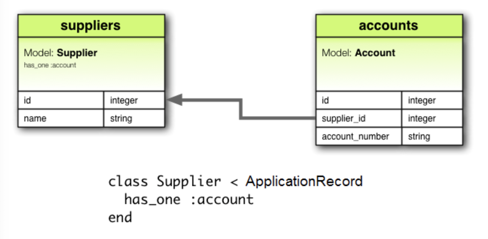
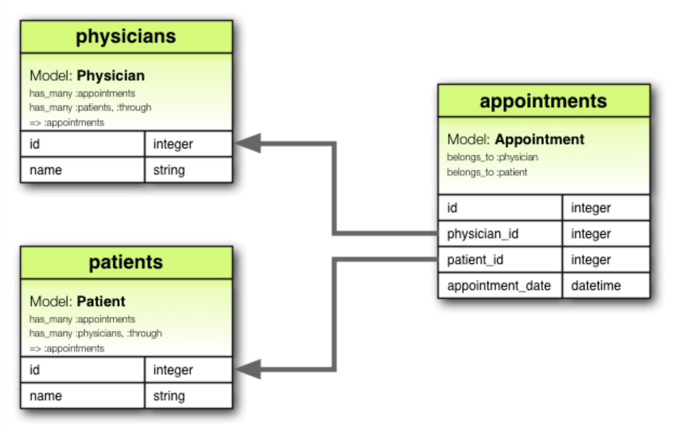
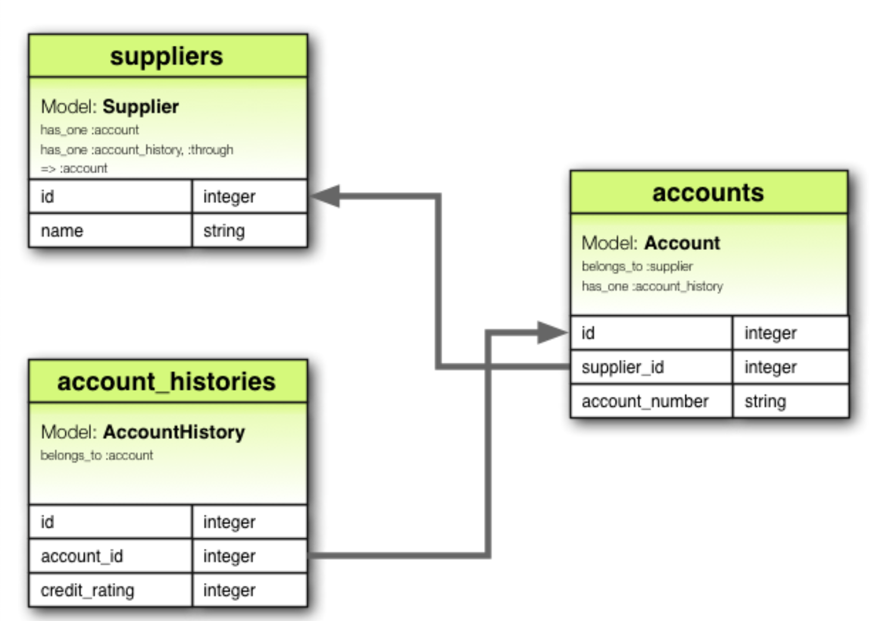
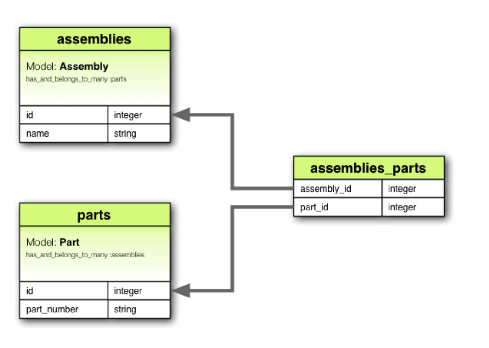
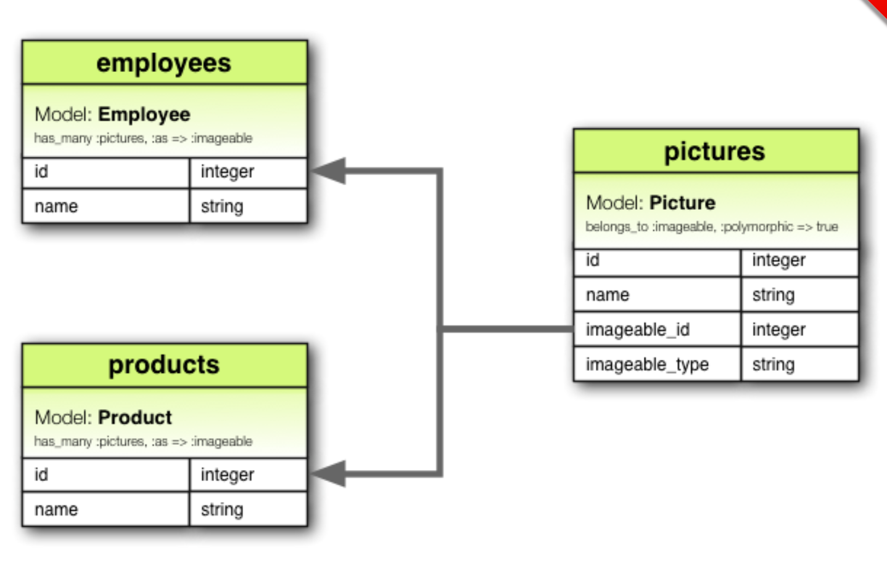

# Active Record: Associations
## 1. Why associations?
- **Association:** It's a **connection between** two Active Record models
- **Why?** Because these types of associations make common operations simpler and easier in your code
- With associations we can streamline operations by declaratively telling rails there's a connection between models
```ruby
class Author < ApplicationRecord
  has_many: :books, dependent: :destroy
end

class Book < ApplicationRecord
  belongs_to: :author
end
```

## 2. Types of Associations
Rails supports 6 types of associations
  - belongs_to
  - has_one
  - has_many
  - has_many :through
  - has_one :through
  - has_and_belongs_to_many

### 2.1 belongs_to
- It's a connection to another model, it _belongs_ to another instance
```ruby
class Book < ApplicationRecord
  belongs_to :author
end
```
- This would create a `PrimaryKey-ForeignKey` relationship between them
- When used **alone** creates a _one-directional_ connection. So in this example _book knows it's author_, but _author does not knows it's books_
- If you want to create a **bi-directional** relationship you need to combine it with `has_one` or `has_many` in the other model. For this example `Author`
- **belongs_to** does not ensure reference consistency. If required add a foreign key at db level
```ruby
create_table :books do |t|
  t.belongs_to :author, foreign_key: true
  # ...
end
```

### 2.2 has_one
- Indicates that one other model has a **reference to this model**.
- That model can be fetched through this association
```ruby
class Supplier < ApplicationRecord
  has_one :account
end 
```
- In this case `Account` has one `Supplier`

- You can read it like: _each account **HAS ONE** supplier_
- You can also add `unique` indexes or foreign keys.
- This relationship can be `bi-directional` by combining it with `belongs_to`

### 2.3 has_many
- Indicates **one-to-many** association between models
- It can be from `zero` to `many` of another model
```ruby
class Author < ApplicationRecord
  has_many :books
end
```
- You can read it like _An author can have **MANY** books_
- Remember to add _foreign keys_ to ensure reference consistency

### 2.4 has_many :through
- This represents **many-to-many** associations
- It's a relationship between 3 models
```ruby
# Physician < has many > appointments
# Appointments < has > patient
# Thus Physician < has many > patients < through > Appointments

class Physician < ApplicationRecord
  has_many :appointments
  has_many :patients, through: :appointments
end

class Appointment < ApplicationRecord
  belongs_to :physician
  belongs_to :patient
end

class Patient < ApplicationRecord
  has_many :appointments
  has_many :physicians, through: :appointments
end
```

- When you add `has_many :through` you can access other models via _join methods_
```ruby
physician.patients
physician.patients = patients
```
### 2.5 has_one through
This association indicates that the declaring model can be matched with one instance of another model by `through` model


### 2.6 has_and_belongs_to_many
- Creates `many to many` association with another model, with no intervening model.
- Each instance of the declaring model has 0 to many of another model
```ruby
class Assembly < ApplicationRecord
  has_and_belongs_to_many :parts
end

class Part < ApplicationRecord
  has_and_belongs_to_many :assemblies
end
```
- It becomes an intermediate table `n to m`


### 2.7 Choosing between belongs_to and has_one
- If you want to create a `1-to-1` relationship you need to use **has_one** and **belongs_to**... but which one is which?
- **Answer**: where you place the foreign key
- `has_one` one of something is **yours**
```ruby
class Supplier < ApplicationRecord
  has_one :account # Makes sense that a Supplier has one account
end

class Account < ApplicationRecord
  belongs_to :supplier # Who is my supplier?
end
```

### 2.8 Choosing between has_many :through and has_and_belongs_to_many
- These 2 options declare a `many-to-many` relationships... but when to use each one?
- **Answer**: `has_and_belongs_to_many` let's you create the association directly, while `has_many :through` creates an indirect association through a **Join Model**
- If you need to work with the relation as an independent entity use `has_many :through` (validations, callbacks or extra attributes)
- If you don't care about the **Join Model** then use `has_and_belongs_to_many`

### 2.9 Polymorphic associations
- **What it solves?** A model can belong to more than one other model
```ruby
# An image of an employee or a product
class Picture < ApplicationRecord
  belongs_to :imageable, polymorphic: true
end

class Employee < ApplicationRecord
  has_many :pictures, as: :imageable
end

class Product < ApplicationRecord
  has_many :pictures, as: :imageable
end
```
- In the end **polymorphic belongs_to** creates an interface to be used by other models
```ruby
@employee.pictures
@product.pictures
```
- Migration example:
```ruby
class CreatePictures < ActiveRecord::Migration[6.0]
  def change
    create_table :pictures do |t|
      t.string :name
      t.references :imageable, polymorphic: true
      t.timestamps
    end
  end
end
```


### 2.10 Self joins
- Relationships with itself (Employee and boss)
```ruby
class Employee < ApplicationRecord 
  has_many :subordinates, class_name: "Employee", foreign_key: "manager_id"

  belongs_to :manager, class_name: "Employee", optional: true
end
```
- With this you can retrieve following:
```ruby
# Who's my manager?
@employee.manager

# Who are my subordinates?
@employee.subordinates
```
- For the migration you need to add the following:
```ruby
class CreateEmployees < ActiveRecord::Migration[6.0]
  def change
    create_table :employees do |t|
      t.references :manager, foreign_key: { to_table: :employees }
      t.timestamps
    end
  end
end
```

## 3. Tips, tricks and warnings
### 3.1 Controlling Caching
- All association methods are build around _caching_
- Keeps results around the **most recent** query
- Cache is _shared_ across other methods
- To update cache, call `reload` method

### 3.2 Avoiding name collisions
- You should be careful with associations names, because each association creates an object inside your model
- Do not add an existing model name.
- `attributes` or `connection` will override a looooot of things

### 3.3 Updating the schema
- You are responsible to maintain your schema to match your associations
- This will mean 2 things:
  1. `belongs_to` needs to have the foreign keys
  ```ruby
    # this will generate foreign key for a new table
    t.references :author 

    # this will generate foreign key for an existing table
    add_reference :books, :author
  ```
  2. `has_and_belongs_to_many` requires the appropriate join table
    - To do this use `:join_table` to explicitly call the join table
    - Active record creates join tables by lexical other `author_books`
    - Example:
    ```ruby
    class CreateAssembliesPartsJoinTable < ActiveRecord::Migration[6.0]
      def change
        create_table :assemblies_parts, id: false do |t|
          t.bigint :assembly_id
          t.bigint :part_id
        end

        add_index :assemblies_parts, :assembly_id
        add_index :assemblies_parts, :part_id
      end
    end
    ```
    - You can also use `create_join_table`
    ```ruby
    class CreateAssembliesPartsJoinTable < ActiveRecord::Migration[6.0]
      def change
        create_join_table :assemblies, :parts do |t|
          t.index :assembly_id
          t.index :part_id
        end
      end
    end
    ```

### 3.4 Controlling association scopes
- Associations look for objects within the current module scope
```ruby
module MyApplication
  module Business
    class Supplier < ApplicationRecord
      has_one :account
    end

    class Account < ApplicationRecord
      belongs_to :supplier
    end
  end
end
```
- This work because both objects are in `Business` scope
- This will not work because they are in different scopes
```ruby
module MyApplication
  module Business
    class Supplier < ApplicationRecord
      has_one :account
    end
  end

  module Billing
    class Account < ApplicationRecord
      belongs_to :supplier
    end
  end
end
```
- To fix this you will need to specify the whole scope
```ruby
    class Account < ApplicationRecord
      belongs_to :supplier,
        class_name: "MyApplication::Business::Supplier"
    end
```

## 3.5 Bi-directional relationships
- Active record will attempt to automatically identify 2 models share a bi-directional association, using association name
- This wont work for associations in different scope or associations via:
  - :through
  - :foreign_key
- To fix this issue: `:inverse_of`
- Before:
```ruby
class Author < ApplicationRecord
  has_many :books
end

class Book < ApplicationRecord
  belongs_to :writer, class_name: 'Author', foreign_key: 'author_id'
end

irb> a = Author.first
irb> b = a.books.first
irb> a.first_name == b.writer.first_name
=> true
irb> a.first_name = 'David'
irb> a.first_name == b.writer.first_name
=> false # this is cause it's not recognized the bi-directional association
```

- After
```ruby
class Author < ApplicationRecord
  has_many :books, inverse_of: 'writer'
end

class Book < ApplicationRecord
  belongs_to :writer, class_name: 'Author', foreign_key: 'author_id'
end

irb> a = Author.first
irb> b = a.books.first
irb> a.first_name == b.writer.first_name
=> true
irb> a.first_name = 'David'
irb> a.first_name == b.writer.first_name
=> true
```
- If you include `inverse_of` then active record will recognize the association

## 4. Detailed association reference
### 4.1 belong_to association reference
- In DB language this creates a column which makes reference to another table
- `1-to-1` or `1-to-Many`
#### 4.1.1 Methods added by belongs_to
By declaring an association of this kind, your model wins 6 methods
```
  - association
  - association=(associate)
  - build_association(attributes)
  - create_association(attributes = {})
  - create_association!(attributes = {})
  - reload_association
```
- Where `association` it's the class associated. For example
```ruby
class Book < ApplicationRecord
  belongs :author
end

# You win following:
author # get with cache
author= # update
build_author # create without save
create_author # crete with save
create_author! # raise exception if can't save
reload_author # return uncached version
```
- If no associated object is found, then `book.author` will return `nil`

##### 4.1.2.1 :autosave
- if `true`  => then save any loaded association and destroy them whenever you **save the parent**
- if `false` => ...
- if `none`  => new association will be saved, but updated associations wont

##### 4.1.2.2 :class_name
- Used to supply the model name
```ruby
class Book < ApplicationRecord
  belongs_to :author, class_name: "Patron"
end

```

##### 4.1.2.3 :counter_cache
- Caches the `COUNT(*)` from the DB
```ruby
class Book < ApplicationRecord
  belongs_to :author, counter_cache: true
end
```
- Counter cache columns are added as `attr_readonly`

##### 4.1.2.4 :dependent
- `:destroy` will be called on it's associated objects
- `:delete` delete directly from the database without calling `destroy method`
- If you add this to a `has_many` relationship will lead to orphan records

##### 4.1.2.5 :foreign_key
- By convention rails assumes that `{association}_id` will be used
- Using this option you can specify the column to use
- **Important:** Rails wont create the foreign key, you need to do it

##### 4.1.2.6 :primary_key
- By default rails uses `id` as primary key
- Specifying this in the relationship will lead to have another column specified
```ruby
class User < ApplicationRecord
  self.primary_key = 'guid' # primary key is guid and not id
end

class Todo < ApplicationRecord
  belongs_to :user, primary_key: 'guid'
end
```

##### 4.1.2.7 :inverse_of
specifies the name of the `has_many` or `has_one` association that is the inverse of this association.

##### 4.1.2.8 :polymorphic
Passing `true` just enabled polymorphic associations

##### 4.1.2.9 :touch
If set to `true` then associated objects will get updates on `updated_at` or `updated_on` whenever this object is saved or destroyed

##### 4.1.2.10 :validate
If set to `true` then associated objects will be validated before save this object. By default is false

##### 4.1.2.11 :optional
The presence of the associated object wont be validated. By default `false` 

#### 4.1.3 Scopes for belongs_to
- Used to add customization to the query used by active record
- These customization are added by `scope blocks`
```ruby
class Book < ApplicationRecord
  belongs_to :author, -> { where active: true }
end
```
- You can use any standard query methods. such as:
  - where    => Standard where 
  - includes => Specify second order associations (eager loaded)
  - readonly => Read only when loaded
  - select   => Ability to override select method

#### 4.1.4 Do any associated objects exists?
You can check this with: `association.nil?`
```ruby
if @book.author.nil?
  @msg = "No author found for this book"
end
```

### 4.2 has_one association reference
- Declares 1-to-1 associations
- Just as `belongs_to` adds 6 methods to your model
- This could be consider the counter part for `belongs_to`

#### 4.2.2 Options for has_one
These options behave the same as in `belongs_to`
- :autosave
- :class_name
- :foreign_key
- :inverse_of
- :primary_key
- :touch
- :validate

##### 4.2.2.1 :as
This option will set the association as **polymorphic**

##### 4.2.2.4 :dependent
Controls what happens when the associated owner object is destroyed
- `:destroy` => cascade effect
- `:delete`  => DB delete without callbacks
- `:nullify` => Callbacks are not executed and FK is set to null (orphans the record)
- `:restrict_with_exception` => Raises an exception `DeleteRestrictionError` if there's an associated record
- `:restrict_with_error`     => Causes an error if there's an associated record

##### 4.2.2.8 :source
This option specifies the source association name for `has_one :through`

##### 4.2.2.9 :source_type
Specifies the source type for `has_one :through` association that proceeds through a polymorphic association
```ruby
class Author < ApplicationRecord
  has_one :book
  has_one :hardback, through: :book, source: :format, source_type: "Hardback"
  has_one :dust_jacket, through: :hardback
end

class Book < ApplicationRecord
  belongs_to :format, polymorphic: true
end

class Paperback < ApplicationRecord; end

class Hardback < ApplicationRecord
  has_one :dust_jacket
end

class DustJacket < ApplicationRecord; end

```

##### 4.2.2.10 :through
Specifies the join model through which to perform the query

#### 4.2.5 When are objects saved?
- Objects are automatically saved in order to update its foreign key
- Any object being replaced will be saved because its FK is being replaced
- If it fails to save then returns false and the assignment itself is cancelled
- This relationship could be like this:
```
`has_one`    => Parent
`belongs_to` => child
```
- If the parent is not **saved** then children objects are not saved. They will be saved once the parent it is

### 4.3 has_many association reference
# Notes:
- **Reference consistency**: Does not validate `orphaned records`
You can read more [here](https://database.guide/what-is-referential-integrity/)